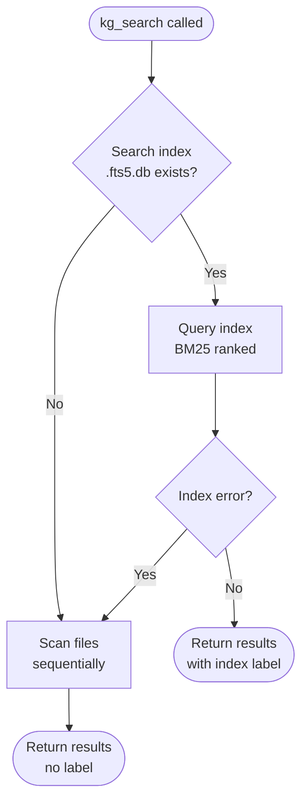

**Version:** 0.3.6-beta | **Updated:** 2026-04-11

> **Claude Code only:** The `/kmgraph:` prefix requires Claude Code with this plugin installed. Other IDEs access equivalent functionality through MCP tools — see [INSTALL.md](INSTALL.md) for platform-specific setup.
## About Commands on Other Platforms

These commands are designed as reference documentation for any LLM:

- **Claude Code:** Invoke as slash commands (e.g., `/kmgraph:capture-lesson`)
- **Other platforms:** Copy the command prompt into your LLM. Substitute `${CLAUDE_PLUGIN_ROOT}` with your actual project path
- **No-tool LLMs:** Commands serve as workflow documentation — follow steps manually

Commands work across platforms, but full automation is Claude Code-specific.

---

> ⚠️ **DEPRECATED PATTERN (v0.2.1-beta):** Thick commands (200+ lines) are no longer the standard pattern.
>
> **New pattern:** Thin dispatchers (80-150 lines) + execution logic in agents/. See [CONCEPTS.md § Four-Layer Architecture](CONCEPTS.md) for overview.
>
> **Why changed:** Reduces duplication, improves maintainability, enables platform portability.
>
> **Migration:** Old thick-command pattern remains functional but deprecated. New commands should use thin-dispatcher + agent pattern.

---

## Quick Navigation

- [I Want To...](#i-want-to) — Task-based command finder
- [Essential Commands](#essential-commands) — Start here
- [Intermediate Commands](#intermediate-commands) — Daily use
- [Advanced Commands](#advanced-commands) — Power features
- [Command Comparison](#command-comparison) — When to use which
- [Troubleshooting](#troubleshooting) — Common problems and fixes
- [Related Documentation](#related-documentation) — Links to other guides

---

## I Want To...

### Getting Started
- **Set up a new knowledge graph** → `/kmgraph:init`
- **See what's in my knowledge graph** → `/kmgraph:status`
- **Document what I just learned** → `/kmgraph:capture-lesson`
- **Find something I documented before** → `/kmgraph:recall "search query"`

### Daily Use
- **Sync lessons to the knowledge graph** → `/kmgraph:update-graph`
- **Summarize this conversation** → `/kmgraph:session-summary`
- **Add a new category (e.g., security, ml-ops)** → `/kmgraph:add-category`
- **See my chat history** → `/kmgraph:extract-chat`
- **Update plugin documentation** → `/kmgraph:update-doc --user-facing`

### Team Collaboration
- **Share knowledge safely** → `/kmgraph:config-sanitization`
- **Check for sensitive data before sharing** → `/kmgraph:check-sensitive`
- **Link lessons to GitHub issues** → `/kmgraph:link-issue`

### Project Transitions & Onboarding
- **Create comprehensive handoff documentation** → `/kmgraph:handoff`
- **Set up for new developer** → `/kmgraph:setup-platform`

> **Note**: The term "issues" in this guide refers to GitHub Issues — a platform feature for tracking bugs, feature requests, and enhancements. This is distinct from "knowledge graph issues" (meta-issues) or "lessons learned issues" (problems documented in the KG).

### Working with Multiple Knowledge Graphs
- **View all configured knowledge graphs** → `/kmgraph:list`
- **Switch to a different knowledge graph** → `/kmgraph:switch`

### Complex Problem Tracking
- **Track a multi-attempt bug** → `/kmgraph:meta-issue`
- **Start structured issue tracking with documentation and Git branch** → `/kmgraph:start-issue-tracking`
- **Sync progress to plans and GitHub** → `/kmgraph:update-issue-plan`

### Memory Management
- **Free up MEMORY.md token budget** → `/kmgraph:archive-memory`
- **Bring back archived context** → `/kmgraph:restore-memory`
- **Run the full sync pipeline in one command** → `/kmgraph:sync-all`


---

## Browse Commands by Category

=== "Setup & Configuration"

    Get the knowledge graph running and configure how it works.

    - [🟢 `/kmgraph:init`](#-kmgraphinit) — Initialize a new knowledge graph
    - [🟡 `/kmgraph:init-personal-kg`](#-kmgraphinit-personal-kg) — Create personal KG for cross-project lessons
    - [🟡 `/kmgraph:list`](#-kmgraphlist) — View all configured knowledge graphs
    - [🟡 `/kmgraph:switch`](#-kmgraphswitch) — Switch to a different knowledge graph
    - [🟡 `/kmgraph:add-category`](#-kmgraphadd-category) — Add custom categories
    - [🟡 `/kmgraph:config-sanitization`](#-kmgraphconfig-sanitization) — Set up safety features for team sharing

=== "Capture & Document"

    Document lessons, capture history, and summarize sessions.

    - [🟢 `/kmgraph:capture-lesson`](#-kmgraphcapture-lesson) — Capture problems solved and patterns discovered
    - [🟡 `/kmgraph:extract-chat`](#-kmgraphextract-chat) — Export chat history to markdown
    - [🟡 `/kmgraph:session-summary`](#-kmgraphsession-summary) — Summarize important work sessions

=== "Search & Sync"

    Find knowledge and keep the graph synchronized.

    - [🟢 `/kmgraph:status`](#-kmgraphstatus) — Check current knowledge graph status
    - [🟢 `/kmgraph:recall`](#-kmgraphrecall) — Search across all knowledge entries
    - [🟡 `/kmgraph:update-graph`](#-kmgraphupdate-graph) — Extract lessons into knowledge graph
    - [🟡 `/kmgraph:update-doc`](#-kmgraphupdate-doc) — Update documentation with changes
    - [🔴 `/kmgraph:sync-all`](#-kmgraphsync-all) — Run complete synchronization pipeline

=== "Team & Sharing"

    Share knowledge safely with team members.

    - [🟡 `/kmgraph:check-sensitive`](#-kmgraphcheck-sensitive) — Scan for sensitive data before sharing
    - [🔴 `/kmgraph:link-issue`](#-kmgraphlink-issue) — Connect lessons to GitHub issues

=== "Advanced Issues"

    Track complex, multi-attempt problems systematically.

    - [🔴 `/kmgraph:meta-issue`](#-kmgraphmeta-issue) — Track multi-attempt bugs and features
    - [🔴 `/kmgraph:start-issue-tracking`](#-kmgraphstart-issue-tracking) — Systematic issue tracking with Git branches
    - [🔴 `/kmgraph:update-issue-plan`](#-kmgraphupdate-issue-plan) — Sync progress with GitHub and plans

=== "Memory Management"

    Manage MEMORY.md size and archive old patterns.

    - [🔴 `/kmgraph:archive-memory`](#-kmgrapharchive-memory) — Archive old patterns from MEMORY.md
    - [🔴 `/kmgraph:restore-memory`](#-kmgraphrestore-memory) — Restore archived context

---

## Essential Commands

### 🟢 `/kmgraph:init`

**Purpose**: Initialize a new knowledge graph with wizard-based setup

**When to use**:

- First time setup on any project
- Starting a new project that needs its own knowledge graph
- Creating a separate KG for different work (e.g., personal vs. team)
- **After a plugin update** — verify/upgrade existing KG to current version

**What it does**:

1. Asks for KG name and storage location (project-local, personal, or custom path)
2. Prompts for category selection (architecture, process, patterns, debugging, or custom)
3. Asks for optional custom prefixes per category
4. Creates directory structure (`knowledge/`, `lessons-learned/`, `decisions/`, `sessions/`, `chat-history/`)
5. Copies templates from the plugin
6. **[NEW in v0.2.2-beta]** Offers to create a **personal KG** at `~/.kmgraph/` for cross-project lessons (see [`/kmgraph:init-personal-kg`](#-kmgraphinit-personal-kg))
7. **[NEW in v0.0.10.2]** Optionally backfills from existing project context (README, CHANGELOG, lessons, decisions, chat history)
8. Optionally installs a git post-commit hook for lesson capture suggestions
9. Updates `.gitignore` based on chosen git strategy
10. Registers the KG in `~/.claude/kg-config.json` and sets it as active

**Time**: 2-3 minutes

**Example**:
```bash
/kmgraph:init

# Claude asks:
# - What should this knowledge graph be called?
# - Where should it be stored? (project-local / personal / custom)
# - Which categories do you want to include?
# - Would you like to backfill from existing project context? (y/N)
#   (If yes: scans README, CHANGELOG, lessons-learned/, decisions/, chat-history/)
# - Install post-commit hook? (y/n)
# - Git strategy for each category? (commit/ignore)
```

**Backfill Feature**:
When you enable backfill, the system extracts existing knowledge from your project:

- **README.md** — Project overview and key concepts
- **CHANGELOG.md** — Released features and changes
- **lessons-learned/** — Existing lessons (if any)
- **decisions/** — Architecture Decision Records
- **chat-history/** — Extracted chat logs

The system presents candidates for your review before creating entries.

**After backfill**: If backfill was used, the knowledge graph now contains a full set of imported content. This is a good time to build the search index so all that content is immediately searchable by relevance. Run `/kmgraph:sync-all` and accept the index prompt, or call `kg_fts5_rebuild` directly from the MCP tool panel.

**Next steps**: Run `/kmgraph:status` to verify setup

---

### 🟡 `/kmgraph:init-personal-kg`

<!-- Updated: 2026-03-29 -->

**Purpose**: Create or register a personal knowledge graph for cross-project lessons

**When to use**:

- After running `/kmgraph:init` and skipping the personal KG offer
- When you want a dedicated place for workflow lessons, cross-project gotchas, and personal ADRs that apply across all projects, not just the current one

**What it does**:

1. Creates `~/.kmgraph/` with standard directory structure
2. Registers it as `type: "personal"` with name `"personal"` in `~/.claude/kg-config.json`
3. Copies knowledge templates (patterns, gotchas, concepts)
4. Builds FTS5 search index for the new KG
5. Does **not** change the active KG — project KG remains active

After setup:
- `/kmgraph:capture-lesson` shows a **KG picker** when ≥2 KGs are registered
- `/kmgraph:recall` searches both project and personal KGs automatically

**Example**:
```bash
/kmgraph:init-personal-kg

# Claude creates ~/.kmgraph/
# Registers "personal" KG (type: personal) in config
# Active KG unchanged
```

**Related**: See [Personal vs Project Knowledge](CONCEPTS.md#personal-vs-project-knowledge) for when to use each.

---

## Cross-Reference Formatting (Wiki Links)

When you run `/kmgraph:init` (Step 1f.2) or `/kmgraph:init-personal-kg` (Step 8.1), the system automatically converts cross-references in your knowledge graph to Obsidian wiki link format for seamless navigation in compatible editors.

### Supported Formats

The wiki pass applies these auto-linkification patterns:

- **Enhancements**: `[[ENH-NNN]]` (e.g., `[[ENH-010]]`)
- **Architecture Decisions**: `[[ADR-NNN-full-title]]` (e.g., `[[ADR-028-postgres-over-mongodb]]`)
- **Lessons Learned**: `[[Lessons_Learned_X]]` (e.g., `[[Lessons_Learned_5]]`)
- **GitHub Issues**: `[#NNN](url)` format (automatically applied when linking via `/kmgraph:link-issue`)

### When Links Are Applied

- During initial `/kmgraph:init` setup (Step 1f.2: "Apply Obsidian wiki link formatting to cross-references")
- During `/kmgraph:init-personal-kg` (Step 8.1: "Applying wiki pass to personal KG")
- Only once — controlled by the `wiki_pass_complete` config flag to avoid re-running on subsequent setups

### Preview Changes with --dry-run

To preview what links will be created without applying them:

```bash
/kmgraph:init --dry-run
```

The `--dry-run` mode shows which files will be modified and what cross-references will be converted, without writing any changes.

### Scope & Limitations

- **5 legacy lesson files** without the `Lessons_Learned_` prefix are excluded from auto-linking (e.g., `lesson-1.md`, `debug-tip.md`). Manual cross-references to these files still work — they are fully searchable and accessible.
- Lesson files created *after* v0.3.3 automatically follow the `Lessons_Learned_X` naming convention and are auto-linked.

**Related**: For naming conventions and documentation structure, see [Style Guide](STYLE-GUIDE.md).

---

### 🟢 `/kmgraph:capture-lesson`

<!-- Updated: 2026-03-30 -->

**Purpose**: Guided UX dispatcher for documenting lessons learned, problems solved, and patterns with git metadata tracking

> **Command refactored in v0.2.1-beta: 710 → 108 lines.** Execution logic delegated to `agents/` for platform portability. See [CONCEPTS.md § Four-Layer Architecture](CONCEPTS.md).

**When to use**:

- Just solved a problem
- Discovered a reusable pattern
- Fixed a tricky bug worth remembering
- Learned something that future you will need

**What it does**:

Dispatches to the capture-lesson agent, which handles:

1. **[NEW in v0.2.2-beta] Snapshot gate** — optionally takes a lightweight session snapshot before the capture dialog, preserving the "why" at the moment of discovery (see `/kmgraph:session-summary --snapshot`)
2. Checks for duplicate/similar existing lessons (pre-flight search)
3. Asks verification questions (topic, audience, scope)
4. Auto-detects category from keywords (architecture, debugging, process, patterns)
5. Gathers git metadata (branch, commit hash, PR, issue number) from YAML frontmatter
6. Guides content gathering (problem, root cause, solution, prevention)
7. Writes the lesson file using the template from `core/templates/`
8. Updates category and chronological indexes
9. Optionally triggers `/kmgraph:update-graph` to extract KG entries
10. Optionally links to a GitHub Issue via `/kmgraph:link-issue`

**Time**: 5-10 minutes (faster with practice)

**Example**:
```bash
/kmgraph:capture-lesson

# Agent guides you through:
# 1. What problem did you encounter?
# 2. What was the root cause?
# 3. How did you solve it?
# 4. How can this be prevented?
```

**Tips**:

- Capture while the problem is fresh (don't wait)
- Include error messages verbatim
- Note what DIDN'T work (helps future you)

---

### 🟢 `/kmgraph:status`

**Purpose**: Display active knowledge graph status, stats, and quick command reference

**When to use**:

- Verify setup after running `/kmgraph:init`
- See recent lessons at a glance
- Check MEMORY.md staleness
- Quick health check on the knowledge graph

**What it shows**:

- Active KG name and file path
- Categories and git strategy
- Last sync timestamp
- File counts (lessons, KG entries, ADRs, sessions)
- Warnings (stale MEMORY.md, missing paths)
- Quick command reference for common next steps

**Time**: Instant

**Example output**:
```
Knowledge Graph Status
━━━━━━━━━━━━━━━━━━━━━

Active KG: my-project
Location:  /Users/name/projects/my-app/docs/
Categories: architecture, process, patterns, debugging
Git: selective (architecture/patterns committed, process/debugging gitignored)
Last sync: 2026-02-12 15:45

Stats:
  Lessons: 12 (3 new since last sync)
  KG Entries: 28 patterns, 6 concepts, 4 gotchas
  ADRs: 5
  Sessions: 8

Quick Commands:
  /kmgraph:capture-lesson    — Document a lesson
  /kmgraph:recall "query"    — Search across all KG
  /kmgraph:sync-all          — Run full sync pipeline
```

**Tip**: Supports `--minimal` for a one-line summary and `--json` for machine-readable output.

---

### 🟢 `/kmgraph:recall`

<!-- Updated: 2026-03-27 -->

**Purpose**: Guided UX dispatcher for searching across all project memory systems (lessons, decisions, knowledge graph, sessions)

> **Command refactored in v0.2.1-beta: 437 → 79 lines.** Execution logic delegated to `agents/` for platform portability. See [CONCEPTS.md § Four-Layer Architecture](CONCEPTS.md).

**When to use**:

- "I solved this before..."
- Looking for a specific pattern or solution
- Need to find a past architectural decision
- Searching for context on a topic

**What it searches**:

Dispatches to the recall agent, which searches:

- Lessons learned (full text)
- Architecture decisions (ADRs)
- Knowledge entries (patterns, gotchas, concepts)
- Session summaries
- MEMORY.md
- **[NEW in v0.2.2-beta]** Personal KG (if registered) — automatically included when a personal KG exists

**Multi-KG behavior**: When a personal KG is registered, `recall` searches both project and personal KGs by default. Results include a source label (`[project]` or `[personal]`) so origin is always clear.

**Time**: 1-2 seconds (single KG); 2-4 seconds (multi-KG with FTS5)

**Example**:
```bash
/kmgraph:recall "database timeout"
/kmgraph:recall "auth patterns" --scope=all
/kmgraph:recall "workflow patterns" --scope=personal-only

# Multi-KG result format:
# Lessons Learned (3 matches)
# 1. Debugging PostgreSQL Connection Timeouts — [project: my-project]
# 2. Connection Pool Best Practices — [project: my-project]
# 3. Database Timeout Patterns — [personal: personal]
```

**`--scope` parameter** (v0.2.2-beta):

| Value | Behavior |
|---|---|
| `active` | Active KG only (original behavior) |
| `all` | Active KG + all registered KGs (auto-default when personal KG exists) |
| `personal-only` | Only KGs with `type: personal` |

**Search tips**:

- Use specific terms ("PostgreSQL timeout" > "database")
- Try synonyms if nothing found
- Search by date: `/kmgraph:recall "2024-01"`
- Search by category: `/kmgraph:recall "architecture"`
- Output formats: default (summary), `--format=paths` (file list), `--format=detailed` (full context)
- Scope override: `--scope=active` to restrict to project KG only

---

## Intermediate Commands

### 🟡 `/kmgraph:update-graph`

**Purpose**: Extract structured insights from lessons learned and sync to knowledge graph entries

**When to use**:

- After creating or updating lesson-learned documents
- When discovering new patterns or best practices
- Before completing complex work sessions
- Daily or weekly consolidation of captured knowledge

**What it does**:

1. Identifies new or modified lessons (since last sync or last 24 hours)
2. Reads each lesson and extracts: title, problem, solution, when-to-use triggers
3. Checks if a matching KG entry already exists in `knowledge/patterns.md` (or similar)
4. Creates new entries or updates existing ones with bidirectional links
5. Runs data integrity audit on each new entry
6. Checks MEMORY.md size and syncs new patterns if within token limits
7. Commits KG and MEMORY.md changes together

**Time**: 1-5 minutes depending on number of lessons

**Example**:
```bash
/kmgraph:update-graph
/kmgraph:update-graph --lesson=Pattern_Discovery.md    # Process specific lesson
/kmgraph:update-graph --auto                          # Skip prompts, silent mode
/kmgraph:update-graph --interactive                    # Review each entry before saving
```

**Tips**:

- `--auto` flag is useful when called from other commands (e.g., after `/kmgraph:capture-lesson`)
- `--interactive` flag lets you review and edit each extracted entry before saving

**Cleaner conversations**: When the context-mode plugin is installed and there are 10 or more lessons to process, `update-graph` reads the lesson files in a background process instead of inline. This keeps the conversation cleaner without changing any results. Falls back automatically if context-mode is not installed.

---

### 🟡 `/kmgraph:add-category`

**Purpose**: Add a new category to an existing knowledge graph with optional custom prefix

**When to use**:

- Need to track a new domain (e.g., security, ml-ops, devops)
- Team-specific categorization needed beyond defaults
- Organizing lessons into more granular groups

**What it does**:

1. Prompts for category name (or accepts from command argument)
2. Asks for optional prefix (e.g., "sec-" for security lessons)
3. Asks for git strategy (commit or ignore)
4. Creates `lessons-learned/[category]/` directory
5. Creates `knowledge/[category].md` KG entry file from template
6. Updates `kg-config.json` with the new category
7. Updates `.gitignore` if git strategy is "ignore"

**Time**: Under 1 minute

**Example**:
```bash
/kmgraph:add-category
/kmgraph:add-category security
/kmgraph:add-category ml-ops --prefix ml- --git ignore
```

**Next steps**: Capture lessons in the new category with `/kmgraph:capture-lesson`

---

### 🟡 `/kmgraph:session-summary`

**Purpose**: Create a summary of the current active chat session

**When to use**:

- Before context limits are reached (~180K tokens)
- At major milestones during long sessions
- Before handing work to another developer
- End of a productive work session to preserve context

**What it does**:

1. Auto-detects session scope from conversation context since last summary
2. Classifies session type (feature development, debugging, planning, research)
3. Generates summary with: goals, problems solved, files touched, commits, lessons, next steps
4. Handles duplicate detection — offers to update existing or create new summary
5. Saves to `{active_kg_path}/sessions/YYYY-MM/YYYY-MM-DD_description.md`
6. Updates sessions README index
7. Optionally triggers lesson capture and KG update

**[NEW in v0.2.2-beta] Snapshot mode** (`--snapshot`): Lightweight mid-session capture. Runs before any capture command when the user opts in. Appends to today's session file (or creates one) without a user review gate. Optional git history (`--snapshot --git`). Used by `capture-lesson`, `create-adr`, and `start-issue-tracking` to preserve the "why" at the moment of discovery.

**Time**: Under 10 seconds (full mode); under 5 seconds (snapshot mode without git)

**Example**:
```bash
/kmgraph:session-summary
/kmgraph:session-summary --auto        # Skip confirmation, save immediately
/kmgraph:session-summary --snapshot    # Mid-session save without review gate — used by capture commands
```

**Tips**:

- Captures git commits automatically — no need to list them manually
- Auto-suggests summary when context approaches ~180K tokens
- If a session summary was saved earlier in the session (via a capture gate), wrap-up only adds closing context

---

### 🟡 `/kmgraph:create-adr`

<!-- Updated: 2026-03-30 -->

**Purpose**: Create Architecture Decision Records with auto-filled git metadata, sequential numbering, and index auto-update

**When to use**:

- Making a significant architecture, process, or technology decision
- Choosing between competing approaches and want to document the rationale
- After a decision has already been made and needs to be formally recorded
- When a lesson learned reveals a decision that should be captured as an ADR

**What it does**:

1. **[NEW in v0.2.2-beta] Snapshot gate** — optionally takes a lightweight session snapshot before the ADR dialog, preserving the "why" at the moment the decision was made (see `/kmgraph:session-summary --snapshot`)
2. Resolves active KG path from `~/.claude/kg-config.json`
3. Auto-increments ADR number (scans existing `ADR-NNN-*.md` files, uses highest + 1)
4. Collects git metadata automatically (author, email, branch, commit SHA, PR/issue numbers)
5. Interactive wizard: title, status (Proposed/Accepted/Deprecated/Superseded), category (Architecture/Process/Technology), context, decision, rationale, consequences, related lessons
6. Generates filename (`ADR-{NNN}-{slug}.md`) and presents summary for user confirmation before writing
7. Creates ADR file from `core/templates/decisions/ADR-template.md` with fully populated frontmatter
8. Updates `decisions/README.md` — total count, chronological list, and by-category section
9. Commits both files with a structured commit message

**Time**: 5-15 minutes (depends on how much detail you provide)

**Example**:
```bash
/kmgraph:create-adr
/kmgraph:create-adr Use PostgreSQL for primary database   # Pre-fills title, skips first prompt
```

**Tips**:

- Pass a title as an argument to skip the first wizard prompt
- Use Proposed status for decisions still under review; Accepted for decisions already implemented
- Link to related lessons in Step 3.8 — creates bidirectional traceability
- If a snapshot was taken earlier in the session, the ADR's Context section can draw from it

---

### 🟡 `/kmgraph:list`

**Purpose**: Display all configured knowledge graphs from `~/.claude/kg-config.json`

**When to use**:

- View all available knowledge graphs
- Check which KG is currently active
- Review KG configurations before switching
- Verify a new KG was created successfully

**What it shows**:

- All configured knowledge graphs with numbered list
- Active KG highlighted
- Location paths, categories, git strategy, last used timestamp
- Total count

**Time**: Instant

**Example output**:
```
Knowledge Graphs:

1. my-project (active) — /Users/name/projects/my-app/docs/
   Categories: architecture, process, patterns
   Git: selective (architecture/patterns committed, process gitignored)
   Last used: 2026-02-13 15:45

2. ai-research — ~/.claude/knowledge-graphs/ai-research/
   Categories: architecture, process, ml-patterns (custom)
   Git: all committed
   Last used: 2026-02-10 12:00

Total: 2 knowledge graph(s) configured
```

**Tip**: Use `--names-only` for scripting or `--json` for machine-readable output.

---

### 🟡 `/kmgraph:switch`

**Purpose**: Change the active knowledge graph for all subsequent commands

**When to use**:

- Switch between different project knowledge graphs
- Change to a topic-based KG for cross-project patterns
- Return to a previously used KG

**What it does**:

1. Validates the target KG exists in config
2. Verifies KG path exists on disk (warns if missing, allows override)
3. Updates the `active` field in `~/.claude/kg-config.json`
4. Updates `lastUsed` timestamp
5. Reports previous and new active KG

**Time**: Instant

**Example**:
```bash
/kmgraph:switch my-project
/kmgraph:switch ai-research
/kmgraph:switch cowork-devops --force    # Skip missing path warning
```

**Tips**:

- All subsequent knowledge commands operate on the newly active KG
- Use `/kmgraph:list` first to see available options

---

### 🟡 `/kmgraph:check-sensitive`

**Purpose**: Scan active knowledge graph for potentially sensitive information before public sharing

**When to use**:

- Before pushing knowledge graph files to a public or shared repository
- As a manual check alongside `/kmgraph:config-sanitization` hooks
- Periodic audit of KG content

**What it does**:

1. Loads scan patterns from `.claude/sanitization-config.json` (or uses defaults)
2. Scans all markdown files in the active KG for: email addresses, API keys/tokens, URLs
3. Reports findings with file name, line number, and matched content
4. Optionally shows fix suggestions with `--fix-suggestions` flag

**Time**: Under 5 seconds

**Example**:
```bash
/kmgraph:check-sensitive

# Output:
# ⚠️  Potential sensitive data found:
#
# - patterns.md:42 — email: user@example.com
# - debugging-auth.md:15 — URL: https://api.internal.company.com
# - lesson-template.md:8 — api-key: API_KEY=abc123def456
#
# Review these entries before pushing to public repository.
```

---

### 🟡 `/kmgraph:config-sanitization`

**Purpose**: Interactive wizard to set up pre-commit hooks for sensitive data detection

**When to use**:

- One-time setup per repository for automated security scanning
- When team members need consistent sanitization enforcement

**What it does**:

1. Prompts for scan patterns (emails, API keys, personal names, internal URLs)
2. Collects custom regex patterns specific to your project
3. Asks for action on match (warn or block commit)
4. Installs a pre-commit hook script to `.git/hooks/pre-commit`
5. Creates `.claude/sanitization-config.json` with selected configuration

**Time**: 2-3 minutes

**Example**:
```bash
/kmgraph:config-sanitization

# Wizard asks:
# 1. What should be scanned for? (checkboxes for email, API keys, names, URLs)
# 2. Any custom patterns? (e.g., "ACME Corp", "internal\.company\.com")
# 3. What should happen when found? (1. Warn  2. Block)
# → Installs hook and creates config
```

**Output**:
```
✅ Pre-commit sanitization hook installed!

Scan patterns: emails, API keys, custom patterns (2)
Action: Block commits with sensitive data

Test the hook:
  git add docs/knowledge/patterns.md
  git commit -m "test"
```

---

### 🟡 `/kmgraph:extract-chat`

**Purpose**: Extract chat history from Claude and Gemini local log sources

**When to use**:

- Preserve chat history for reference or knowledge extraction
- End of day archival of important conversations
- When logs might be cleared by app updates

**What it does**:

1. Determines output directory (active KG's `chat-history/` by default, or custom path)
2. Scans Claude logs (`~/.claude/projects/` for `.jsonl` files) and/or Gemini logs (`~/.gemini/tmp/`, `~/.gemini/antigravity/conversations/` for `.json`/`.pb` files)
3. Merges sessions by date into `YYYY-MM-DD-claude.md` and/or `YYYY-MM-DD-gemini.md`
4. Supports incremental append — re-running adds new sessions without overwriting

**Time**: Under 30 seconds

**Date filtering options**:

- `--today` — Extract only today's sessions
- `--date=YYYY-MM-DD` — Extract only sessions from a specific date
- `--after=YYYY-MM-DD` — Extract sessions from this date onwards (inclusive)
- `--before=YYYY-MM-DD` — Extract sessions up to and including this date
- `--project=<fragment>` — Filter to sessions from a specific project (path fragment match)

**Example**:
```bash
/kmgraph:extract-chat                                          # Extract all (Claude + Gemini)
/kmgraph:extract-chat -claude                                  # Extract only Claude
/kmgraph:extract-chat -gemini                                  # Extract only Gemini
/kmgraph:extract-chat --output-dir=/custom/path               # Custom output location
/kmgraph:extract-chat --today                                  # Today only
/kmgraph:extract-chat -claude 2026-02-20 through 2026-02-21   # Date range
/kmgraph:extract-chat --project=knowledge-graph               # Specific project only
```

**Tips**:

- Extracted files are automatically searchable via `/kmgraph:recall`
- Optional `blackboxprotobuf` Python library enables Gemini protobuf file support
- Date ranges use natural language: `YYYY-MM-DD through YYYY-MM-DD` or `YYYY-MM-DD to YYYY-MM-DD`
- Gemini date filtering: passthrough implemented; underlying Gemini extraction may have known limitations

---

### 🟡 `/kmgraph:update-doc`

**Purpose**: Update an existing documentation file — plugin/project documentation (`--user-facing`) or knowledge graph content

**When to use**:

- A plugin feature changed and COMMAND-GUIDE, CHEAT-SHEET, or README needs updating
- Adding a new command entry to user-facing docs
- Ensuring documentation follows v0.0.7 language standards (third-person, Section 508)

**What it does**:

Without `--user-facing`: shows a disambiguation dialog to distinguish plugin documentation from KG content.

With `--user-facing`:

1. Reads target file and displays current sections and version
2. Asks what type of update (add command entry, update existing entry, add section, update metadata, validate only)
3. Runs v0.0.7 standards validation (third-person voice, heading hierarchy, table headers, link text)
4. Shows diff preview before writing
5. Applies changes and commits with standards-compliant message

**Time**: 2-5 minutes

**Example**:
```bash
/kmgraph:update-doc COMMAND-GUIDE.md --user-facing   # Update plugin documentation wizard
/kmgraph:update-doc README.md --user-facing           # Update README with new feature info
/kmgraph:update-doc some-lesson.md                    # Disambiguation dialog for KG content
```

**Tips**:

- Always use `--user-facing` for plugin/project docs (README, COMMAND-GUIDE, CHEAT-SHEET, etc.)
- Without `--user-facing`, a dialog clarifies whether the target is plugin docs or KG content
- Standards validation runs automatically — violations are flagged before writing

---

## Advanced Commands

### 🔴 `/kmgraph:meta-issue`

**Purpose**: Initialize and manage meta-issue tracking for complex multi-attempt problems

**When to use** (2 or more criteria should be met):

- 3+ solution attempts already tried or expected
- Root cause understanding has shifted 2+ times
- Problem spans multiple project versions
- High complexity requiring coordination across systems
- Significant learning value for future similar problems

**What it does**:

1. **Initialize** (`/kmgraph:meta-issue "Problem Title"`):
   - Prompts for domain, scope, severity, expected attempts
   - Creates structured directory under `{active_kg_path}/issues/[meta-issue-name]/`
   - Populates core files: README, description, implementation-log, test-cases
   - Creates analysis files: root-cause-evolution, timeline, lessons-learned
   - Links to knowledge graph
2. **Add attempt** (`--add-attempt 003 "Try connection pooling"`):
   - Creates numbered attempt folder with solution approach and results templates
   - Updates implementation log
3. **Update understanding** (`--update-understanding "Root cause is network latency"`):
   - Records belief shifts with timestamp and evidence
   - Updates description with current best understanding
4. **View status** (`--status`):
   - Shows all active meta-issues with attempt counts and current understanding

**Time**: 3-5 minutes for initialization

**Example**:
```bash
/kmgraph:meta-issue "Authentication Redesign"
/kmgraph:meta-issue --add-attempt 002 "OAuth2 with JWT"
/kmgraph:meta-issue --update-understanding "Token expiry logic flawed"
/kmgraph:meta-issue --status
```

> **Note**: Do NOT use meta-issue for simple bugs, standard features, or one-off debugging. Use `/kmgraph:capture-lesson` instead.

---

### 🔴 `/kmgraph:start-issue-tracking`

<!-- Updated: 2026-03-30 -->

**Purpose**: Initialize issue tracking for a specific problem or enhancement with structured documentation and Git branch creation

**When to use**:

- Identified a bug that needs structured tracking
- Planning a new feature or enhancement
- Documenting a problem before solving it
- Creating a developer handoff with full context

> **Note**: The term "issue" here refers to a GitHub Issue — a platform feature for tracking bugs and feature requests/enhancements.

**What it does**:

1. **[NEW in v0.2.2-beta] Snapshot gate** — optionally takes a session snapshot before the issue dialog
2. **[NEW in v0.2.2-beta] Branch guard** — Step 1.0 now surfaces a ⚠️ warning when current branch ≠ main, priming the user before versioning decisions; Step 6.2 lesson capture prompt becomes strongly recommended when working on a non-main branch
3. **Steps 1.1–1.4 ask one question at a time** — type (bug vs. enhancement), version impact, branch name, and plan filename are each asked independently, waiting for a response before the next question. No multi-question prompts.
4. Scans chat history for recent proposals ("Would you like me to...")
5. Runs git authority check and auto-detects version increment path
6. Auto-detects issue type from keywords (bug vs. enhancement)
7. Creates directory structure with documentation templates (description, solution approach, test cases, implementation log)
8. Generates an implementation plan with safety headers and atomic approval protocol
9. Creates a Git feature branch (`issue/{N}-{slug}`)
10. Optionally creates a draft PR on GitHub with `--body-file` populated from solution approach
11. **Step 6.2 (lesson capture) is a mandatory gate** — must receive a response before continuing. When working on a non-main branch, this step is strongly recommended.
12. **Step 6.4 (ROADMAP + CHANGELOG update) is a mandatory gate** — must receive a response confirming ROADMAP and CHANGELOG entries have been considered before the command completes.
13. Links to knowledge graph and prompts for lesson capture
14. Engages implementation freeze — stops before any code changes

**Time**: 5-10 minutes

**Example**:
```bash
/kmgraph:start-issue-tracking
/kmgraph:start-issue-tracking CLI flag parsing fails on quoted args
/kmgraph:start-issue-tracking Add token usage display
```

**Tips**:

- Uses the Dual-ID Policy: local IDs (`issue-N` or `ENH-NNN`) are independent from GitHub issue numbers (`#N`)
- Always use `--body-file` flag (not manual summary) when creating the GitHub Issue

---

### 🔴 `/kmgraph:update-issue-plan`

**Purpose**: Synchronize knowledge graph extraction with active plans and local/GitHub issue tracking

**When to use**:

- After extracting new KG entries with `/kmgraph:update-graph`
- When implementation plan needs to reflect new insights
- Before committing governance-related changes
- When progress needs to be posted to a GitHub Issue

> **Note**: References to "issues" here mean GitHub Issues — platform-level bug reports or feature requests.

**What it does**:

1. **Knowledge extraction**: Runs `/kmgraph:update-graph` to extract patterns
2. **Plan sync**: Updates the active implementation plan with a "Lessons Learned Integration" section
3. **Local issue update**: Appends progress and new verification requirements to local issue docs
4. **GitHub sync**: Maps local issue ID to GitHub Issue number, posts a knowledge sync comment, and updates PR description with related lessons
5. **Governance audit**: Outputs a summary table showing sync status across all components

**Time**: 2-5 minutes

**Example**:
```bash
/kmgraph:update-issue-plan
/kmgraph:update-issue-plan --auto       # Skip prompts
/kmgraph:update-issue-plan --pr=42      # Sync to specific PR
```

**Tips**:

- Works fully offline — GitHub steps gracefully degrade if `gh` CLI is not installed
- Decision gates will prompt before creating new issues for out-of-scope discoveries

---

### 🔴 `/kmgraph:link-issue`

**Purpose**: Manually link an existing lesson or ADR to a GitHub Issue with bidirectional references

**When to use**:

- A lesson was captured but not linked to its relevant GitHub Issue
- An ADR should reference the GitHub Issue that prompted the decision
- Building traceability between knowledge and tracked work

> **Note**: "Issue" here refers to a GitHub Issue — which could be a bug report or a feature request/enhancement.

**What it does**:

1. Validates the file exists and issue number is provided
2. Updates YAML frontmatter in the lesson/ADR with issue and PR metadata
3. Posts a comment to the GitHub Issue with a link to the lesson (if `gh` CLI available)
4. Updates the related KG entry with the issue reference
5. Reports bidirectional link status

**Time**: Under 1 minute

**Example**:
```bash
/kmgraph:link-issue docs/lessons-learned/process/my-lesson.md --issue 42
/kmgraph:link-issue docs/decisions/ADR-005.md --issue 38 --pr 40
```

---

### 🔴 `/kmgraph:archive-memory`

**Purpose**: Archive stale MEMORY.md entries to prevent bloat while preserving historical context

**When to use**:

- MEMORY.md approaching 1,500 token soft limit (warning from `/kmgraph:sync-all`)
- MEMORY.md exceeds 2,000 token hard limit (blocked from adding new entries)
- Periodic cleanup (recommended quarterly)
- Before major project phase changes

**What it does**:

1. Calculates current MEMORY.md token count (word count × 1.3)
2. Identifies stale entries using date-based staleness criteria (default: 90 days)
3. Previews entries proposed for archival with token savings estimate
4. Moves stale entries to `MEMORY-archive.md` (preserving content)
5. Adds archive notice and log to both files
6. Commits both files with descriptive message

**Time**: 1-2 minutes

**Example**:
```bash
/kmgraph:archive-memory
/kmgraph:archive-memory --auto           # Skip confirmation
/kmgraph:archive-memory --dry-run        # Preview without writing
/kmgraph:archive-memory --threshold=180  # Custom staleness threshold (days)
```

**Tips**:

- Token limits: 1,500 soft (warning) / 2,000 hard (block)
- Archived entries can be restored with `/kmgraph:restore-memory`

---

### 🔴 `/kmgraph:restore-memory`

**Purpose**: Restore archived MEMORY.md entries from MEMORY-archive.md back into active memory

**When to use**:

- Need to reference archived knowledge for current work
- Working on a problem related to a previously archived solution
- Rebuilding context from a previous project phase
- Token budget has been freed up and historical context is needed

**What it does**:

1. Parses all archived entries with IDs, titles, dates, and token sizes
2. Supports fuzzy search by title, ID-based selection, or interactive list
3. Previews entry content and calculates post-restoration token count
4. Checks token limits before restoring (blocks if would exceed 2,000 token hard limit)
5. Inserts entry into the appropriate MEMORY.md section
6. Updates archive log with restoration timestamp (entry content remains in archive for history)
7. Commits both files

**Time**: 1-2 minutes

**Example**:
```bash
/kmgraph:restore-memory                    # Interactive mode (show list, select)
/kmgraph:restore-memory "Git Pre-Commit"  # Fuzzy search by title
/kmgraph:restore-memory --id=5            # Restore by archive ID
/kmgraph:restore-memory --list            # Show all archived entries
/kmgraph:restore-memory --dry-run         # Preview without writing
```

---

### 🔴 `/kmgraph:sync-all`

**Purpose**: Automated knowledge sync orchestrator — replaces 4-step manual pipeline with 1 command

**When to use**:

- After significant work sessions to consolidate everything
- Weekly deep sync to ensure KG, MEMORY.md, plans, and GitHub are aligned
- Before major milestones or project phase changes
- As a catch-up sync if you've been capturing lessons without syncing

**What it does**:

1. **Scans** for new or modified lessons in `{active_kg_path}/lessons-learned/`
2. **Extracts** KG entries from lessons (delegates to `/kmgraph:update-graph`)
3. **Checks** MEMORY.md size and syncs new patterns (respects token limits)
4. **Links** to active implementation plan if relevant
5. **Updates** local issue with KG references and progress notes
6. **Enriches** today's session summary with KG insights
7. **Generates** GitHub Issue comment draft and asks for single confirmation before posting

**Time**: 1-5 minutes depending on volume

**Example**:
```bash
/kmgraph:sync-all
/kmgraph:sync-all --auto       # Skip GitHub posting confirmation
/kmgraph:sync-all --dry-run    # Preview without changes
```

**Output**:
```
Knowledge Sync Complete
-----------------------
Lessons scanned:  3 (2 new, 1 modified)
KG entries:       2 created, 1 updated
MEMORY.md:        Updated (1 new pattern)
Plan linked:      v2.0 (Step 2 → Prefix Naming lesson)
Local issue:      issue-42 (updated)
GitHub:           #45 (comment posted)
Session:          2026-02-11 (enriched)
```

**Tips**:

- Idempotent — safe to run multiple times (existing entries updated, not duplicated)
- GitHub integration is optional — works fully offline if `gh` CLI is not installed

**Cleaner conversations**: When the context-mode plugin is installed, `sync-all` runs file scans in a background process so the results do not fill the conversation. Falls back automatically if context-mode is not installed. No configuration required.

**Search index**: Each run of `sync-all` automatically refreshes the search index if one has been built. On the first run after upgrading, `sync-all` will ask once whether to build the index. The preference is remembered.

---

### 🔴 `/kmgraph:handoff`

**Purpose**: Create comprehensive project handoff documentation for transitions, context limits, or onboarding

**When to use**:

- Before transitioning project to another developer
- Preparing for context window limits (>180K tokens)
- Completing a major release cycle
- Creating documentation for AI assistant handoffs
- Before taking a long break

**What it creates**:

1. **START-HERE.md** — Current session state, active branch, next steps
2. **DOCUMENTATION-MAP.md** — File inventory with purpose annotations
3. **SESSION-COMPILATION.md** — Recent session summaries linked chronologically
4. **OPEN-ISSUES.md** — Unresolved issues, PRs, and pending work
5. **ARCHITECTURE-SNAPSHOT.md** — Current codebase structure and key decisions

**Time**: 2-5 minutes depending on project size

**Example**:
```bash
/kmgraph:handoff
/kmgraph:handoff --output-dir=./backup/
/kmgraph:handoff --skip-sessions     # Faster, smaller output
```

**Output**:
```
✅ Handoff package created!

Location: ./handoff-packages/2026-02-27

Files:
- START-HERE.md               — 85 lines
- DOCUMENTATION-MAP.md        — 156 lines
- SESSION-COMPILATION.md      — 234 lines
- OPEN-ISSUES.md              — 67 lines
- ARCHITECTURE-SNAPSHOT.md    — 189 lines

Total: ~731 lines of documentation
Reading time: ~30-45 minutes for complete orientation
```

**Tips**:

- Creates dated directory: `handoff-packages/YYYY-MM-DD/` by default
- Files can be shared via zip or archived for future reference
- Perfect companion to `/kmgraph:session-summary` for comprehensive handoff

---

## Command Comparison

### Capture vs Update vs Sync

**Three ways to save learnings**:

1. **`/kmgraph:capture-lesson`**
   - Creates a NEW lesson file
   - Guided interview process
   - Use: When documenting new learnings

2. **`/kmgraph:update-graph`**
   - Extracts patterns from existing lessons
   - Updates knowledge entries
   - Syncs to MEMORY.md
   - Use: Daily or weekly to consolidate

3. **`/kmgraph:sync-all`**
   - Full 4-step pipeline (capture → update → sync → link)
   - Comprehensive sync across KG, plans, issues, and GitHub
   - Use: Weekly deep sync or before sharing

**When to use which**:

- Just solved a problem → `capture-lesson`
- End of day/week → `update-graph`
- Major milestone → `sync-all`

---

### Status vs Recall vs List

**Three ways to view knowledge**:

1. **`/kmgraph:status`**
   - High-level overview of active KG
   - File counts, warnings, recent activity
   - Use: Daily check-in, health check

2. **`/kmgraph:recall`**
   - Deep full-text search across all memory systems
   - Find specific content by keyword
   - Use: Looking for something specific

3. **`/kmgraph:list`**
   - Shows all configured KGs (if multiple)
   - Metadata only (names, paths, categories)
   - Use: Switching between projects

---

### Issue Tracking: meta-issue vs start-issue-tracking

**Two levels of issue tracking**:

1. **`/kmgraph:start-issue-tracking`**
   - For individual bugs or enhancements
   - Creates a single issue directory, implementation plan, and Git branch
   - Standard workflow for most tracked work

2. **`/kmgraph:meta-issue`**
   - For complex problems requiring 3+ solution attempts
   - Creates a richer directory structure with attempt folders and root-cause evolution
   - Tracks how understanding changes over time

**When to use which**:

- Standard bug or feature → `start-issue-tracking`
- Multi-attempt investigation → `meta-issue`

---

### Memory: archive vs restore

**MEMORY.md lifecycle management**:

1. **`/kmgraph:archive-memory`**
   - Moves stale entries (>90 days old by default) to `MEMORY-archive.md`
   - Frees token budget for new entries
   - Recommended when approaching 1,500 token soft limit

2. **`/kmgraph:restore-memory`**
   - Brings archived entries back to active MEMORY.md
   - Fuzzy search or ID-based selection
   - Checks token limits before restoring

---

## Troubleshooting

### "Command not found"

**Problem**: Claude doesn't recognize `/kmgraph:...` command

**Solutions**:

1. Verify plugin installed: Check Claude Code > Extensions
2. Restart Claude Code
3. Update plugin: Check for updates in marketplace
4. Check active KG: Run `/kmgraph:status`

---

### "No active knowledge graph"

**Problem**: Commands fail with "no active KG"

**Solutions**:

1. Run `/kmgraph:init` to create your first KG
2. Run `/kmgraph:list` to see available KGs
3. Run `/kmgraph:switch` to activate an existing KG

---

### "MEMORY.md is too large"

**Problem**: MEMORY.md over 1,500 tokens, slowing down sessions or blocking new entries

**Solutions**:

1. Run `/kmgraph:archive-memory` to archive old entries
2. Review archived entries: Check `MEMORY-archive.md`
3. Restore if needed: `/kmgraph:restore-memory`
4. Adjust threshold: `/kmgraph:archive-memory --threshold=60` for more aggressive archival

---

### "No chat history found"

**Problem**: `/kmgraph:extract-chat` finds no logs

**Solutions**:

1. Verify log directories exist:
   ```bash
   ls ~/.claude/projects/
   ls ~/.gemini/tmp/
   ```
2. Check if you've used Claude Code or Gemini recently
3. Logs may be cleared on app updates

---

### "Protobuf extraction fails"

**Problem**: Gemini `.pb` files can't be read

**Solutions**:
```bash
# Install optional dependency
pip install blackboxprotobuf

# Or skip protobuf files (JSON extraction still works)
/kmgraph:extract-chat -gemini  # Will warn about .pb files
```

---

### "Git branch creation fails"

**Problem**: `/kmgraph:start-issue-tracking` can't create a branch

**Solutions**:
```bash
# Check current branch
git branch

# Make sure you're on main/develop
git checkout main

# Try again
git checkout -b issue/N-description
```

---
## Technical Details

This section covers implementation specifics for users who want to understand how features work internally.

### Context-Mode Integration

When the [context-mode plugin](https://github.com/steventcramer/context-mode) is installed alongside kmgraph:

- `sync-all` uses `ctx_batch_execute` to combine lesson scanning and MEMORY.md size checks in a single sandboxed background process
- `update-graph` uses `ctx_execute_file` for sandboxed file reads when processing 10 or more lessons; falls back to the knowledge-extractor subagent for large batches without context-mode, or reads directly for small batches
- Detection: kmgraph checks for `mcp__plugin_context-mode_context-mode__ctx_batch_execute` at runtime; no configuration required; zero breaking change if context-mode is absent

### Search Index Implementation

The diagram below shows how `kg_search` decides which search method to use.



`kg_search` checks for a search index first. If the index exists, it queries the index and returns BM25-ranked results with an index label. If the index does not exist or encounters an error, `kg_search` falls back to reading files sequentially. The caller receives the same result format either way.

- Index format: SQLite database using FTS5 (Full-Text Search version 5) extension
- Ranking: BM25 — the same relevance algorithm used by most search engines
- Stemming: porter stemmer — "searching" matches "search", "decisions" matches "decision"
- Rebuild strategy: incremental — only re-indexes files whose modification time changed
- Storage: `{kg-root}/.fts5.db` — gitignored, local only, rebuilt on demand
- Package: `node-sqlite3-wasm` (WASM-based SQLite, no native compilation required)
- Fallback: if the index is corrupt or missing, `kg_search` silently uses file-scan

---

## Related Documentation

### **Quick help**
<div class="grid cards" markdown>
- [Cheat Sheet](CHEAT-SHEET.md)

  One-page quick reference

- [Concepts](CONCEPTS.md)

  Term definitions
</div>

### **Writing better entries**
<div class="grid cards" markdown>
- [Patterns Guide](reference/PATTERNS-GUIDE.md)

  Quality standards

- [Templates](templates/)

  Structured formats

- [Examples](examples/)

  Real samples
</div>

## Next Steps

<div class="grid cards" markdown>

- **[Getting Started](GETTING-STARTED.md)**

  Installation, first lesson, and setup verification.

- **[Quick Reference](CHEAT-SHEET.md)**

  One-page cheat sheet with all commands at a glance.

- **[Concepts Guide](CONCEPTS.md)**

  Plain-English explanations of all key terms and patterns.

</div>

---

## Related Documentation

### **Getting started**
<div class="grid cards" markdown>

- [Getting Started Guide](GETTING-STARTED.md)

  Installation, first lesson, setup verification (5 min)

- [Installation](INSTALL.md)

  Universal installer for all platforms (paste-friendly)

- [Configuration Guide](CONFIGURATION.md)

  Post-install setup: sanitization, team workflows, MCP server
</div>

### **Learning resources**
<div class="grid cards" markdown>

- [Quick Reference](CHEAT-SHEET.md)

  One-page cheat sheet for common tasks

- [Concepts Guide](CONCEPTS.md)

  Plain-English definitions of every term and pattern

- [Examples](examples/)

  Real-world completed examples of lessons, ADRs, and KG entries
</div>

### **Advanced**
<div class="grid cards" markdown>

- [Workflows](reference/WORKFLOWS.md)

  Step-by-step guides for all 9 workflow types (non-Claude platforms)

- [Platform Adaptation](reference/PLATFORM-ADAPTATION.md)

  Integration details for Cursor, Windsurf, Continue, VS Code, Aider

- [Style Guide](STYLE-GUIDE.md)

  Documentation authoring standards and conventions
</div>
---

**Version**: 0.3.6-beta
**Updated**: 2026-04-11
