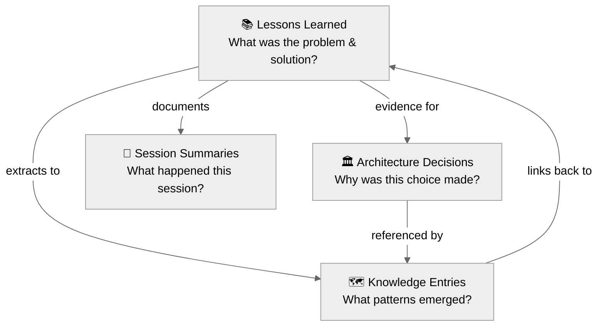
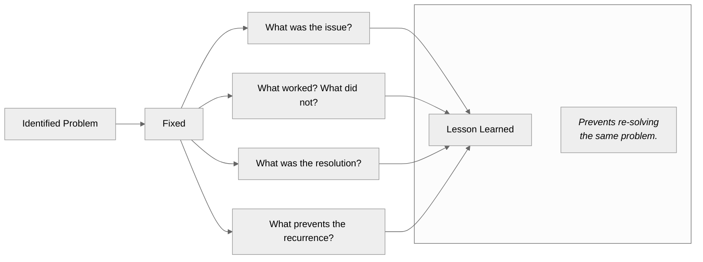
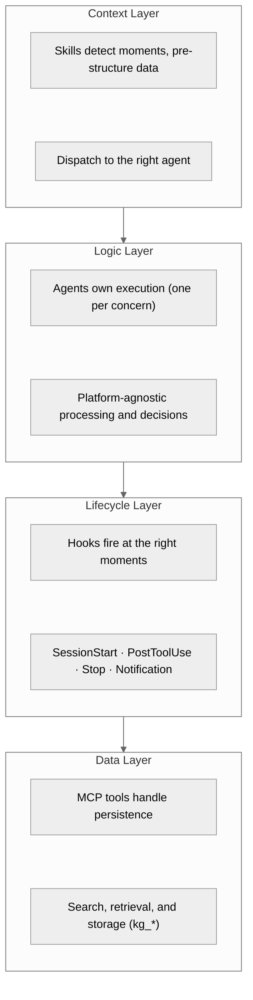
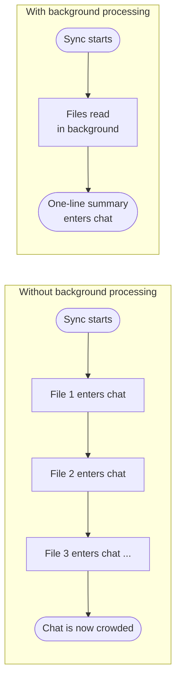
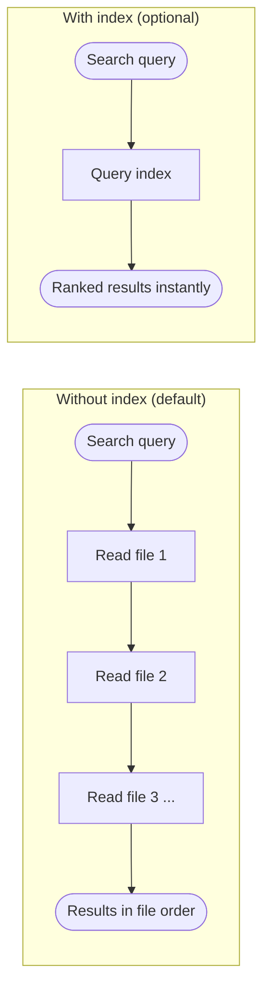
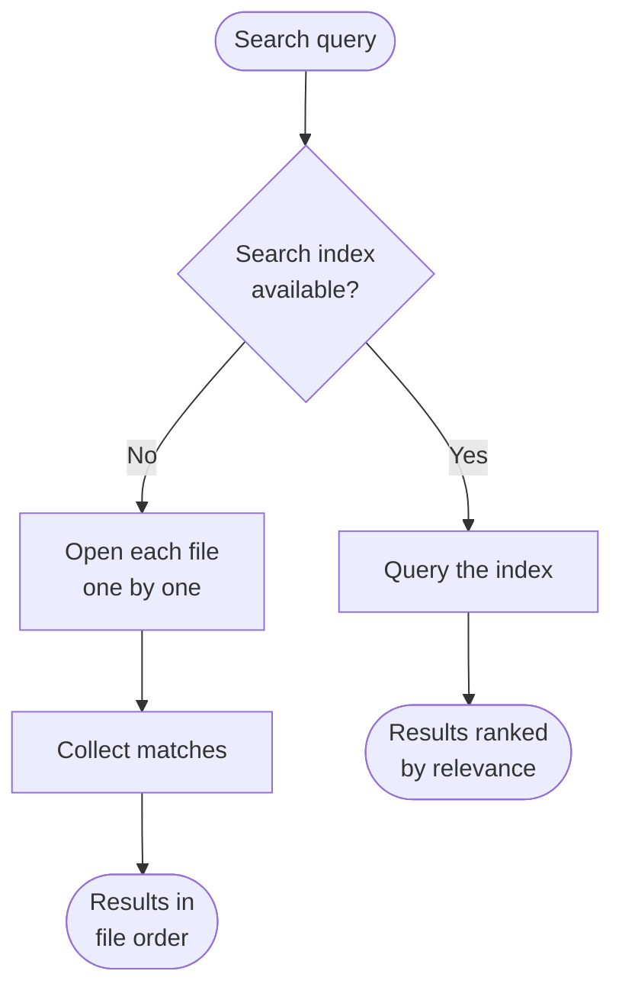
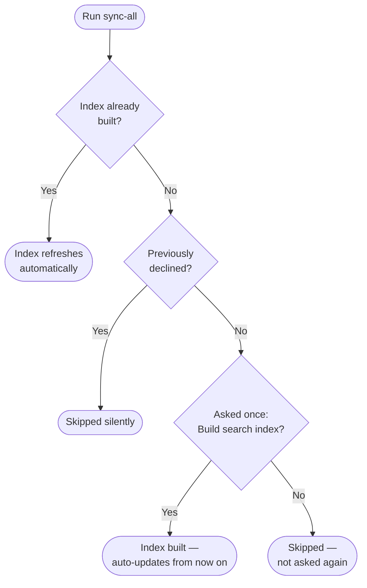

# Knowledge Graph Concepts

A plain-English guide to key terms and concepts used throughout the Knowledge Management Graph documentation. This guide explains technical terminology in accessible language, with concrete examples for each concept.

**Audience**: First-time users, non-technical team members, and anyone encountering unfamiliar terms in the documentation.

---

## What is a Knowledge Graph?

A **knowledge graph** is a structured way to organize information learned while working on projects. Unlike freeform notes, a knowledge graph uses consistent templates, links related information together, and enables fast searching across all captured learnings.

**How it works in practice**: A developer spends two hours debugging a database connection issue. Instead of that knowledge disappearing after the fix, the developer captures it as a "lesson learned." Weeks later, when a similar issue appears, a quick search surfaces the original solution in seconds.

**What makes it a "graph"**: The "graph" in knowledge graph refers to the web of connections between different pieces of knowledge:

- **Lessons** are extracted to create **knowledge entries**
- **Lessons** provide evidence that motivates **Decisions**
- **Lessons** link to the **decisions** that motivated the fix
- **Decisions** link to the **knowledge entries** that document the pattern
- **Decisions** are referenced in **knowledge entries**
- **Git metadata** links everything back to actual code changes
- **Sessions** document what was accomplished

!!! info

    - Everything links back together for future discovery

    - All artifacts remain searchable and interconnected

### Knowledge Graph vs. Regular Notes

| Feature | Regular Notes | Knowledge Graph |
|---|---|---|
| Structure | Freeform | Templated with consistent fields |
| Searchable | Sometimes | Always (by date, tag, category, full text) |
| Linked to code | Rarely | Automatic via git metadata |
| AI-readable | No | Yes (MEMORY.md syncs to AI context) |
| Team sharing | Difficult | Built-in sanitization for safe sharing |

---

## Core Components

### The Four Pillars

The knowledge graph system organizes information into four distinct types, each optimized for a different purpose. Together, these pillars form a comprehensive institutional memory.

#### The Four Pillars Relationships

Different knowledge types need different structures:

- Quick reference ≠ detailed narrative
- Formal decision ≠ informal learning
- Snapshot ≠ timeless knowledge

All four pillars work together to create a comprehensive institutional memory system:

```mermaid
%%{init: { 'flowchart': { 'useMaxWidth': true }, 'theme': 'neutral' }}%%
graph TD
    A["📚 Lessons Learned<br/>What was the problem &amp; solution?"]
    B["🏛️ Architecture Decisions<br/>Why was this choice made?"]
    C["🗺️ Knowledge Entries<br/>What patterns emerged?"]
    D["📸 Session Summaries<br/>What happened this session?"]

    A -->|evidence for| B
    A -->|extracts to| C
    A -->|documents| D
    B -->|referenced by| C
    C -->|links back to| A

    accTitle: Knowledge Graph Four Pillars
    accDescr: Relationship diagram showing how Lessons Learned provide evidence for Architecture Decisions and extract to Knowledge Entries. Decisions are referenced by Entries, which link back to Lessons. Session Summaries document what was accomplished.
```

---

#### Pillar 1: Lessons Learned

**What it is**: Detailed documentation of problems solved and how the solutions were reached.

```mermaid
%%{init: { 'flowchart': { 'useMaxWidth': true }, 'theme': 'neutral' }}%%
flowchart LR
    %% 1. Main Flow
    Problem[Identified Problem] --> Fixed[Fixed]

    %% 2. Branching: Fixed points to 4 stacked boxes
    Fixed --> Issue[What was the issue?]
    Fixed --> Analysis[What worked? What did not?]
    Fixed --> Resolution[What was the resolution?]
    Fixed --> Prevention[What prevents the recurrence?]

    %% 3. Final Step Container (Forces Vertical Stacking)
    subgraph FinalGroup [ ]
        direction TB
        Takeaway[Lesson Learned]
        %% Invisible link (~~~) pushes Caption below Takeaway
        Takeaway ~~~ Caption["<i>Prevents re-solving<br/>the same problem.</i>"]
    end

    %% 4. Converging: Middle boxes point to the Takeaway inside the subgraph
    Issue --> Takeaway
    Analysis --> Takeaway
    Resolution --> Takeaway
    Prevention --> Takeaway

```

**Location**: `/lessons-learned/` directory, organized by category.

**When to create**: After solving a non-trivial problem, discovering a useful technique, or fixing a tricky bug.

**Plain English**: A detective's case file for every problem solved.

!!! example

    "Lesson: Fixing PostgreSQL Connection Timeouts" — documents the problem, root cause, solution steps, and prevention strategies.

---

#### Pillar 2: Architecture Decision Records (ADRs)

**What it is**: Formal documentation of important technical choices and the reasoning behind each decision.

**Location**: `/decisions/` directory, numbered sequentially (ADR-001, ADR-002, etc.).

**When to create**: When making a significant choice

 — selecting a database, choosing a framework, defining an API structure
 — where future team members might ask "why did the team do it this way?"

**Plain English**: A written record of "why this choice was made" so the reasoning is never lost.

!!! example

    "ADR-003: Choosing PostgreSQL Over MongoDB" — records the context, options considered, decision made, and expected consequences.

---

#### Pillar 3: Knowledge Entries

**What it is**: Quick-reference entries that distill patterns, concepts, and common pitfalls into scannable summaries.

**Location**: `/knowledge/` directory, organized into categories:

- **patterns.md** — Reusable design patterns and best practices
- **concepts.md** — Core technical concepts and definitions
- **gotchas.md** — Common pitfalls and how to avoid each one

**When to create**: When a pattern emerges across multiple lessons, or when a concept needs a quick-reference summary.

**Relationship to lessons**: Knowledge entries are extracted from lessons. A lesson provides the full narrative; the corresponding knowledge entry provides the quick-reference summary with a link back to the lesson.

**Plain English**: Cheat sheets distilled from real experience.

---

#### Pillar 4: Session Summaries

**What it is**: Snapshot documentation of what happened during an important work session.

**Location**: `/sessions/` directory, organized by date.

**When to create**: After a significant work session — a major debugging effort, an architecture discussion, a sprint planning session.

**Plain English**: Meeting minutes for work sessions.

!!! example

    "2024-01-15 Database Migration Session" — records what was built, what was decided, what was learned, and what comes next.

---

---

<!-- Updated: 2026-03-27 -->

## Four-Layer Architecture

KMGraph separates responsibilities into four layers. Each layer handles one concern, and layers communicate in a single direction: Context feeds Logic, Logic triggers Lifecycle, and Lifecycle calls Data. This separation keeps each layer independently testable, replaceable, and portable across platforms.

```mermaid
%%{init: { 'flowchart': { 'useMaxWidth': true }, 'theme': 'neutral' }}%%
flowchart TD
    subgraph Context ["Context Layer"]
        direction TB
        C1["Skills detect moments, pre-structure data"]
        C2["Dispatch to the right agent"]
        C1 ~~~ C2
    end

    subgraph Logic ["Logic Layer"]
        direction TB
        L1["Agents own execution (one per concern)"]
        L2["Platform-agnostic processing and decisions"]
        L1 ~~~ L2
    end

    subgraph Lifecycle ["Lifecycle Layer"]
        direction TB
        F1["Hooks fire at the right moments"]
        F2["SessionStart · PostToolUse · Stop · Notification"]
        F1 ~~~ F2
    end

    subgraph Data ["Data Layer"]
        direction TB
        D1["MCP tools handle persistence"]
        D2["Search, retrieval, and storage (kg_*)"]
        D1 ~~~ D2
    end

    Context --> Logic
    Logic --> Lifecycle
    Lifecycle --> Data

    accTitle: Four-Layer Architecture
    accDescr: Flow diagram showing data moving from Context Layer (Skills) to Logic Layer (Agents) to Lifecycle Layer (Hooks) to Data Layer (MCP tools).
```

### Context Layer — Skills

Skills are auto-triggered context providers. They watch for specific moments in a conversation and respond by pre-structuring data and dispatching to the appropriate agent or command.

**What skills do:**

- Detect that a bug was just fixed and suggest capturing a lesson
- Recognize a search intent and guide the user toward the right query
- Notice a session ending and prompt for a summary
- Identify an architecture decision being made and suggest an ADR

**Why a separate layer:** Skills decouple *when to act* from *how to act*. Adding a new trigger (for example, detecting a performance regression) requires only a new skill file — no changes to agents, hooks, or MCP tools.

**Location:** `skills/` directory. See [Command Reference](COMMAND-GUIDE.md) for command dispatching examples.

### Logic Layer — Agents

Agents are subagent definitions that own execution logic. Each agent handles one concern: the knowledge-extractor parses files, the session-documenter performs git archaeology. Agents receive structured input from skills and produce structured output for hooks and MCP tools.

**What agents do:**

- Parse large files and extract knowledge graph entries (knowledge-extractor)
- Walk git history to build session summaries (session-documenter)
- Execute plans with zero-deviation constraints (gov-execute-plan skill dispatches to agents)

**Why a separate layer:** Agents are platform-agnostic. They receive data and return results without knowing whether the caller is Claude Code, Cursor, or a manual workflow. This makes the system portable — swapping the host platform changes only the Context Layer, not the Logic Layer.

**Location:** `agents/` directory. Each agent definition specifies its inputs, outputs, and approval gates.

### Lifecycle Layer — Hooks

Hooks automate actions at specific moments in the tool lifecycle. They fire on system events rather than conversational cues, handling work that should happen reliably and without user prompting.

**Hook events and their purposes:**

| Event | When it fires | Typical use |
|---|---|---|
| SessionStart | A new session begins | Load MEMORY.md, sync knowledge graph state |
| PostToolUse | After a tool completes | Validate outputs, trigger follow-up actions |
| Stop | Session is ending | Prompt for session summary if work was done |
| PreToolUse | Before a tool executes | Check preconditions, validate inputs |
| Notification | System event occurs | Alert on sync failures or stale data |

**Why a separate layer:** Hooks guarantee that critical automation runs regardless of conversational flow. A skill might not fire if the user does not mention the right topic, but a SessionStart hook always runs. This reliability layer ensures consistency across sessions.

**Location:** `hooks/hooks.json` defines the hook registry and event bindings.

### Data Layer — MCP Tools

MCP (Model Context Protocol) tools handle all persistence, search, and retrieval. Every tool in this layer follows the `kg_*` naming convention and operates through a cross-platform server.

**What MCP tools do:**

- `kg_search` — Query the knowledge graph by text, tags, or category
- `kg_scaffold` — Create new knowledge graph entries from templates
- `kg_config_*` — Manage configuration (init, list, switch, add category)
- `kg_fts5_rebuild` — Build or refresh the full-text search index
- `kg_check_sensitive` — Scan entries for sensitive content before sharing

**Why a separate layer:** Data operations are the most platform-dependent part of the system. By isolating them behind MCP, the same tools work identically whether called from Claude Code, a Python script, or any MCP-compatible client. The Logic and Lifecycle layers never touch the filesystem directly — they call MCP tools.

**Location:** `mcp-server/` directory (TypeScript/Node.js implementation).

### How the Layers Interact

A typical flow moves through all four layers in sequence:

1. **Context:** The lesson-capture skill detects that a bug was just fixed and pre-structures the problem description, root cause, and fix.
2. **Logic:** The knowledge-extractor agent validates the structured data, identifies related existing entries, and prepares the final lesson content.
3. **Lifecycle:** A PostToolUse hook fires after the lesson is created, triggering a MEMORY.md sync and search index update.
4. **Data:** MCP tools (`kg_scaffold`, `kg_fts5_rebuild`) write the lesson file and update the search index.

Each layer depends only on the layer below it. Skills never call MCP tools directly. Agents never register hooks. This strict layering means any single layer can be replaced — for example, swapping the MCP server implementation from TypeScript to Python — without affecting the layers above.

### Why This Separation Matters

| Benefit | How the architecture delivers it |
|---|---|
| **Maintainability** | Each layer has a single responsibility. Bug in search? Fix the Data Layer. Trigger firing at the wrong time? Fix the Context Layer. |
| **Platform portability** | Only the Context Layer is platform-specific. The remaining three layers work on any host that supports MCP. |
| **Automation reliability** | The Lifecycle Layer guarantees critical actions run on every session, independent of conversational flow. |
| **Testability** | Layers can be tested in isolation. Mock the Data Layer to test Logic. Mock Logic to test Context. |

For detailed command dispatching and execution examples, see [Command Reference](COMMAND-GUIDE.md). For system design and data flow diagrams, see [Architecture Guide](reference/ARCHITECTURE.md).

---

## Keeping the Conversation Focused

When kmgraph syncs or updates the knowledge graph, it reads files to do its work. In a large knowledge graph, that means a lot of content entering the conversation at once — content that stays in memory even after the work is done. The context-mode plugin, when installed, moves that file-reading to a background process. Only a short summary returns to the conversation. The knowledge graph gets updated the same way — the conversation just stays cleaner.

The diagram below illustrates the difference between reading files inline versus in a background process.

```mermaid
flowchart LR
    subgraph inline ["Without background processing"]
        direction TB
        W1([Sync starts]) --> W2[File 1 enters chat]
        W2 --> W3[File 2 enters chat]
        W3 --> W4[File 3 enters chat ...]
        W4 --> W5([Chat is now crowded])
    end
    subgraph background ["With background processing"]
        direction TB
        B1([Sync starts]) --> B2[Files read\nin background]
        B2 --> B3([One-line summary\nenters chat])
    end
```

Both approaches produce identical results. Background processing is optional and activates automatically when the context-mode plugin is installed. No configuration is required.

---

## Global vs Project-Local Knowledge

<!-- Updated: 2026-03-29 -->

Every knowledge graph belongs to one of two scopes: **project-local** or **global**.

### Project-Local KG

A project-local KG lives inside a project's directory (typically `./docs/`). It contains knowledge specific to that project:

- Bug fixes and workarounds found in this codebase
- Architecture decisions for this system
- Debugging sessions for this project's stack

**Best for**: Anything that only makes sense in the context of one project.

### Global (Personal) KG

A global KG lives at `~/.claude/knowledge-graph/` and is accessible from any project. It contains cross-project patterns and lessons:

- Workflow habits ("Create vs Update in implementation plans")
- Tool quirks that appear across projects (MCP registration, IDE setup)
- Personal ADRs ("Why I prefer TypeScript strict mode")
- Reusable checklists and process patterns

**Best for**: Knowledge that would apply identically in your next project.

### How They Work Together

| Behavior | Detail |
|---|---|
| **`/kmgraph:recall`** | Searches both KGs automatically when a global KG is registered. Results show `[project]` or `[global]` source labels. |
| **`/kmgraph:capture-lesson`** | Shows a KG picker when ≥2 KGs are registered. Only one prompt per session (choice remembered). |
| **SessionStart hook** | Surfaces recent global KG lessons alongside project lessons. |
| **Active KG** | Unchanged by global KG setup — project KG stays active for new captures by default. |

### When to Use Global vs Local

| Situation | Save to |
|---|---|
| "I fixed a bug specific to this repo" | Project KG |
| "I learned a general debugging pattern" | Global KG |
| "We decided to use Redis for this project" | Project KG |
| "I always prefer feature flags over config files" | Global KG |
| "This MCP registration quirk affects all IDEs" | Global KG |

### Setup

- **During init**: `/kmgraph:init` offers to create a global KG at the end of setup
- **Standalone**: `/kmgraph:init-global-kg` creates and registers the global KG at any time

See [COMMAND-GUIDE.md § init-global-kg](COMMAND-GUIDE.md#-kgsisinitglobalkg-commands-tab) for setup details.

---

## How Search Works

When a search is run, kmgraph needs to match the query against everything in the knowledge graph. There are two ways to do this. The first is to open each file one by one and check whether the query appears — straightforward, but slower as the knowledge graph grows, and results are sorted by where the match appeared in the file rather than how relevant the file is. The second is to maintain a search index: a compact catalog built from all the files that can be queried directly. The index returns results ranked by relevance — files that closely match the query float to the top. The index is optional and kept current automatically.

The diagram below compares search without and with the index.

```mermaid
flowchart LR
    subgraph without ["Without index (default)"]
        direction TB
        S1([Search query]) --> F1[Read file 1]
        F1 --> F2[Read file 2]
        F2 --> F3[Read file 3 ...]
        F3 --> R1([Results in file order])
    end
    subgraph with ["With index (optional)"]
        direction TB
        S2([Search query]) --> I[Query index]
        I --> R2([Ranked results instantly])
    end
```

Without an index, kmgraph reads each file in the knowledge graph sequentially. With an index, a single query returns results sorted by relevance. Both methods return the same files — the index is faster and ranks more relevant matches higher.

The diagram below shows the two search paths in detail.

```mermaid
flowchart TD
    A([Search query]) --> B{Search index\navailable?}

    B -- No --> C[Open each file\none by one]
    C --> D[Collect matches]
    D --> E([Results in\nfile order])

    B -- Yes --> F[Query the index]
    F --> G([Results ranked\nby relevance])
```

Both paths return results from the same knowledge graph files. The difference is speed and ranking: the indexed path is faster for large knowledge graphs and surfaces the most relevant results first. The index is built once and updated automatically during sync.

The search label `(FTS5)` in results means the index was used. FTS5 stands for Full-Text Search version 5 — the underlying search technology. The label can be ignored; it is there for users who want to know which path was taken.

### How to Enable the Search Index

The index is off by default and takes about a second to build. Once enabled, it stays current automatically — no maintenance required.

The first time `/kmgraph:sync-all` is run, it will ask once whether to build the index. Answer yes and the index builds automatically. After that, every `sync-all` run keeps it current with no prompts.

To build the index at any time without running sync-all: call `kg_fts5_rebuild` from the MCP tool panel.

The diagram below shows what happens the first time sync-all is run after upgrading.

```mermaid
flowchart TD
    A([Run sync-all]) --> B{Index already\nbuilt?}
    B -- Yes --> C([Index refreshes\nautomatically])
    B -- No --> D{Previously\ndeclined?}
    D -- Yes --> E([Skipped silently])
    D -- No --> F{Asked once:\nBuild search index?}
    F -- Yes --> G([Index built —\nauto-updates from now on])
    F -- No --> H([Skipped —\nnot asked again])
```

If a search index already exists, sync-all refreshes it automatically with no prompt. If no index exists and the user has not previously declined, sync-all asks once. The preference is remembered — users are never asked again regardless of the answer.

- **How to tell it is active**: search results show `(FTS5)` — this means the index was used
- **How to re-enable after declining**: run `kg_fts5_rebuild` directly
- **How to revert**: delete the `.fts5.db` file from the knowledge graph root folder

---

## Common Questions

### "Is git required to use the knowledge graph?"

Git is recommended but not required. When running inside a git repository, the system automatically captures branch, commit, and PR information as metadata. Without git, the knowledge graph still functions — lessons can be created and searched — but automatic git metadata linking is unavailable.

### "What is the difference between a lesson and a decision (ADR)?"

**Lesson Learned**: Tactical documentation — *how* a problem was solved.
- "The database timed out because the connection pool was exhausted. The fix involved increasing the pool size and adding connection recycling."

**Architecture Decision Record**: Strategic documentation — *why* a choice was made.
- "The team chose PostgreSQL over MongoDB because the data model is highly relational and ACID compliance is a requirement."

Both types are valuable. Lessons capture problem-solving journeys. Decisions capture the reasoning behind architectural choices.

### "Can the knowledge graph be used without Claude Code?"

Yes. The core system (`core/` directory) is platform-agnostic and works with:

- **Manual workflows** — Copy templates, edit by hand, commit to git
- **Other AI assistants** — Cursor, Continue, Aider, or any tool that reads markdown
- **Python scripts** — Included in `core/scripts/` for standalone operations
- **MCP server** — Exposes knowledge as resources accessible from any MCP-compatible platform

Claude Code provides automation (slash commands, auto-fill, hooks). Without Claude Code, the same operations are performed manually using the templates and workflows documented in `core/docs/WORKFLOWS.md`.

### "How does the knowledge graph compare to regular note-taking?"

Regular notes are freeform and often lost or forgotten. A knowledge graph adds structure, searchability, and connections:

- **Consistent structure** — Templates ensure nothing important is missed
- **Searchable** — Every entry is findable by date, tag, category, or full text
- **Connected** — Cross-references link related documents into a navigable network
- **Git-linked** — Lessons connect back to actual code changes
- **AI-integrated** — Key patterns sync to MEMORY.md for cross-session persistence

### "What happens when MEMORY.md gets too large?"

MEMORY.md works best under 200 lines. When it grows beyond that threshold:

1. Run `/kmgraph:archive-memory` to move older entries to `MEMORY-archive.md`
2. Archived entries remain available for reference but no longer load into AI context
3. Run `/kmgraph:restore-memory` to bring back any archived entry when needed

---

## Next Steps

- **[Getting Started](GETTING-STARTED.md)**

  New to the system? Follow the installation and first lesson walkthrough.

- **[Command Reference](COMMAND-GUIDE.md)**

  Ready to explore all commands? Detailed documentation with examples and learning path.

- **[Architecture Guide](reference/ARCHITECTURE.md)**

  Want to understand how it works? Learn system design, patterns, and implementation details.

---

## Related Documentation

### **Getting started**

- [Getting Started Guide](GETTING-STARTED.md)

  Installation, setup, first lesson walkthrough

- [Installation](INSTALL.md)

  Universal installer for all platforms

- [Quick Reference](CHEAT-SHEET.md)

  One-page cheat sheet for commands

### **Learning**

- [Command Reference](COMMAND-GUIDE.md)

  All commands with detailed documentation and examples

- [Configuration Guide](CONFIGURATION.md)

  Post-install setup and customization

- [Examples](examples/)

  Real-world lesson, ADR, and KG entry examples

### **Advanced**

- [Architecture Guide](reference/ARCHITECTURE.md)

  System design, data flow, and patterns

- [Pattern Writing Guide](reference/PATTERNS-GUIDE.md)

  How to write high-quality knowledge entries

- [Manual Workflows](reference/WORKFLOWS.md)

  Step-by-step guides for non-Claude platforms

- [Platform Adaptation](reference/PLATFORM-ADAPTATION.md)

  Integration for different IDEs and LLMs

- [Style Guide](STYLE-GUIDE.md)

  Documentation authoring standards

---

**Version**: 0.2.2-beta
**Last Updated**: 2026-03-29
