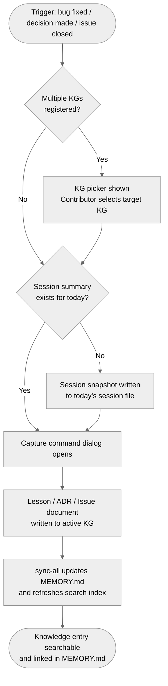

## What is a Knowledge Graph?

A **knowledge graph** is a structured way to organize information learned while working on projects. Unlike freeform notes, a knowledge graph uses consistent templates, links related information together, and enables fast searching across all captured learnings.

**How it works in practice**: A developer spends two hours debugging a database connection issue. Instead of that knowledge disappearing after the fix, the developer captures it as a "lesson learned." Weeks later, when a similar issue appears, a quick search surfaces the original solution in seconds.

**What makes it a "graph"**: The "graph" in knowledge graph refers to the web of connections between different pieces of knowledge:

- **Lessons** are extracted to create **knowledge entries**
- **Lessons** provide evidence that motivates **Decisions**
- **Lessons** link to the **decisions** that motivated the fix
- **Decisions** link to the **knowledge entries** that document the pattern
- **Decisions** are referenced in **knowledge entries**
- **Git metadata** links everything back to actual code changes
- **Sessions** document what was accomplished

### Knowledge Graph vs. Regular Notes

| Feature | Regular Notes | Knowledge Graph |
|---|---|---|
| Structure | Freeform | Templated with consistent fields |
| Searchable | Sometimes | Always (by date, tag, category, full text) |
| Linked to code | Rarely | Automatic via git metadata |
| AI-readable | No | Yes (MEMORY.md syncs to AI context) |
| Team sharing | Difficult | Built-in sanitization for safe sharing |

---

## Keeping the Conversation Focused

When kmgraph syncs or updates the knowledge graph, it reads files to do its work. In a large knowledge graph, that means a lot of content entering the conversation at once — content that stays in memory even after the work is done. The context-mode plugin, when installed, moves that file-reading to a background process. Only a short summary returns to the conversation. The knowledge graph gets updated the same way — the conversation just stays cleaner.

The diagram below illustrates the difference between reading files inline versus in a background process.

```mermaid
flowchart LR
    subgraph inline ["Without background processing"]
        direction TB
        W1([Sync starts]) --> W2[File 1 enters chat]
        W2 --> W3[File 2 enters chat]
        W3 --> W4[File 3 enters chat ...]
        W4 --> W5([Chat is now crowded])
    end
    subgraph background ["With background processing"]
        direction TB
        B1([Sync starts]) --> B2[Files read\nin background]
        B2 --> B3([One-line summary\nenters chat])
    end
```

Both approaches produce identical results. Background processing is optional and activates automatically when the context-mode plugin is installed. No configuration is required.

---

## Knowledge capture workflow

The capture workflow describes the sequence of events from a trigger moment to a committed knowledge entry. The diagram below shows each decision point a contributor encounters when running a capture command.

The two branching decisions — KG picker and snapshot gate — resolve before the capture dialog opens. The KG picker appears only when multiple knowledge graphs are registered; the snapshot gate appears only when no session summary exists for the current day.

```mermaid
%%{init: { 'flowchart': { 'useMaxWidth': true }, 'theme': 'neutral' }}%%
flowchart TD
    A([Trigger: bug fixed / decision made / issue closed]) --> B{Multiple KGs\nregistered?}
    B -- Yes --> C[KG picker shown\nContributor selects target KG]
    B -- No --> D{Session summary\nexists for today?}
    C --> D
    D -- No --> E[Session snapshot written\nto today's session file]
    D -- Yes --> F[Capture command dialog opens]
    E --> F
    F --> G[Lesson / ADR / Issue document\nwritten to active KG]
    G --> H[sync-all updates MEMORY.md\nand refreshes search index]
    H --> I([Knowledge entry searchable\nand linked in MEMORY.md])

    accTitle: Knowledge capture workflow
    accDescr: Flowchart showing capture trigger, KG picker decision, snapshot gate decision, capture dialog, document write, and sync steps.
```

The capture commands that follow this workflow are `/kmgraph:capture-lesson`, `/kmgraph:create-adr`, and `/kmgraph:start-issue-tracking`. Each command enters the workflow at the same trigger point and follows identical branching logic.

---

## Common Questions

### "Is git required to use the knowledge graph?"

Git is recommended but not required. When running inside a git repository, the system automatically captures branch, commit, and PR information as metadata. Without git, the knowledge graph still functions — lessons can be created and searched — but automatic git metadata linking is unavailable.

### "What is the difference between a lesson and a decision (ADR)?"

**Lesson Learned**: Tactical documentation — *how* a problem was solved.
- "The database timed out because the connection pool was exhausted. The fix involved increasing the pool size and adding connection recycling."

**Architecture Decision Record**: Strategic documentation — *why* a choice was made.
- "The team chose PostgreSQL over MongoDB because the data model is highly relational and ACID compliance is a requirement."

Both types are valuable. Lessons capture problem-solving journeys. Decisions capture the reasoning behind architectural choices.

### "Can the knowledge graph be used without Claude Code?"

Yes. The core system (`core/` directory) is platform-agnostic and works with:

- **Manual workflows** — Copy templates, edit by hand, commit to git
- **Other AI assistants** — Cursor, Continue, Aider, or any tool that reads markdown
- **Python scripts** — Included in `core/scripts/` for standalone operations
- **MCP server** — Exposes knowledge as resources accessible from any MCP-compatible platform

Claude Code provides automation (slash commands, auto-fill, hooks). Without Claude Code, the same operations are performed manually using the templates and workflows documented in `core/docs/WORKFLOWS.md`.

### "How does the knowledge graph compare to regular note-taking?"

Regular notes are freeform and often lost or forgotten. A knowledge graph adds structure, searchability, and connections:

- **Consistent structure** — Templates ensure nothing important is missed
- **Searchable** — Every entry is findable by date, tag, category, or full text
- **Connected** — Cross-references link related documents into a navigable network
- **Git-linked** — Lessons connect back to actual code changes
- **AI-integrated** — Key patterns sync to MEMORY.md for cross-session persistence

### "How do cross-references work?"

Cross-references in the knowledge graph follow the Obsidian wiki link convention (`[[...]]`), which enables navigation in compatible editors:

- **Enhancements**: `[[ENH-010]]`
- **Architecture Decisions**: `[[ADR-028-postgres-over-mongodb]]` (includes full filename for clarity)
- **Lessons**: `[[Lessons_Learned_5]]`
- **GitHub Issues**: Linked via `/kmgraph:link-issue` (generates `[#NNN](url)` format)

These formats are automatically applied during knowledge graph initialization (see `/kmgraph:init` and `/kmgraph:init-personal-kg`). Once applied, cross-references become clickable links in Obsidian and other tools that support wiki link syntax.

### "What happens when MEMORY.md gets too large?"

MEMORY.md works best under 200 lines. When it grows beyond that threshold:

1. Run `/kmgraph:archive-memory` to move older entries to `MEMORY-archive.md`
2. Archived entries remain available for reference but no longer load into AI context
3. Run `/kmgraph:restore-memory` to bring back any archived entry when needed

---

## Next Steps

- **[Getting Started](GETTING-STARTED.md)**

  New to the system? Follow the installation and first lesson walkthrough.

- **[Command Reference](COMMAND-GUIDE.md)**

  Ready to explore all commands? Detailed documentation with examples and learning path.

- **[Architecture Guide](reference/ARCHITECTURE.md)**

  Want to understand how it works? Learn system design, patterns, and implementation details.

---

## Related Documentation

### **Getting started**

- [Getting Started Guide](GETTING-STARTED.md)

  Installation, setup, first lesson walkthrough

- [Installation](INSTALL.md)

  Universal installer for all platforms

- [Quick Reference](CHEAT-SHEET.md)

  One-page cheat sheet for commands

### **Learning**

- [Command Reference](COMMAND-GUIDE.md)

  All commands with detailed documentation and examples

- [Configuration Guide](CONFIGURATION.md)

  Post-install setup and customization

- [Examples](examples/)

  Real-world lesson, ADR, and KG entry examples

### **Advanced**

- [Architecture Guide](reference/ARCHITECTURE.md)

  System design, data flow, and patterns

- [Pattern Writing Guide](reference/PATTERNS-GUIDE.md)

  How to write high-quality knowledge entries

- [Manual Workflows](reference/WORKFLOWS.md)

  Step-by-step guides for non-Claude platforms

- [Platform Adaptation](reference/PLATFORM-ADAPTATION.md)

  Integration for different IDEs and LLMs

- [Style Guide](STYLE-GUIDE.md)

  Documentation authoring standards

---

**Version**: 0.2.3.4-beta
**Last Updated**: 2026-04-07
