# Knowledge Graph Concepts

A plain-English guide to key terms and concepts used throughout the Knowledge Management Graph documentation. This guide explains technical terminology in accessible language, with concrete examples for each concept.

**Audience**: First-time users, non-technical team members, and anyone encountering unfamiliar terms in the documentation.

---

## What is a Knowledge Graph?

A **knowledge graph** is a structured way to organize information learned while working on projects. Unlike freeform notes, a knowledge graph uses consistent templates, links related information together, and enables fast searching across all captured learnings.

**How it works in practice**: A developer spends two hours debugging a database connection issue. Instead of that knowledge disappearing after the fix, the developer captures it as a "lesson learned." Weeks later, when a similar issue appears, a quick search surfaces the original solution in seconds.

**What makes it a "graph"**: The "graph" in knowledge graph refers to the web of connections between different pieces of knowledge:

- Lessons link to the decisions that motivated the fix
- Decisions link to the knowledge entries that document the pattern
- Git metadata links everything back to actual code changes
- All artifacts remain searchable and interconnected

### Knowledge Graph vs. Regular Notes

| Feature | Regular Notes | Knowledge Graph |
|---|---|---|
| Structure | Freeform | Templated with consistent fields |
| Searchable | Sometimes | Always (by date, tag, category, full text) |
| Linked to code | Rarely | Automatic via git metadata |
| AI-readable | No | Yes (MEMORY.md syncs to AI context) |
| Team sharing | Difficult | Built-in sanitization for safe sharing |

---

## Core Components

### The Four Pillars

The knowledge graph system organizes information into four distinct types, each optimized for a different purpose. Together, these pillars form a comprehensive institutional memory.

#### The Four Pillars Relationships

All four pillars work together to create a comprehensive institutional memory system:

```mermaid
%%{init: { 'flowchart': { 'useMaxWidth': true }, 'theme': 'neutral' }}%%
graph TD
    A["📚 Lessons Learned<br/>What was the problem &amp; solution?"]
    B["🏛️ Architecture Decisions<br/>Why was this choice made?"]
    C["🗺️ Knowledge Entries<br/>What patterns emerged?"]
    D["📸 Session Summaries<br/>What happened this session?"]

    A -->|evidence for| B
    A -->|extracts to| C
    A -->|documents| D
    B -->|referenced by| C
    C -->|links back to| A

    accTitle: Knowledge Graph Four Pillars
    accDescr: Relationship diagram showing how Lessons Learned provide evidence for Architecture Decisions and extract to Knowledge Entries. Decisions are referenced by Entries, which link back to Lessons. Session Summaries document what was accomplished.
```



**How they connect:**
- Lessons provide evidence that motivates Decisions
- Lessons are extracted to create Knowledge entries
- Decisions are referenced in Knowledge entries
- Sessions document what was accomplished
- Everything links back together for future discovery

---

#### Pillar 1: Lessons Learned

**What it is**: Detailed documentation of problems solved and how the solutions were reached.

**Location**: `/lessons-learned/` directory, organized by category.

**When to create**: After solving a non-trivial problem, discovering a useful technique, or fixing a tricky bug.

**Example**: "Lesson: Fixing PostgreSQL Connection Timeouts" — documents the problem, root cause, solution steps, and prevention strategies.

**Plain English**: A detective's case file for every problem solved.

---

#### Pillar 2: Architecture Decision Records (ADRs)

**What it is**: Formal documentation of important technical choices and the reasoning behind each decision.

**Location**: `/decisions/` directory, numbered sequentially (ADR-001, ADR-002, etc.).

**When to create**: When making a significant choice — selecting a database, choosing a framework, defining an API structure — where future team members might ask "why did the team do it this way?"

**Example**: "ADR-003: Choosing PostgreSQL Over MongoDB" — records the context, options considered, decision made, and expected consequences.

**Plain English**: A written record of "why this choice was made" so the reasoning is never lost.

---

#### Pillar 3: Knowledge Entries

**What it is**: Quick-reference entries that distill patterns, concepts, and common pitfalls into scannable summaries.

**Location**: `/knowledge/` directory, organized into categories:
- **patterns.md** — Reusable design patterns and best practices
- **concepts.md** — Core technical concepts and definitions
- **gotchas.md** — Common pitfalls and how to avoid each one

**When to create**: When a pattern emerges across multiple lessons, or when a concept needs a quick-reference summary.

**Relationship to lessons**: Knowledge entries are extracted from lessons. A lesson provides the full narrative; the corresponding knowledge entry provides the quick-reference summary with a link back to the lesson.

**Plain English**: Cheat sheets distilled from real experience.

---

#### Pillar 4: Session Summaries

**What it is**: Snapshot documentation of what happened during an important work session.

**Location**: `/sessions/` directory, organized by date.

**When to create**: After a significant work session — a major debugging effort, an architecture discussion, a sprint planning session.

**Example**: "2024-01-15 Database Migration Session" — records what was built, what was decided, what was learned, and what comes next.

**Plain English**: Meeting minutes for work sessions.

---

## Key Terms

### Active Knowledge Graph (Active KG)

**What it is**: The currently selected knowledge graph when multiple graphs exist in the system configuration.

**Why it matters**: Users working across multiple projects may maintain separate knowledge graphs for each one (e.g., one for a web app, another for an infrastructure project). Commands operate on whichever graph is currently active.

**How to manage**: The `/kmgraph:list` command displays all configured graphs. The `/kmgraph:switch` command changes the active selection.

**Plain English**: The "currently open notebook" when multiple notebooks exist.

---

### ADR (Architecture Decision Record)

**What it is**: A structured document that captures an important technical decision along with the context, alternatives considered, and reasoning.

**Format**: Each ADR follows a standard template with sections for Status, Context, Decision, and Consequences. ADRs are numbered sequentially (ADR-001, ADR-002, etc.).

**When to write one**: When a decision is significant enough that a future team member might ask "why was this done this way?" — choosing a technology, defining an API contract, selecting a deployment strategy.

**Example**: "ADR-007: Use Markdown for Knowledge Storage" — records why markdown was chosen over a database, wiki, or proprietary format.

**Plain English**: A written "decision receipt" that preserves not just what was decided, but why.

---

### Bidirectional Links

**What it is**: Cross-references that connect two documents in both directions. When Document A links to Document B, Document B also links back to Document A.

**Why it matters**: Bidirectional links create a navigable web of knowledge. Starting from any entry, related information is always one click away.

**Example**: A lesson about database timeouts links to a pattern entry about connection pooling. The connection pooling pattern links back to the timeout lesson. Starting from either document leads to the other.

**Link notation used**: `[[filename.md]]` for document links, `[[filename.md#section]]` for links to specific sections.

**Plain English**: Two-way street signs between related documents.

---

### Category

**What it is**: A classification label that groups lessons by topic. The system includes four default categories:

| Category | Description | Example Lesson |
|---|---|---|
| **architecture** | System design, component structure, integration | "Microservices vs. Monolith Decision" |
| **process** | Workflow improvements, tools, procedures | "Setting Up Pre-Commit Hooks" |
| **patterns** | Reusable design patterns, best practices | "Retry Pattern for API Calls" |
| **debugging** | Troubleshooting, bug fixes, root cause analysis | "Solving Memory Leak in Node.js" |

**Custom categories**: The `/kmgraph:add-category` command allows adding project-specific categories beyond the four defaults.

**Auto-detection**: When using the `/kmgraph:capture-lesson` command, the system suggests a category based on keywords in the lesson title and content. The suggestion can be accepted or overridden.

**Plain English**: Filing cabinet labels that organize lessons by topic.

---

### Cross-References

**What it is**: Links between knowledge artifacts that create connections across the knowledge graph. Cross-references appear in a dedicated section of each document.

**Types of cross-references**:
- Lesson → Pattern (lesson discovered this pattern)
- Pattern → Lesson (pattern was documented in this lesson)
- ADR → Lesson (decision was motivated by this lesson)
- Gotcha → Lesson (pitfall was first encountered in this lesson)

**Why cross-references matter**: Without connections, each document exists in isolation. With cross-references, the knowledge graph becomes a navigable network where related information is always accessible.

**Plain English**: Hyperlinks between related documents that make the "graph" in knowledge graph.

---

### Git Metadata

**What it is**: Information about code changes automatically captured when a lesson or ADR is created. Git metadata connects documentation to the actual code that prompted each learning.

**Fields captured**:

| Field | Description | Example |
|---|---|---|
| `git.branch` | The git branch active at creation time | `feature/add-pooling` |
| `git.commit` | The most recent commit hash | `a1b2c3d` |
| `git.pr` | Pull request number, if detectable | `#42` or `null` |
| `git.issue` | GitHub issue number, if detectable | `#15` or `null` |

**Why it matters**: Git metadata creates a breadcrumb trail from documentation back to code. When reviewing a lesson months later, the linked commit and PR provide direct access to the actual code changes.

**How it works**: When running inside a git repository, the `/kmgraph:capture-lesson` command automatically detects and records these fields. No manual entry is required.

**Plain English**: A breadcrumb trail connecting lessons back to actual code changes.

---

### GitHub Issue

**What it is**: A tracking item on GitHub used to report bugs, request features, or plan enhancements. In the knowledge graph context, "issue" refers specifically to GitHub Issues — not general problems or troubleshooting concerns.

**Relationship to knowledge graph**: Lessons and ADRs can be linked to GitHub issues via the `/kmgraph:link-issue` command, creating bidirectional traceability between documentation and project management.

**Disambiguation**: When the documentation mentions "issues," it refers to GitHub Issues (bug reports or feature requests), not to "issues" in the general sense of problems or difficulties.

**Plain English**: A GitHub tracking ticket (bug report or feature request) that can be linked to lessons and decisions.

---

### ISO 8601

**What it is**: An international standard for representing dates and times in an unambiguous format: `YYYY-MM-DDTHH:MM:SSZ`.

**Why this format**: Standard date formats like "01/02/2024" are ambiguous (January 2nd or February 1st?). ISO 8601 eliminates ambiguity and sorts correctly in file systems.

**How to read it**:

| Component | Meaning | Example |
|---|---|---|
| `YYYY-MM-DD` | Year-Month-Day | `2024-01-15` |
| `T` | Separator between date and time | — |
| `HH:MM:SS` | Hours:Minutes:Seconds (24-hour) | `14:30:00` |
| `Z` | UTC timezone indicator | — |

**Full example**: `2024-01-15T14:30:00Z` = January 15, 2024 at 2:30 PM UTC.

**In templates**: Date fields use this format. The `/kmgraph:capture-lesson` command fills timestamps automatically. Manual users can use the date-only form: `2024-01-15`.

**Plain English**: Year-Month-Day format that computers and humans both read consistently.

---

### Lesson Learned

**What it is**: A structured document that captures a problem-solving experience — what the problem was, what caused it, how it was solved, and how to prevent it in the future.

**Structure**: Each lesson follows a template with these sections:
1. **Problem** — What went wrong or what needed to be figured out
2. **Root Cause** — The underlying reason for the problem
3. **Solution** — Step-by-step description of the fix
4. **Prevention** — How to avoid the same problem in the future
5. **Key Takeaways** — Concise lessons for quick reference

**How to create one**: Claude Code users run `/kmgraph:capture-lesson`. Manual users copy the lesson template from `core/templates/lessons-learned/lesson-template.md` and fill in each section.

**When to write one**: After solving any non-trivial problem. The best time to document is immediately after solving the problem, while details are fresh.

**Plain English**: A structured "here's what happened and how it was fixed" document.

---

### MCP Server

**What it is**: MCP stands for **Model Context Protocol** — an open standard that allows AI assistants to access external tools and data sources. The knowledge graph includes an MCP server that exposes knowledge data as searchable resources.

**Why it matters**: The MCP server allows any MCP-compatible AI assistant (not just Claude Code) to search and read knowledge graph entries. This makes the knowledge graph accessible from multiple platforms.

**What it provides**:
- **Tools**: Search knowledge, list entries, read specific documents
- **Resources**: Direct access to knowledge graph files

**Who needs it**: The MCP server is most relevant for advanced users integrating the knowledge graph with non-Claude platforms or building custom tooling. Claude Code users interact through slash commands instead.

**Plain English**: A universal adapter that lets any compatible AI assistant access the knowledge graph.

---

### MEMORY.md

**What it is**: A special file that persists the most important learnings and patterns into the AI assistant's long-term context. Claude reads MEMORY.md at the start of every session.

**Location**: `/MEMORY.md` at the root of the knowledge graph directory.

**How it works**:
1. Lessons and patterns accumulate over time
2. The `/kmgraph:update-graph` command extracts the most important insights
3. Key patterns are written to MEMORY.md
4. Claude loads MEMORY.md at the start of each session
5. Claude "remembers" documented patterns without being reminded

**Why it exists**: AI assistant context resets between sessions. MEMORY.md bridges that gap by ensuring key learnings persist across conversations.

**Size management**: MEMORY.md works best under 200 lines. When it grows too large, the `/kmgraph:archive-memory` command moves older entries to `MEMORY-archive.md`. Archived entries can be restored with `/kmgraph:restore-memory`.

**Plain English**: The AI assistant's long-term memory file — ensures important learnings survive between sessions.

---

### Meta-Issue

**What it is**: A structured tracking system for complex problems that require multiple attempts to solve. Unlike a single lesson, a meta-issue documents an entire investigation across days or weeks.

**When to use**: When a problem has not been resolved after two or three attempts and the root cause understanding keeps evolving.

**Structure**: A meta-issue lives in its own directory:
- `description.md` — The problem description (updated as understanding evolves)
- `attempts/001-approach/` — First attempt: what was tried, what happened
- `attempts/002-approach/` — Second attempt: different approach, results
- `test-cases.md` — How to verify the problem is truly fixed
- `timeline.md` — Chronological record of events

**Example**: Application performance degrades over three weeks. Attempt 1: add caching (did not resolve). Attempt 2: optimize queries (partial improvement). Attempt 3: implement connection pooling (resolved). The meta-issue tracks all three attempts and what each one revealed.

**Plain English**: A detective's case file for problems that take multiple attempts to solve.

---

### Namespace Prefix

**What it is**: The `knowledge:` prefix that appears before every command name, grouping all knowledge graph commands under a single namespace.

**Example**: `/kmgraph:capture-lesson`, `/kmgraph:status`, `/kmgraph:recall` — all share the `knowledge:` prefix.

**Why namespaces exist**: Claude Code plugins can each register their own commands. Namespaces prevent naming collisions when multiple plugins are installed. The `knowledge:` prefix clearly identifies commands belonging to the Knowledge Management Graph.

**Common mistake**: Using a hyphen instead of a colon. The correct syntax is `/kmgraph:command` (colon), not `/knowledge-command` (hyphen).

**Plain English**: A label that groups all knowledge graph commands together and prevents name conflicts with other plugins.

---

### Platform-Agnostic Core

**What it is**: The `core/` directory contains the knowledge graph system in a form that works with any AI assistant or no AI assistant at all. Templates, examples, documentation, and scripts in `core/` have no Claude Code dependency.

**What it includes**:
- `core/templates/` — Blank templates for lessons, ADRs, knowledge entries, and sessions
- `core/examples/` — Filled-out examples demonstrating proper usage
- `core/docs/` — Guides for manual workflows, patterns, and platform adaptation
- `core/scripts/` — Python scripts for standalone operations

**Who uses it**: Non-Claude users (Cursor, Continue, Aider, or manual workflow users) work directly with the core system. Claude Code users interact through slash commands that automate core operations.

**Plain English**: The universal core that works with any tool — the engine underneath the automation.

---

### Pre-Commit Hook

**What it is**: An automated check that runs every time a `git commit` is attempted. In the knowledge graph context, pre-commit hooks scan for sensitive data (API keys, passwords, credentials) before allowing a commit to proceed.

**How to set up**: The `/kmgraph:config-sanitization` command provides a wizard-based setup for configuring pre-commit hooks.

**What it catches**: API keys, passwords, tokens, email addresses, internal URLs, and other patterns that should not be committed to a shared repository.

**Why it matters**: Committing sensitive data to git is difficult to fully undo (it persists in git history). Pre-commit hooks prevent accidental exposure by catching problems before the data enters version control.

**Plain English**: An automatic security guard that checks for secrets before every git commit.

---

### Sanitization

**What it is**: The process of detecting and removing sensitive information from knowledge graph content before sharing publicly or with a team.

**What gets detected**:
- API keys, passwords, authentication tokens
- Email addresses, personal names, phone numbers
- Internal URLs, server addresses, database connection strings
- Company-specific or customer-specific data

**Two levels of protection**:
1. **Manual scan**: The `/kmgraph:check-sensitive` command scans all knowledge graph files and reports findings for review.
2. **Automated prevention**: The `/kmgraph:config-sanitization` command sets up pre-commit hooks that block commits containing sensitive patterns.

**Why it matters**: Knowledge graphs are most valuable when shared with team members. Sanitization ensures that sharing does not accidentally expose credentials or private information.

**Plain English**: Cleaning up secrets and private data before sharing knowledge with others.

---

### Session Summary

**What it is**: A markdown document that captures the highlights of a work session — what was accomplished, what decisions were made, what was learned, and what remains for next time.

**When to create**: After a significant work session, particularly one involving architecture discussions, major debugging efforts, or important decisions.

**How to create**: The `/kmgraph:session-summary` command generates a summary from the current conversation. Manual users can copy the session template from `core/templates/sessions/session-template.md`.

**Sections included**: Overview, key accomplishments, decisions made, lessons learned, and next steps.

**Plain English**: Meeting minutes for a work session, generated from the conversation.

---

### Sync Pipeline

**What it is**: A multi-step process that captures, extracts, and synchronizes knowledge across the system. The full pipeline runs four operations in sequence:

1. **Capture** — Document a lesson from recent work
2. **Extract** — Pull key insights into knowledge graph entries
3. **Sync** — Update MEMORY.md with new patterns
4. **Summarize** — Create a session summary

**How to run**: The `/kmgraph:sync-all` command orchestrates all four steps automatically. Individual steps can also be run separately for more control.

**When to use**: At major milestones, end-of-week reviews, or before sharing knowledge with the team. Daily use typically involves only Step 1 (capture) and Step 2 (extract).

**Plain English**: A one-command pipeline that captures, organizes, and synchronizes all new knowledge.

---

### Template

**What it is**: A pre-formatted markdown file that provides the structure for a new lesson, ADR, knowledge entry, or session summary. Templates include placeholder fields that indicate what information belongs in each section.

**Location**: `core/templates/` directory, organized by type:
- `lessons-learned/lesson-template.md` — For documenting problems solved
- `decisions/ADR-template.md` — For recording important decisions
- `knowledge/entry-template.md` — For patterns and quick-reference entries
- `sessions/session-template.md` — For work session summaries

**Field markers**: Each template field is marked to indicate how it should be filled:
- `[AUTO]` — Filled automatically by Claude Code commands
- `[MANUAL]` — Requires manual input from the user
- `[AUTO-SUGGEST]` — The system suggests a value; the user can accept or override

**How to use (manual workflow)**: Copy the template, fill in `[MANUAL]` fields, write content in the body sections, save, and commit.

**How to use (Claude Code)**: Run the corresponding command (e.g., `/kmgraph:capture-lesson`). The command fills `[AUTO]` fields and guides the user through `[MANUAL]` fields interactively.

**Plain English**: A fill-in-the-blank form that ensures every entry has the right structure.

---

### Token Count

**What it is**: A measurement of text size used by AI language models. One token is roughly equivalent to 4 characters or 0.75 words in English.

**Why it matters for knowledge graphs**: AI assistants have a limited context window (the amount of text processed in a single session). MEMORY.md must stay concise — under 200 lines — to avoid consuming too much of the available context.

**Practical impact**: Keeping MEMORY.md lean ensures the AI assistant has room for the current conversation while still retaining knowledge graph context.

**Plain English**: A measure of file size for AI reading — smaller files leave more room for conversation.

---

### YAML Frontmatter

**What it is**: A block of structured metadata at the top of a markdown file, enclosed between two `---` lines. Frontmatter stores machine-readable information about the document (title, date, tags, category, etc.) separately from the human-readable content below.

**Example**:

```yaml
---
title: "Lesson: Database Connection Pooling"
created: 2024-01-15T14:30:00Z
author: "Jane Smith"
tags: [database, performance, postgresql]
category: debugging
---

# Lesson content starts here...
```

**Why it exists**: Frontmatter enables searching by date, author, category, or tag without parsing the entire document. Automation tools read frontmatter to organize and index entries.

**How to fill it**: Fields marked `[AUTO]` are filled by commands automatically. Fields marked `[MANUAL]` require input from the user. The template comments explain each field.

**Plain English**: A structured header on each file — like the label on a filing folder — that enables searching and organization.

---

## Common Questions

### "Is git required to use the knowledge graph?"

Git is recommended but not required. When running inside a git repository, the system automatically captures branch, commit, and PR information as metadata. Without git, the knowledge graph still functions — lessons can be created and searched — but automatic git metadata linking is unavailable.

### "What is the difference between a lesson and a decision (ADR)?"

**Lesson Learned**: Tactical documentation — *how* a problem was solved.
- "The database timed out because the connection pool was exhausted. The fix involved increasing the pool size and adding connection recycling."

**Architecture Decision Record**: Strategic documentation — *why* a choice was made.
- "The team chose PostgreSQL over MongoDB because the data model is highly relational and ACID compliance is a requirement."

Both types are valuable. Lessons capture problem-solving journeys. Decisions capture the reasoning behind architectural choices.

### "Can the knowledge graph be used without Claude Code?"

Yes. The core system (`core/` directory) is platform-agnostic and works with:
- **Manual workflows** — Copy templates, edit by hand, commit to git
- **Other AI assistants** — Cursor, Continue, Aider, or any tool that reads markdown
- **Python scripts** — Included in `core/scripts/` for standalone operations
- **MCP server** — Exposes knowledge as resources accessible from any MCP-compatible platform

Claude Code provides automation (slash commands, auto-fill, hooks). Without Claude Code, the same operations are performed manually using the templates and workflows documented in `core/docs/WORKFLOWS.md`.

### "How does the knowledge graph compare to regular note-taking?"

Regular notes are freeform and often lost or forgotten. A knowledge graph adds structure, searchability, and connections:

- **Consistent structure** — Templates ensure nothing important is missed
- **Searchable** — Every entry is findable by date, tag, category, or full text
- **Connected** — Cross-references link related documents into a navigable network
- **Git-linked** — Lessons connect back to actual code changes
- **AI-integrated** — Key patterns sync to MEMORY.md for cross-session persistence

### "What happens when MEMORY.md gets too large?"

MEMORY.md works best under 200 lines. When it grows beyond that threshold:
1. Run `/kmgraph:archive-memory` to move older entries to `MEMORY-archive.md`
2. Archived entries remain available for reference but no longer load into AI context
3. Run `/kmgraph:restore-memory` to bring back any archived entry when needed

---

## Next Steps

<div class="grid cards" markdown>

- **[Getting Started](GETTING-STARTED.md)**

    New to the system? Follow the installation and first lesson walkthrough.

- **[Command Reference](COMMAND-GUIDE.md)**

    Ready to explore all commands? Detailed documentation with examples and learning path.

- **[Architecture Guide](../core/docs/ARCHITECTURE.md)**

    Want to understand how it works? Learn system design, patterns, and implementation details.

</div>

---

## Related Documentation

**Getting started**:
- [Getting Started Guide](GETTING-STARTED.md) — Installation, setup, first lesson walkthrough
- [Installation](INSTALL.md) — Universal installer for all platforms
- [Quick Reference](CHEAT-SHEET.md) — One-page cheat sheet for commands

**Learning**:
- [Command Reference](COMMAND-GUIDE.md) — All commands with detailed documentation and examples
- [Configuration Guide](CONFIGURATION.md) — Post-install setup and customization
- [Examples](../core/examples/) — Real-world lesson, ADR, and KG entry examples

**Advanced**:
- [Architecture Guide](../core/docs/ARCHITECTURE.md) — System design, data flow, and patterns
- [Pattern Writing Guide](../core/docs/PATTERNS-GUIDE.md) — How to write high-quality knowledge entries
- [Manual Workflows](../core/docs/WORKFLOWS.md) — Step-by-step guides for non-Claude platforms
- [Platform Adaptation](../core/docs/PLATFORM-ADAPTATION.md) — Integration for different IDEs and LLMs
- [Style Guide](STYLE-GUIDE.md) — Documentation authoring standards

---

**Version**: 0.0.10-alpha
**Last Updated**: 2026-02-27
