# Knowledge Graph Concepts

A plain-English guide to key terms and concepts used throughout the Knowledge Management Graph documentation. This guide explains technical terminology in accessible language, with concrete examples for each concept.

**Audience**: First-time users, non-technical team members, and anyone encountering unfamiliar terms in the documentation.

---

## What is a Knowledge Graph?

A **knowledge graph** is a structured way to organize information learned while working on projects. Unlike freeform notes, a knowledge graph uses consistent templates, links related information together, and enables fast searching across all captured learnings.

**How it works in practice**: A developer spends two hours debugging a database connection issue. Instead of that knowledge disappearing after the fix, the developer captures it as a "lesson learned." Weeks later, when a similar issue appears, a quick search surfaces the original solution in seconds.

**What makes it a "graph"**: The "graph" in knowledge graph refers to the web of connections between different pieces of knowledge:

- Lessons link to the decisions that motivated the fix
- Decisions link to the knowledge entries that document the pattern
- Git metadata links everything back to actual code changes
- All artifacts remain searchable and interconnected

### Knowledge Graph vs. Regular Notes

| Feature | Regular Notes | Knowledge Graph |
|---|---|---|
| Structure | Freeform | Templated with consistent fields |
| Searchable | Sometimes | Always (by date, tag, category, full text) |
| Linked to code | Rarely | Automatic via git metadata |
| AI-readable | No | Yes (MEMORY.md syncs to AI context) |
| Team sharing | Difficult | Built-in sanitization for safe sharing |

---

## Core Components

### The Four Pillars

The knowledge graph system organizes information into four distinct types, each optimized for a different purpose. Together, these pillars form a comprehensive institutional memory.

#### The Four Pillars Relationships

All four pillars work together to create a comprehensive institutional memory system:

```mermaid
%%{init: { 'flowchart': { 'useMaxWidth': true }, 'theme': 'neutral' }}%%
graph TD
    A["📚 Lessons Learned<br/>What was the problem &amp; solution?"]
    B["🏛️ Architecture Decisions<br/>Why was this choice made?"]
    C["🗺️ Knowledge Entries<br/>What patterns emerged?"]
    D["📸 Session Summaries<br/>What happened this session?"]

    A -->|evidence for| B
    A -->|extracts to| C
    A -->|documents| D
    B -->|referenced by| C
    C -->|links back to| A

    accTitle: Knowledge Graph Four Pillars
    accDescr: Relationship diagram showing how Lessons Learned provide evidence for Architecture Decisions and extract to Knowledge Entries. Decisions are referenced by Entries, which link back to Lessons. Session Summaries document what was accomplished.
```

**How they connect:**
- Lessons provide evidence that motivates Decisions
- Lessons are extracted to create Knowledge entries
- Decisions are referenced in Knowledge entries
- Sessions document what was accomplished
- Everything links back together for future discovery

---

#### Pillar 1: Lessons Learned

**What it is**: Detailed documentation of problems solved and how the solutions were reached.

**Location**: `/lessons-learned/` directory, organized by category.

**When to create**: After solving a non-trivial problem, discovering a useful technique, or fixing a tricky bug.

**Example**: "Lesson: Fixing PostgreSQL Connection Timeouts" — documents the problem, root cause, solution steps, and prevention strategies.

**Plain English**: A detective's case file for every problem solved.

---

#### Pillar 2: Architecture Decision Records (ADRs)

**What it is**: Formal documentation of important technical choices and the reasoning behind each decision.

**Location**: `/decisions/` directory, numbered sequentially (ADR-001, ADR-002, etc.).

**When to create**: When making a significant choice — selecting a database, choosing a framework, defining an API structure — where future team members might ask "why did the team do it this way?"

**Example**: "ADR-003: Choosing PostgreSQL Over MongoDB" — records the context, options considered, decision made, and expected consequences.

**Plain English**: A written record of "why this choice was made" so the reasoning is never lost.

---

#### Pillar 3: Knowledge Entries

**What it is**: Quick-reference entries that distill patterns, concepts, and common pitfalls into scannable summaries.

**Location**: `/knowledge/` directory, organized into categories:
- **patterns.md** — Reusable design patterns and best practices
- **concepts.md** — Core technical concepts and definitions
- **gotchas.md** — Common pitfalls and how to avoid each one

**When to create**: When a pattern emerges across multiple lessons, or when a concept needs a quick-reference summary.

**Relationship to lessons**: Knowledge entries are extracted from lessons. A lesson provides the full narrative; the corresponding knowledge entry provides the quick-reference summary with a link back to the lesson.

**Plain English**: Cheat sheets distilled from real experience.

---

#### Pillar 4: Session Summaries

**What it is**: Snapshot documentation of what happened during an important work session.

**Location**: `/sessions/` directory, organized by date.

**When to create**: After a significant work session — a major debugging effort, an architecture discussion, a sprint planning session.

**Example**: "2024-01-15 Database Migration Session" — records what was built, what was decided, what was learned, and what comes next.

**Plain English**: Meeting minutes for work sessions.

---

## Key Terms

Full definitions for all key terms have moved to the [Glossary](GLOSSARY.md).
## Common Questions

### "Is git required to use the knowledge graph?"

Git is recommended but not required. When running inside a git repository, the system automatically captures branch, commit, and PR information as metadata. Without git, the knowledge graph still functions — lessons can be created and searched — but automatic git metadata linking is unavailable.

### "What is the difference between a lesson and a decision (ADR)?"

**Lesson Learned**: Tactical documentation — *how* a problem was solved.
- "The database timed out because the connection pool was exhausted. The fix involved increasing the pool size and adding connection recycling."

**Architecture Decision Record**: Strategic documentation — *why* a choice was made.
- "The team chose PostgreSQL over MongoDB because the data model is highly relational and ACID compliance is a requirement."

Both types are valuable. Lessons capture problem-solving journeys. Decisions capture the reasoning behind architectural choices.

### "Can the knowledge graph be used without Claude Code?"

Yes. The core system (`core/` directory) is platform-agnostic and works with:
- **Manual workflows** — Copy templates, edit by hand, commit to git
- **Other AI assistants** — Cursor, Continue, Aider, or any tool that reads markdown
- **Python scripts** — Included in `core/scripts/` for standalone operations
- **MCP server** — Exposes knowledge as resources accessible from any MCP-compatible platform

Claude Code provides automation (slash commands, auto-fill, hooks). Without Claude Code, the same operations are performed manually using the templates and workflows documented in `core/docs/WORKFLOWS.md`.

### "How does the knowledge graph compare to regular note-taking?"

Regular notes are freeform and often lost or forgotten. A knowledge graph adds structure, searchability, and connections:

- **Consistent structure** — Templates ensure nothing important is missed
- **Searchable** — Every entry is findable by date, tag, category, or full text
- **Connected** — Cross-references link related documents into a navigable network
- **Git-linked** — Lessons connect back to actual code changes
- **AI-integrated** — Key patterns sync to MEMORY.md for cross-session persistence

### "What happens when MEMORY.md gets too large?"

MEMORY.md works best under 200 lines. When it grows beyond that threshold:
1. Run `/kmgraph:archive-memory` to move older entries to `MEMORY-archive.md`
2. Archived entries remain available for reference but no longer load into AI context
3. Run `/kmgraph:restore-memory` to bring back any archived entry when needed

---

## Next Steps

- **[Getting Started](GETTING-STARTED.md)**

  New to the system? Follow the installation and first lesson walkthrough.

- **[Command Reference](COMMAND-GUIDE.md)**

  Ready to explore all commands? Detailed documentation with examples and learning path.

- **[Architecture Guide](reference/ARCHITECTURE.md)**

  Want to understand how it works? Learn system design, patterns, and implementation details.

---

## Related Documentation

### **Getting started**

- [Getting Started Guide](GETTING-STARTED.md)

 Installation, setup, first lesson walkthrough

- [Installation](INSTALL.md)

  Universal installer for all platforms

- [Quick Reference](CHEAT-SHEET.md)

  One-page cheat sheet for commands

### **Learning**

- [Command Reference](COMMAND-GUIDE.md)

  All commands with detailed documentation and examples

- [Configuration Guide](CONFIGURATION.md)

  Post-install setup and customization

- [Examples](examples/)

  Real-world lesson, ADR, and KG entry examples

### **Advanced**

- [Architecture Guide](reference/ARCHITECTURE.md)

  System design, data flow, and patterns

- [Pattern Writing Guide](reference/PATTERNS-GUIDE.md)

  How to write high-quality knowledge entries

- [Manual Workflows](reference/WORKFLOWS.md)

  Step-by-step guides for non-Claude platforms

- [Platform Adaptation](reference/PLATFORM-ADAPTATION.md)

  Integration for different IDEs and LLMs

- [Style Guide](STYLE-GUIDE.md)

  Documentation authoring standards

---

**Version**: 0.0.10-alpha
**Last Updated**: 2026-02-27
