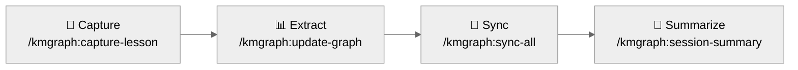
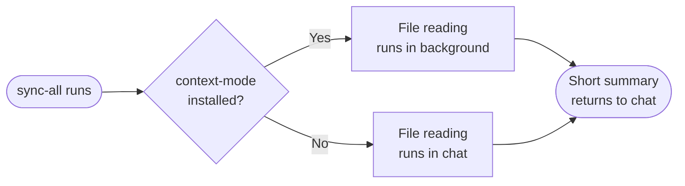
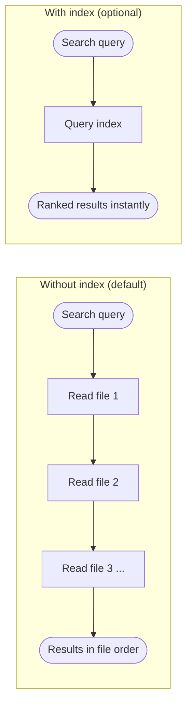
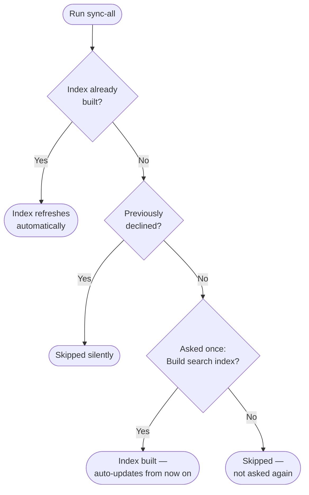

# Getting Started with Knowledge Graph

A step-by-step guide for setting up the knowledge graph system and capturing the first lesson.

**Version**: 0.1.0-beta

---

## Universal Installer (All Platforms)

**For Cursor, Windsurf, Continue.dev, JetBrains, VS Code, Aider, and other AI assistants:** Paste [INSTALL.md](INSTALL.md) into the AI assistant for fully automated setup.

The universal installer is a natural language prompt designed to execute shell scripts and manage file system operations within the local project directory. The installer detects the platform, configures the Model Context Protocol (MCP) server, and initializes the knowledge graph automatically.

!!! important "Access Requirements"
    Automated setup requires an AI assistant with terminal and file system access. Assistants without these capabilities require manual configuration following the setup within the prompt itself.

**For Claude Code users:** Follow the setup steps below, or paste [INSTALL.md](INSTALL.md) for the same automated experience.

**Not sure which platform fits?** Read [CONCEPTS.md](CONCEPTS.md) for a plain-English overview of the system before proceeding.

---

## Using Commands on Non-Claude-Code Platforms

The commands in this guide work across different platforms:

| Platform | How Commands Work |
|---|---|
| **Claude Code** | Slash commands: `/kmgraph:capture-lesson` — full automation |
| **Cursor, Windsurf, Continue.dev, VS Code** | Paste command content into your LLM. Substitute `${CLAUDE_PLUGIN_ROOT}` with your actual path |
| **Claude.ai, ChatGPT, Gemini, etc.** | Commands serve as reference documentation. Follow steps manually |

**Note:** Commands are designed to work with any LLM. Full automation is Claude Code-exclusive, but the underlying workflows work everywhere.

---

## Claude Code Setup


**For**: Users with the Claude Code plugin installed.

**Time to first lesson**: ~5 minutes

### Prerequisites

- Claude Code (latest version)
- Git (recommended; enables automatic code linking)
- Node.js 18+ (required for the MCP server)

### Step 1: Load the Plugin

Start Claude Code from the plugin directory to load the knowledge graph commands:

```bash
claude --plugin-dir /path/to/knowledge-graph
```

Verify the plugin loaded by typing `/knowledge` — the autocomplete menu should display available commands.

### Step 2: Initialize the Knowledge Graph

```bash
/kmgraph:init
```

The initialization wizard prompts for:

- **Project name** — the name of the current project
- **Git tracking** — enable to automatically capture branch and commit metadata
- **KG type** — `project-local` (default, stored in the project) or `personal` (stored at `~/.claude/knowledge-graph/`, shared across all projects). Use `/kmgraph:init-personal-kg` to create a personal KG separately.
- **Optional Backfill** (Step 1.10) — "Would you like to backfill the knowledge graph from existing project context? [y/N]"
  - If yes: automatically extracts from README, CHANGELOG, existing lessons, decisions, and chat history
  - If no: starts with empty knowledge graph, grows organically as you document lessons

After completion, the command creates the knowledge graph directory structure in the project.

### Step 3: Verify Setup

```bash
/kmgraph:status
```

Expected output: `Knowledge Graph: [project-name] | 0 lessons | 0 decisions`

### Step 4: Capture the First Lesson

```bash
/kmgraph:capture-lesson
```

Claude Code guides the session through documenting a problem solved recently. The command auto-fills metadata fields (`created`, `author`, `git.*`) and asks for the manual fields (`title`, `category`, `tags`).

**Tip**: The best time to document is immediately after solving a problem — details are freshest then.

### Step 5: Verify the Lesson Was Saved

```bash
/kmgraph:status
```

Expected output now shows: `1 lesson`

### The Knowledge Capture Pipeline

The workflow for capturing and synchronizing knowledge follows a four-step pipeline:


```mermaid
%%{init: { 'flowchart': { 'useMaxWidth': true }, 'theme': 'neutral' }}%%
graph LR
    A["📝 Capture<br/>/kmgraph:capture-lesson"] --> B["📊 Extract<br/>/kmgraph:update-graph"]
    B --> C["🔄 Sync<br/>/kmgraph:sync-all"]
    C --> D["💾 Summarize<br/>/kmgraph:session-summary"]

    accTitle: Knowledge Capture Pipeline
    accDescr: Four-step workflow: Capture lessons (step 1) feeds into Extract patterns (step 2), which feeds into Sync across graphs (step 3), which feeds into Summarize session (step 4)
```

Each step serves a specific purpose:

1. **Capture** - Document what you learned immediately after solving a problem. `/kmgraph:capture-lesson` optionally prompts to snapshot the current session first (`--snapshot` gate) so context is preserved before the lesson is written.
2. **Extract** - Transform lessons into searchable patterns and concepts
3. **Sync** - Consolidate across multiple knowledge graphs
4. **Summarize** - Create session snapshots for future reference. Use `/kmgraph:session-summary --snapshot` for a lightweight mid-session checkpoint that appends to the current session file without replacing it.

### Next Steps for Claude Code Users

<div class="grid cards" markdown>

- **[Essential Commands](COMMAND-GUIDE.md#essential-commands)**

    Start with the core commands: init, capture-lesson, status, and recall. These cover 80% of daily use.

- **[Real-World Examples](examples/)**

    See completed examples of lessons learned, ADRs, and KG entries from real projects.

- **[Set Up Sharing](CONFIGURATION.md#privacy-public-sharing)**

    Configure sanitization to safely share your knowledge graph with team members and the public.

</div>

---

## Optional Features

### Cleaner Conversations

If the context-mode plugin is installed alongside kmgraph, `sync-all` and `update-graph` offload heavy file-reading to a background process, keeping the conversation cleaner. No configuration is required — kmgraph detects context-mode automatically. Nothing changes if context-mode is not installed.

The diagram below shows how `sync-all` handles file reading differently depending on whether context-mode is installed.


```mermaid
flowchart LR
    A([sync-all runs]) --> B{context-mode\ninstalled?}
    B -- Yes --> C[File reading\nruns in background]
    C --> D([Short summary\nreturns to chat])
    B -- No --> E[File reading\nruns in chat]
    E --> D
```

When context-mode is installed, file reading is offloaded to a background process. When it is not installed, file reading runs inline in the conversation. Both paths produce the same result.

---

### Richer Session Summaries (Optional)

Session summaries are built by looking backwards — reading recent git commits, checking open plans, scanning for lesson-worthy work. This works well when a session has clear git activity.

If context-mode is also installed, session summaries can read a live event log instead. Context-mode tracks everything as it happens — every file edited, every command run, every agent spawned. This catches sessions that were mostly conversation, investigation, or planning with few commits. Those sessions currently produce thin summaries; with context-mode they produce complete ones.

Context-mode is not required. Without it, session summaries work exactly as they do today.

---

### Faster Search (Optional)

By default, kmgraph searches by reading every file in the knowledge graph. For larger knowledge graphs, building a search index makes results faster and ranks them by relevance. The index is local-only and is not included in version control, so it does not survive a fresh install or upgrade.

After a plugin upgrade, two paths offer to rebuild a missing index:

- **`/kmgraph:init` → option 1 (Verify/upgrade)** — the wizard checks for a missing index and offers to rebuild it as part of the standard post-upgrade flow.
- **`/kmgraph:sync-all`** — if the index is absent and has not been previously declined, sync-all asks once whether to build it. After that, the index stays current automatically.

The diagram below compares how kmgraph searches without and with a search index.


```mermaid
flowchart LR
    subgraph without ["Without index (default)"]
        direction TB
        S1([Search query]) --> F1[Read file 1]
        F1 --> F2[Read file 2]
        F2 --> F3[Read file 3 ...]
        F3 --> R1([Results in file order])
    end
    subgraph with ["With index (optional)"]
        direction TB
        S2([Search query]) --> I[Query index]
        I --> R2([Ranked results instantly])
    end
```

Without an index, kmgraph reads each file in the knowledge graph sequentially. With an index, a single query returns results sorted by relevance. Both methods return the same files — the index is faster and ranks more relevant matches higher.

The diagram below shows what happens the first time `sync-all` is run after upgrading to a version that supports the search index.


```mermaid
flowchart TD
    A([Run sync-all]) --> B{Index already\nbuilt?}
    B -- Yes --> C([Index refreshes\nautomatically])
    B -- No --> D{Previously\ndeclined?}
    D -- Yes --> E([Skipped silently])
    D -- No --> F{Asked once:\nBuild search index?}
    F -- Yes --> G([Index built —\nauto-updates from now on])
    F -- No --> H([Skipped —\nnot asked again])
```

If a search index already exists, sync-all refreshes it automatically with no prompt. If no index exists and the user has not previously declined, sync-all asks once. The preference is remembered — users are never asked again regardless of the answer.

How to tell the index is active: search results show `(FTS5)` — this just means the index was used. How to build the index manually: run `kg_fts5_rebuild` from the MCP tool panel. How to revert: delete the `.fts5.db` file from the knowledge graph root folder.

**After backfill or upgrade with existing lessons:** If the backfill option was used during `/kmgraph:init`, or if lessons already existed before the plugin was installed, run `/kmgraph:update-graph` to populate `knowledge/` with structured patterns and concepts extracted from those lessons. Without this step, `knowledge/` remains empty and recall results will lack extracted insights. After extraction, run `/kmgraph:sync-all` to build the search index so all content is immediately searchable by relevance.

---

## Troubleshooting

### Plugin update does not take effect { #plugin-update-does-not-take-effect }

!!! warning "Known Claude Code Limitation: Plugin Cache Not Refreshed on Update"
    Claude Code's "Update Now" feature and `claude plugin update` command update version metadata but do **not** re-download plugin files. The installed plugin continues running from the old cached version after an update.

    This is a known platform issue ([#19197](https://github.com/anthropics/claude-code/issues/19197), [#14061](https://github.com/anthropics/claude-code/issues/14061)).

    **Symptoms:**

    - Installed tab still shows the old version number
    - New commands or skills added in the update are unavailable
    - MCP server shows a `failed` status

!!! info "Command types used in this guide"
    Two types of commands appear below. Make sure to run each in the right place:

    - **Shell commands** — run in the terminal (the same place `claude` is launched to start Claude Code)
    - **Claude Code commands** — type directly into the Claude Code prompt (the `>` input)

**Fix — clear the cache and reinstall:**

=== "macOS / Linux"

    **Step 1 — Shell: Remove the stale plugin cache**

    ```bash
    rm -rf ~/.claude/plugins/cache/stayinginsync-knowledge-graph/
    ```

    **Step 2 — Claude Code: Uninstall kmgraph**

    ```
    /plugin uninstall kmgraph
    ```

    **Step 3 — Claude Code: Reload plugins**

    ```
    /reload-plugins
    ```

    **Step 4 — Claude Code: Update the marketplace listing**

    ```
    /plugin update stayinginsync
    ```

    !!! note
        The marketplace may still show the older version number after this step. That is expected — continue anyway.

    **Step 5 — Claude Code: Reinstall kmgraph**

    ```
    /plugin install stayinginsync
    ```

    **Step 6 — Claude Code: Reload plugins**

    ```
    /reload-plugins
    ```

    **Step 7 — Shell: Close and reopen Claude Code**

    Fully quit Claude Code (`exit` or close the terminal) and relaunch it:

    ```bash
    claude
    ```

    **Step 8 — Claude Code: Restart the MCP server**

    ```
    /mcp restart kmgraph
    ```

    **Step 9 — Claude Code: Verify and upgrade the knowledge graph**

    ```
    /kmgraph:init
    ```

    Select **option 1 (Verify/upgrade)** when prompted. This checks that directories, config fields, templates, and the search index are current with the new plugin version. If the search index (`.fts5.db`) is missing, the wizard offers to rebuild it. If `knowledge/` is empty despite existing lessons, the wizard offers to run `/kmgraph:update-graph --auto --sync-all` — this processes all lessons silently in one pass without per-lesson prompts. Existing lessons and decisions are never modified.

=== "Windows"

    **Step 1 — Shell (PowerShell): Remove the stale plugin cache**

    ```powershell
    Remove-Item -Recurse -Force "$env:USERPROFILE\.claude\plugins\cache\stayinginsync-knowledge-graph"
    ```

    **Steps 2–6 — Claude Code:** Run the following commands in Claude Code one at a time:

    ```
    /plugin uninstall kmgraph
    /reload-plugins
    /plugin update stayinginsync
    /plugin install stayinginsync
    /reload-plugins
    ```

    !!! note
        The marketplace may still show the older version number after `/plugin update stayinginsync`. That is expected — continue with the reinstall.

    **Step 7 — Shell: Close and reopen Claude Code**

    Fully quit Claude Code and relaunch from the terminal or Start menu.

    **Step 8 — Claude Code: Restart the MCP server**

    ```
    /mcp restart kmgraph
    ```

    **Step 9 — Claude Code: Verify and upgrade the knowledge graph**

    ```
    /kmgraph:init
    ```

    Select **option 1 (Verify/upgrade)** when prompted. The wizard checks directories, config fields, templates, and the search index.

=== "GUI (Finder / File Explorer)"

    **Step 1 — Finder/File Explorer: Delete the stale cache folder**

    === "macOS (Finder)"

        1. Open **Finder**
        2. Press `Cmd + Shift + G` to open "Go to Folder"
        3. Type `~/.claude/plugins/cache/` and press **Go**

            !!! tip
                If the `.claude` folder is not visible, press `Cmd + Shift + .` in Finder to show hidden files.

        4. Delete the `stayinginsync-knowledge-graph` folder (drag to Trash or right-click → Move to Trash)

    === "Windows (File Explorer)"

        1. Open **File Explorer**
        2. Click the address bar and type `%USERPROFILE%\.claude\plugins\cache\` and press **Enter**

            !!! tip
                If the `.claude` folder is not visible, go to **View → Show → Hidden items** in File Explorer.

        3. Delete the `stayinginsync-knowledge-graph` folder (right-click → Delete)

    **Steps 2–6 — Claude Code:** Open a Claude Code terminal and run these commands one at a time:

    ```
    /plugin uninstall kmgraph
    /reload-plugins
    /plugin update stayinginsync
    /plugin install stayinginsync
    /reload-plugins
    ```

    !!! note
        The marketplace may still show the older version number after `/plugin update stayinginsync`. That is expected — continue with the reinstall.

    **Step 7:** Fully quit Claude Code and relaunch it.

    **Step 8 — Claude Code: Restart the MCP server**

    ```
    /mcp restart kmgraph
    ```

    **Step 9 — Claude Code: Verify and upgrade the knowledge graph**

    ```
    /kmgraph:init
    ```

    Select **option 1 (Verify/upgrade)** when prompted. The wizard checks directories, config fields, templates, and the search index.

### Commands do not appear in Claude Code autocomplete

- Verify the plugin is loaded: start Claude Code with `claude --plugin-dir /path/to/knowledge-graph`
- Commands use the `knowledge:` prefix with a colon, not a hyphen: `/kmgraph:init` (correct), `/knowledge-init` (incorrect)
- Restart Claude Code completely if commands still do not appear

### The MCP server does not start

```bash
# Verify Node.js is installed
node --version  # Should show 18.x or higher

# Check the MCP server binary exists
ls mcp-server/dist/index.js

# Test the MCP server directly
./tests/test-mcp-direct.sh
```

### Templates are not found

Verify that `core/templates/` exists in the project directory and that templates were copied to `docs/templates/` with `cp -r core/templates/. docs/templates/`.

### Which category should this lesson use?

| Category | Use for |
|---|---|
| `architecture` | System design decisions, component relationships |
| `process` | Workflow improvements, tool configurations, procedures |
| `patterns` | Reusable solutions discovered through experience |
| `debugging` | Bug investigations, troubleshooting sessions, root cause analysis |

When uncertain, choose `debugging` for problem-solving documentation and `process` for workflow-related insights.

### Is git required?

Git is recommended but not required. With git, the system automatically captures branch name, commit hash, and PR/issue numbers as lesson metadata. Without git, all features remain available — only automatic code linking is unavailable.

---

<!-- Updated: 2026-03-29 -->
## Meet Your New Agents

Agents are heavy-lift task handlers that run separately from your main conversation. They exist so that complex or resource-intensive work — parsing large files, searching the knowledge graph, assembling session summaries — happens in isolation and does not crowd out your working context. You rarely invoke agents directly; skills and commands trigger them automatically when the work warrants it.

| Agent | What it does |
|---|---|
| **lesson-capture-agent** | Real-time lesson capture from active sessions |
| **session-summary-agent** | Session summaries with open plans and ADRs tracked |
| **recall-agent** | Natural-language search across your knowledge graph |
| **knowledge-extractor** | Large-file parsing for KG extraction (approval-gated writes) |
| **knowledge-reviewer** | Quality review for lessons and ADRs before saving |
| **session-documenter** | Git archaeology for complex multi-branch sessions |
| **platform-sync-agent** | Cross-platform config file management |
| **mcp-setup-agent** | IDE detection and MCP server registration |

**Next steps:**

- For detailed architecture, see [CONCEPTS.md § Four-Layer Architecture](CONCEPTS.md#four-layer-architecture)
- For command examples, see [COMMAND-GUIDE.md](COMMAND-GUIDE.md)
- For specific agent workflows, run `/kmgraph:help`

---

## Skills and Subagents

As you work, the system provides two types of intelligent assistance:

### Skills (Auto-Triggered Context Providers)

Skills activate automatically based on what you're doing. They provide guidance without interrupting:

| Skill | Triggers On | Suggests |
|---|---|---|
| **lesson-capture** | "figured it out", bug solved, breakthrough made | `/kmgraph:capture-lesson` with pre-filled context |
| **kg-recall** | "have we done this before", past decisions, history questions | `/kmgraph:recall` with extracted search terms |
| **session-wrap** | Session ending, context limit (180K+), major milestone | `/kmgraph:session-summary` before compaction |
| **adr-guide** | "I'm thinking of using...", architecture decisions | `/kmgraph:create-adr` with decision guidance |
| **doc-update-router** | "update [doc name]", "update the session summary", "update the changelog" | Routes to correct update command, bypassing direct file edits |
| **gov-execute-plan** | "execute plan", implementation start, `docs/plans/*.md` mentioned | Zero-deviation 8-step execution protocol |

You don't invoke skills directly — they appear as helpful context when relevant.

### Subagents (Heavy-Lift Handlers)

Subagents handle resource-intensive tasks in isolation, keeping your main context clean:

| Subagent | Mode | When to Use |
|---|---|---|
| **knowledge-extractor** | Read-only (approval-gated writes) | Parsing 10+ lessons, 50+ KB extracts, or backfill from existing project context. Never auto-writes without user review. |
| **session-documenter** | Git archaeology (approval-gated commits/pushes) | Complex multi-file sessions, automated session summaries with conventional commit format. Never auto-commits or auto-pushes. |

Use `--delegate knowledge-extractor` or `--delegate session-documenter` in commands like `/kmgraph:extract-chat`, `/kmgraph:update-graph`, or `/kmgraph:session-summary` to invoke subagents for heavy operations.

---

## Related Documentation

### **Installation & Setup**
<div class="grid cards" markdown>
- [Universal Installer](INSTALL.md)

  Automated setup for all platforms (paste into any AI assistant)

- [Configuration Guide](CONFIGURATION.md)

  Post-install customization: sanitization, team workflows, MCP server

- [Platform Adaptation](reference/PLATFORM-ADAPTATION.md)

  Integration details for Cursor, Windsurf, Continue, VS Code, Aider
</div>

### **Learning & Reference**
<div class="grid cards" markdown>
- [Command Reference Guide](COMMAND-GUIDE.md)

  All commands with examples, learning path, and troubleshooting

- [Quick Reference (Cheat Sheet)](CHEAT-SHEET.md)

  One-page guide for common tasks and commands

- [Concepts Guide](CONCEPTS.md)

  Plain-English definitions of every term used in documentation

- [Examples](examples/)

  Real-world completed examples: lessons, ADRs, KG entries
</div>

### **Advanced**
<div class="grid cards" markdown>
- [Manual Workflows](reference/WORKFLOWS.md)

  Step-by-step guides for all 9 workflow types

- [Pattern Writing Guide](reference/PATTERNS-GUIDE.md)

  How to write high-quality knowledge entries

- [Style Guide](STYLE-GUIDE.md)

  Documentation authoring standards and best practices

</div>

---

**Version**: 0.2.1-beta
**Last Updated**: 2026-03-28
