# Getting Started with Knowledge Graph

A step-by-step guide for setting up the knowledge graph system and capturing the first lesson.

**Version**: 0.0.8-alpha

---

## Universal Installer (All Platforms)

**For Cursor, Windsurf, Continue.dev, JetBrains, VS Code, Aider, and other AI assistants:** Paste [INSTALL.md](INSTALL.md) into the AI assistant for fully automated setup.

The universal installer is a natural language prompt designed to execute shell scripts and manage file system operations within the local project directory. The installer detects the platform, configures the Model Context Protocol (MCP) server, and initializes the knowledge graph automatically.

!!! important "Access Requirements"
    Automated setup requires an AI assistant with terminal and file system access. Assistants without these capabilities require manual configuration following the setup within the prompt itself.

**For Claude Code users:** Follow the setup steps below, or paste [INSTALL.md](INSTALL.md) for the same automated experience.

**Not sure which platform fits?** Read [CONCEPTS.md](CONCEPTS.md) for a plain-English overview of the system before proceeding.

---

## Claude Code Setup

**For**: Users with the Claude Code plugin installed.

**Time to first lesson**: ~5 minutes

### Prerequisites

- Claude Code (latest version)
- Git (recommended; enables automatic code linking)
- Node.js 18+ (required for the MCP server)

### Step 1: Load the Plugin

Start Claude Code from the plugin directory to load the knowledge graph commands:

```bash
claude --plugin-dir /path/to/knowledge-graph
```

Verify the plugin loaded by typing `/knowledge` — the autocomplete menu should display available commands.

### Step 2: Initialize the Knowledge Graph

```bash
/kmgraph:init
```

The initialization wizard prompts for:
- **Project name** — the name of the current project
- **Git tracking** — enable to automatically capture branch and commit metadata

After completion, the command creates the knowledge graph directory structure in the project.

### Step 3: Verify Setup

```bash
/kmgraph:status
```

Expected output: `Knowledge Graph: [project-name] | 0 lessons | 0 decisions`

### Step 4: Capture the First Lesson

```bash
/kmgraph:capture-lesson
```

Claude Code guides the session through documenting a problem solved recently. The command auto-fills metadata fields (`created`, `author`, `git.*`) and asks for the manual fields (`title`, `category`, `tags`).

**Tip**: The best time to document is immediately after solving a problem — details are freshest then.

### Step 5: Verify the Lesson Was Saved

```bash
/kmgraph:status
```

Expected output now shows: `1 lesson`

### The Knowledge Capture Pipeline

The workflow for capturing and synchronizing knowledge follows a four-step pipeline:

```mermaid
%%{init: { 'flowchart': { 'useMaxWidth': true }, 'theme': 'neutral' }}%%
graph LR
    A["📝 Capture<br/>/kmgraph:capture-lesson"] --> B["📊 Extract<br/>/kmgraph:update-graph"]
    B --> C["🔄 Sync<br/>/kmgraph:sync-all"]
    C --> D["💾 Summarize<br/>/kmgraph:session-summary"]

    accTitle: Knowledge Capture Pipeline
    accDescr: Four-step workflow: Capture lessons (step 1) feeds into Extract patterns (step 2), which feeds into Sync across graphs (step 3), which feeds into Summarize session (step 4)
```



Each step serves a specific purpose:

1. **Capture** - Document what you learned immediately after solving a problem
2. **Extract** - Transform lessons into searchable patterns and concepts
3. **Sync** - Consolidate across multiple knowledge graphs
4. **Summarize** - Create session snapshots for future reference

### Next Steps for Claude Code Users

<div class="grid cards" markdown>

- **[Essential Commands](COMMAND-GUIDE.md#essential-commands)**

  Start with the core commands: init, capture-lesson, status, and recall. These cover 80% of daily use.

- **[Real-World Examples](../core/examples/)**

  See completed examples of lessons learned, ADRs, and knowledge entries from real projects.

- **[Set Up Sharing](CONFIGURATION.md#privacy-public-sharing)**

  Configure sanitization to safely share your knowledge graph with team members and the public.

</div>

---

## Troubleshooting

### Commands do not appear in Claude Code autocomplete

- Verify the plugin is loaded: start Claude Code with `claude --plugin-dir /path/to/knowledge-graph`
- Commands use the `knowledge:` prefix with a colon, not a hyphen: `/kmgraph:init` (correct), `/knowledge-init` (incorrect)
- Restart Claude Code completely if commands still do not appear

### The MCP server does not start

```bash
# Verify Node.js is installed
node --version  # Should show 18.x or higher

# Check the MCP server binary exists
ls mcp-server/dist/index.js

# Test the MCP server directly
./tests/test-mcp-direct.sh
```

### Templates are not found

Verify that `core/templates/` exists in the project directory and that templates were copied to `docs/templates/` with `cp -r core/templates/. docs/templates/`.

### Which category should this lesson use?

| Category | Use for |
|---|---|
| `architecture` | System design decisions, component relationships |
| `process` | Workflow improvements, tool configurations, procedures |
| `patterns` | Reusable solutions discovered through experience |
| `debugging` | Bug investigations, troubleshooting sessions, root cause analysis |

When uncertain, choose `debugging` for problem-solving documentation and `process` for workflow-related insights.

### Is git required?

Git is recommended but not required. With git, the system automatically captures branch name, commit hash, and PR/issue numbers as lesson metadata. Without git, all features remain available — only automatic code linking is unavailable.

---

## Related Documentation

**Installation**:
- [Universal Installer](INSTALL.md) — Automated setup for all platforms (paste into any AI assistant)
- [Platform Adaptation](../core/docs/PLATFORM-ADAPTATION.md) — Platform capability comparisons and integration details

**Getting deeper into the system**:
- [Concepts Guide](CONCEPTS.md) — Plain-English definitions of every term used in documentation
- [Command Reference](COMMAND-GUIDE.md) — All commands with examples and learning path
- [Quick Reference](CHEAT-SHEET.md) — One-page cheat sheet for common tasks

**Configuration and customization**:
- [Configuration Guide](CONFIGURATION.md) — Post-install setup: sanitization, team workflows, MCP server

**Writing effective entries**:
- [Manual Workflows](../core/docs/WORKFLOWS.md) — Step-by-step guides for all 9 workflow types
- [Pattern Writing Guide](../core/docs/PATTERNS-GUIDE.md) — How to write high-quality knowledge entries
- [Examples](../core/examples/) — Completed examples to learn from

---

**Version**: 0.0.8-alpha
**Last Updated**: 2026-02-20
