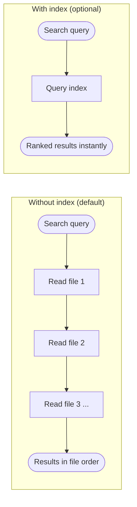
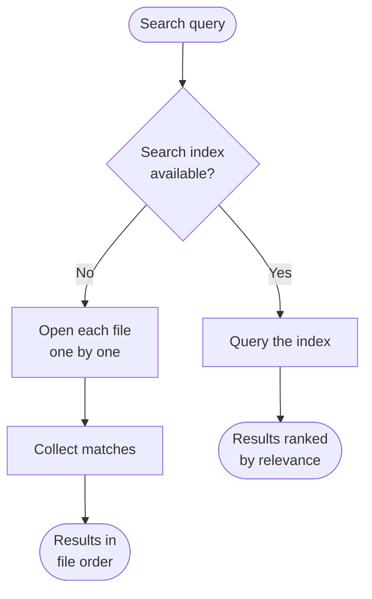
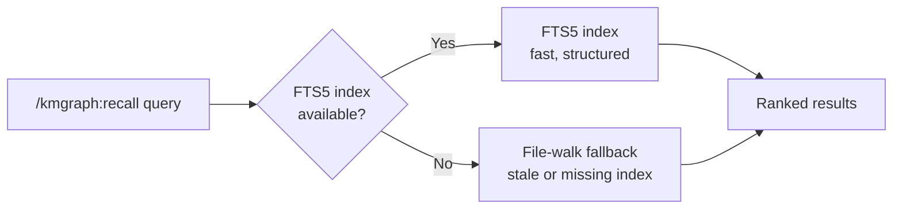
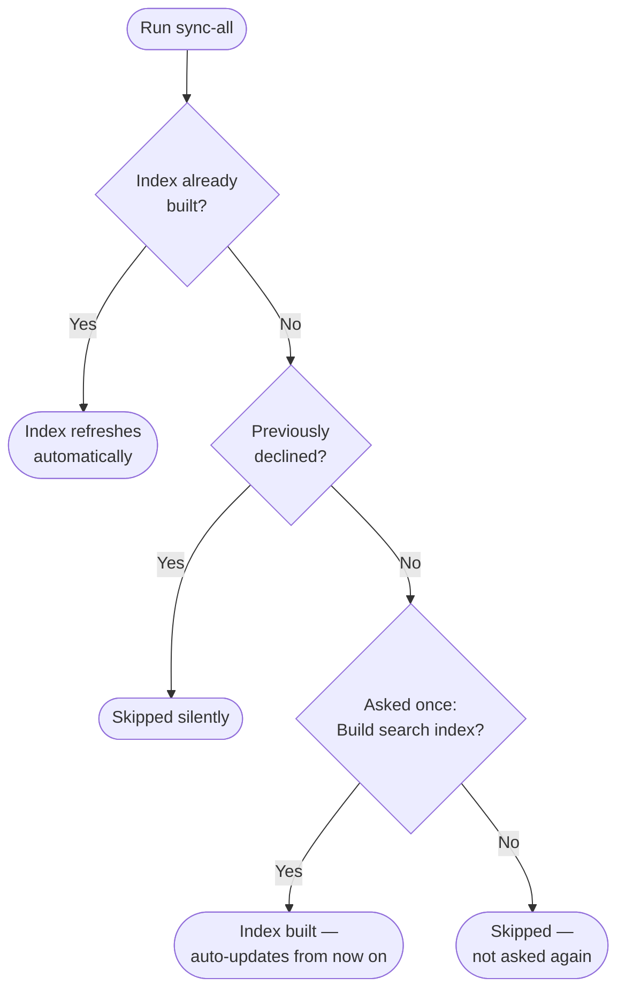

When a search is run, kmgraph needs to match the query against everything in the knowledge graph. There are two ways to do this. The first is to open each file one by one and check whether the query appears — straightforward, but slower as the knowledge graph grows, and results are sorted by where the match appeared in the file rather than how relevant the file is. The second is to maintain a search index: a compact catalog built from all the files that can be queried directly. The index returns results ranked by relevance — files that closely match the query float to the top. The index is optional and kept current automatically.

The diagram below compares search without and with the index.

Without an index, kmgraph reads each file in the knowledge graph sequentially. With an index, a single query returns results sorted by relevance. Both methods return the same files — the index is faster and ranks more relevant matches higher.

The diagram below shows the two search paths in detail.

Both paths return results from the same knowledge graph files. The difference is speed and ranking: the indexed path is faster for large knowledge graphs and surfaces the most relevant results first. The index is built once and updated automatically during sync.

The search label `(FTS5)` in results means the index was used. FTS5 stands for Full-Text Search version 5 — the underlying search technology. The label can be ignored; it is there for users who want to know which path was taken.

### How to Enable the Search Index

The index is off by default and takes about a second to build. Once enabled, it stays current automatically — no maintenance required.

The first time `/kmgraph:sync-all` is run, it will ask once whether to build the index. Answer yes and the index builds automatically. After that, every `sync-all` run keeps it current with no prompts.

To build the index at any time without running sync-all: call `kg_fts5_rebuild` from the MCP tool panel.

The diagram below shows what happens the first time sync-all is run after upgrading.

If a search index already exists, sync-all refreshes it automatically with no prompt. If no index exists and the user has not previously declined, sync-all asks once. The preference is remembered — users are never asked again regardless of the answer.

- **How to tell it is active**: search results show `(FTS5)` — this means the index was used
- **How to re-enable after declining**: run `kg_fts5_rebuild` directly
- **How to revert**: delete `~/.kmgraph/index/projects/<kgName>.db` (project KG) or `~/.kmgraph/index/personal.db` (personal KG). Run `kg_fts5_rebuild` to recreate.
