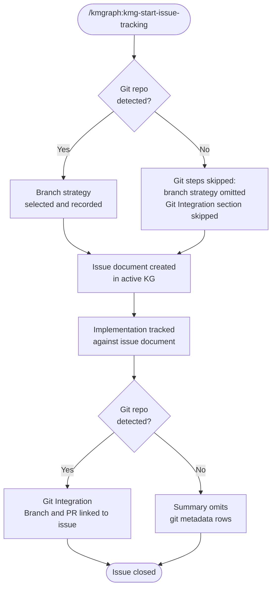

The issue tracking process documents a problem or enhancement from identification through resolution. The `/kmgraph:kmg-start-issue-tracking` command drives this process. Beginning with v0.2.3.4-beta, the command gates all git-dependent steps on repository presence — when no git repository is detected, branch strategy and git integration steps are omitted automatically.

The diagram below shows the full issue tracking flow, including the git presence gate introduced in v0.2.3.4-beta.

The git presence check runs once at Step 1.0 using `git rev-parse --is-inside-work-tree`. The result is applied at every subsequent step that would otherwise invoke a git subcommand.

## GitHub-issue-sync invariant

Every `knowledge/issues/` and `knowledge/enhancements/` folder is expected to carry a real `github_issue` in its spec frontmatter. A structural scan (`scripts/check-github-issue-sync.sh`) runs at pre-push and flags any folder that lacks one, so specs captured outside `/kmgraph:kmg-start-issue-tracking` cannot silently ship without a linked GitHub issue. Folders that predate the check are baseline-exempt; drafts still in progress may set `github_issue: pending` to mark themselves as an in-flight, known-unsynced state rather than a leak.
