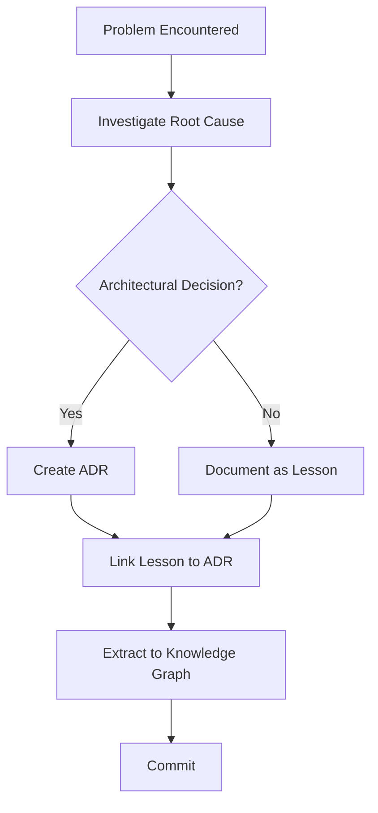

# MkDocs Layout Test

This temporary test document demonstrates the new Material theme layout with:
- Sticky horizontal navigation tabs at the top
- Table of Contents integrated into the left sidebar
- Dark mode as default
- Copy buttons on code blocks
- Breadcrumbs above page title

Use this document to preview the two-panel layout before full implementation.

---

## Section 1: Code Blocks

### Python Example

```python
def capture_lesson(topic: str, category: str = "patterns") -> dict:
    """
    Capture a lessons learned document.

    Args:
        topic: What problem was solved
        category: Category (architecture, debugging, process, patterns)

    Returns:
        Dictionary with lesson metadata and content
    """
    metadata = {
        "title": f"Lesson: {topic}",
        "category": category,
        "created": datetime.now().isoformat(),
    }
    return metadata
```

### JavaScript Example

```javascript
// MkDocs configuration loader
async function loadMkDocsConfig() {
  const response = await fetch('mkdocs.yml');
  const config = await response.json();
  return config;
}
```

### YAML Example

```yaml
theme:
  name: material
  features:
    - navigation.tabs.sticky
    - navigation.path
    - navigation.footer
    - toc.integrate
    - content.code.copy
```

---

## Section 2: Lists and Tables

### Feature Comparison Table

| Feature | Status | Version | Impact |
|---------|--------|---------|--------|
| Dark Mode Default | ✅ Implemented | v0.0.8.6 | Visual improvement |
| Sticky Navigation Tabs | ✅ Implemented | v0.0.8.6 | UX improvement |
| Breadcrumbs | ✅ Implemented | v0.0.8.6 | Navigation clarity |
| ToC Integration | ✅ Implemented | v0.0.8.6 | Reduced scrolling |
| Copy Button | ✅ Implemented | v0.0.8.6 | Developer convenience |

### Key Patterns

- **Commands vs Skills**: Flat commands for direct execution; hierarchical skills for guidance
- **Multi-KG System**: Project-local, personal, and shared knowledge graphs
- **Delegated Architecture**: Routing via active KG pointer for multi-KG support
- **Three-Tier Installation**: Claude Code, MCP IDEs, template-only
- **Session Parallelization**: Run multiple independent sessions concurrently

---

## Section 3: Heading Hierarchy

### Subsection 3.1: Getting Started

The knowledge graph plugin provides structured knowledge capture for Claude Code projects.

#### Step 1: Installation

Follow the INSTALL.md guide for your platform.

#### Step 2: Configuration

Set up your knowledge graph type (project-local, personal, or cowork).

#### Step 3: Capture Your First Lesson

Use `/kg-sis:capture-lesson` to document a problem you solved.

### Subsection 3.2: Advanced Usage

Explore multi-KG configurations and cross-project knowledge linking.

---

## Section 4: Admonitions

!!! note "Pro Tip"
    Use `/kg-sis:recall "pattern"` to search across all your knowledge entries.

!!! warning "Important"
    The `commands/` directory contains LLM prompts. Modifications may break plugin functionality.

!!! tip "Best Practice"
    Always link lessons to related Architecture Decision Records (ADRs).

!!! example "Example Usage"
    ```bash
    /kg-sis:capture-lesson "Async Error Handling"
    ```

---

## Section 5: Mermaid Diagram



---

## Section 6: Nested Lists

1. **Phase 1: Global Configuration**
   - Make dark mode default
   - Add sticky navigation tabs
   - Configure search plugin
   - Add social links

   1.1. Sub-feature: Typography
   - Override `--md-text-font` to Inter
   - Override `--md-code-font` to JetBrains Mono

   1.2. Sub-feature: Colors
   - Set primary color to deep navy
   - Set accent color to electric cyan

2. **Phase 2: Custom CSS**
   - Create `docs/stylesheets/extra.css`
   - Implement typography changes
   - Apply glassmorphism header effect

3. **Phase 3: Page Restructuring**
   - Add grid cards to index and getting started
   - Convert command lists to tabbed interfaces
   - Add mermaid diagrams to documentation

---

## Section 7: Mixed Content

This section demonstrates content that benefits from the new layout features:

### Knowledge Capture Workflow

```
Capture → Extract → Sync → Summarize
```

Each step corresponds to plugin commands:

- `/kg-sis:capture-lesson` — Document what you learned
- `/kg-sis:update-graph` — Extract patterns and concepts
- `/kg-sis:sync-all` — Synchronize across KGs
- `/kg-sis:session-summary` — Summarize session insights

!!! info "Related Resources"
    - [Commands Guide](COMMAND-GUIDE.md) - Full command reference
    - [Concepts](CONCEPTS.md) - Architectural concepts
    - [Getting Started](GETTING-STARTED.md) - Setup guide

---

## Summary

This test document demonstrates:

✅ **Heading hierarchy** — H1 through H4 for navigation structure
✅ **Code blocks** — With language syntax highlighting and copy buttons
✅ **Tables** — With proper formatting and alignment
✅ **Lists** — Both ordered and nested structures
✅ **Admonitions** — Info, note, tip, warning callouts
✅ **Diagrams** — Mermaid flowcharts for visual documentation
✅ **Mixed content** — Realistic documentation patterns

**Next steps:** Review this document with `mkdocs serve`, then confirm to proceed with full Phase 1 implementation.
