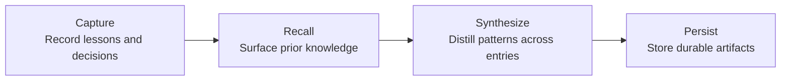
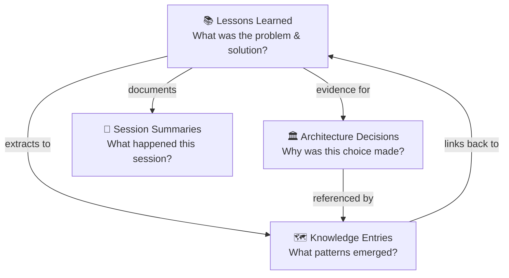
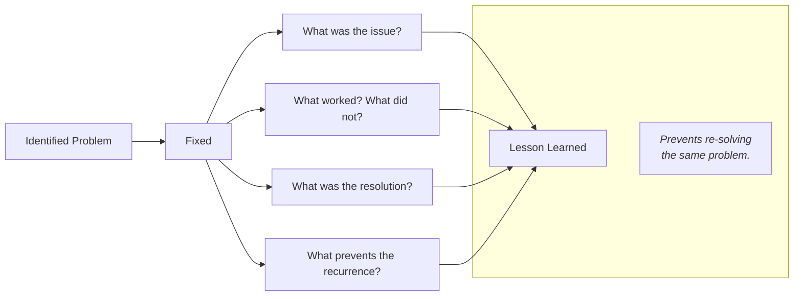

The knowledge graph system organizes information into four distinct types, each optimized for a different purpose. Together, these pillars form a comprehensive institutional memory.

#### The Four Content Types Relationships

Different knowledge types need different structures:

- Quick reference ≠ detailed narrative
- Formal decision ≠ informal learning
- Snapshot ≠ timeless knowledge

All four content types work together to create a comprehensive institutional memory system:

---

#### Pillar 1: Lessons Learned

**What it is**: Detailed documentation of problems solved and how the solutions were reached.

**Location**: `/lessons-learned/` directory, organized by category.

**When to create**: After solving a non-trivial problem, discovering a useful technique, or fixing a tricky bug.

**Plain English**: A detective's case file for every problem solved.

> 📘 **Note**
>
> "Lesson: Fixing PostgreSQL Connection Timeouts" — documents the problem, root cause, solution steps, and prevention strategies.
---

#### Pillar 2: Architecture Decision Records (ADRs)

**What it is**: Formal documentation of important technical choices and the reasoning behind each decision.

**Location**: `/decisions/` directory, numbered sequentially (ADR-001, ADR-002, etc.).

**When to create**: When making a significant choice

 — selecting a database, choosing a framework, defining an API structure
 — where future team members might ask "why did the team do it this way?"

**Plain English**: A written record of "why this choice was made" so the reasoning is never lost.

> 📘 **Note**
>
> "ADR-003: Choosing PostgreSQL Over MongoDB" — records the context, options considered, decision made, and expected consequences.
---

#### Pillar 3: Knowledge Entries

**What it is**: Quick-reference entries that distill patterns, concepts, and common pitfalls into scannable summaries.

**Location**: `/knowledge/` directory, organized into categories:

- **patterns.md** — Reusable design patterns and best practices
- **concepts.md** — Core technical concepts and definitions
- **gotchas.md** — Common pitfalls and how to avoid each one

**When to create**: When a pattern emerges across multiple lessons, or when a concept needs a quick-reference summary.

**Relationship to lessons**: Knowledge entries are extracted from lessons. A lesson provides the full narrative; the corresponding knowledge entry provides the quick-reference summary with a link back to the lesson.

**Plain English**: Cheat sheets distilled from real experience.

---

#### Pillar 4: Session Summaries

**What it is**: Snapshot documentation of what happened during an important work session.

**Location**: `/sessions/` directory, organized by date.

**When to create**: After a significant work session — a major debugging effort, an architecture discussion, a sprint planning session.

**Plain English**: Meeting minutes for work sessions.

> 📘 **Note**
>
> "2024-01-15 Database Migration Session" — records what was built, what was decided, what was learned, and what comes next.

## Related

- [What is a knowledge graph?](./what-is-a-knowledge-graph.md) — the graph structure and how KMGraph implements it
- [How KMGraph is organized](./how-kmgraph-is-organized.md) — the layered architecture around the graph
- [Why KMGraph?](./why-kmgraph.md) — the problem KMGraph solves
