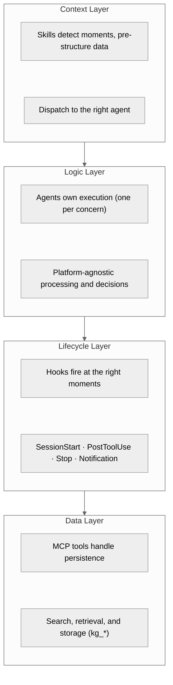
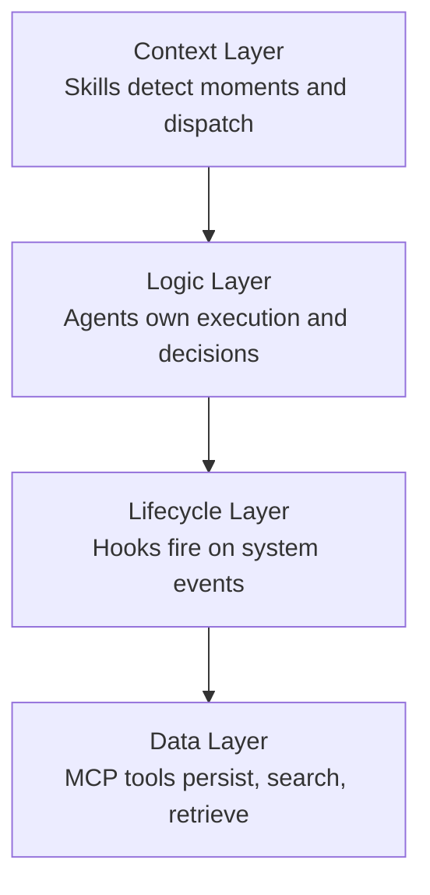

KMGraph separates responsibilities into four layers. Each layer handles one concern, and layers communicate in a single direction: Context feeds Logic, Logic triggers Lifecycle, and Lifecycle calls Data. This separation keeps each layer independently testable, replaceable, and portable across platforms.

### Context Layer — Skills

Skills are auto-triggered context providers. They watch for specific moments in a conversation and respond by pre-structuring data and dispatching to the appropriate agent or command.

**What skills do:**

- Detect that a bug was just fixed and suggest capturing a lesson
- Recognize a search intent and guide the user toward the right query
- Notice a session ending and prompt for a summary
- Identify an architecture decision being made and suggest an ADR

**Why a separate layer:** Skills decouple *when to act* from *how to act*. Adding a new trigger (for example, detecting a performance regression) requires only a new skill file — no changes to agents, hooks, or MCP tools.

**Location:** `skills/` directory. See [Command Reference](COMMAND-GUIDE.md) for command dispatching examples.

### Logic Layer — Agents

Agents are subagent definitions that own execution logic. Each agent handles one concern: the knowledge-extractor parses files, the session-documenter performs git archaeology. Agents receive structured input from skills and produce structured output for hooks and MCP tools.

**What agents do:**

- Parse large files and extract knowledge graph entries (knowledge-extractor)
- Walk git history to build session summaries (session-documenter)
- Execute plans with zero-deviation constraints (gov-execute-plan skill dispatches to agents)

**Why a separate layer:** Agents are platform-agnostic. They receive data and return results without knowing whether the caller is Claude Code, Cursor, or a manual workflow. This makes the system portable — swapping the host platform changes only the Context Layer, not the Logic Layer.

**Location:** `agents/` directory. Each agent definition specifies its inputs, outputs, and approval gates.

### Lifecycle Layer — Hooks

Hooks automate actions at specific moments in the tool lifecycle. They fire on system events rather than conversational cues, handling work that should happen reliably and without user prompting.

**Hook events and their purposes:**

| Event | When it fires | Typical use |
|---|---|---|
| SessionStart | A new session begins | Load MEMORY.md, sync knowledge graph state |
| PostToolUse | After a tool completes | Validate outputs, trigger follow-up actions |
| Stop | Session is ending | Prompt for session summary if work was done |
| PreToolUse | Before a tool executes | Check preconditions, validate inputs |
| Notification | System event occurs | Alert on sync failures or stale data |

**Why a separate layer:** Hooks guarantee that critical automation runs regardless of conversational flow. A skill might not fire if the user does not mention the right topic, but a SessionStart hook always runs. This reliability layer ensures consistency across sessions.

**Location:** `hooks/hooks.json` defines the hook registry and event bindings.

### Data Layer — MCP Tools

MCP (Model Context Protocol) tools handle all persistence, search, and retrieval. Every tool in this layer follows the `kg_*` naming convention and operates through a cross-platform server.

**What MCP tools do:**

- `kg_search` — Query the knowledge graph by text, tags, or category
- `kg_scaffold` — Create new knowledge graph entries from templates
- `kg_config_*` — Manage configuration (init, list, switch, add category)
- `kg_fts5_rebuild` — Build or refresh the full-text search index
- `kg_check_sensitive` — Scan entries for sensitive content before sharing

**Why a separate layer:** Data operations are the most platform-dependent part of the system. By isolating them behind MCP, the same tools work identically whether called from Claude Code, a Python script, or any MCP-compatible client. The Logic and Lifecycle layers never touch the filesystem directly — they call MCP tools.

**Location:** `mcp-server/` directory (TypeScript/Node.js implementation).

### How the Layers Interact

A typical flow moves through all four layers in sequence:

1. **Context:** The lesson-capture skill detects that a bug was just fixed and pre-structures the problem description, root cause, and fix.
2. **Logic:** The knowledge-extractor agent validates the structured data, identifies related existing entries, and prepares the final lesson content.
3. **Lifecycle:** A PostToolUse hook fires after the lesson is created, triggering a MEMORY.md sync and search index update.
4. **Data:** MCP tools (`kg_scaffold`, `kg_fts5_rebuild`) write the lesson file and update the search index.

Each layer depends only on the layer below it. Skills never call MCP tools directly. Agents never register hooks. This strict layering means any single layer can be replaced — for example, swapping the MCP server implementation from TypeScript to Python — without affecting the layers above.

### Why This Separation Matters

| Benefit | How the architecture delivers it |
|---|---|
| **Maintainability** | Each layer has a single responsibility. Bug in search? Fix the Data Layer. Trigger firing at the wrong time? Fix the Context Layer. |
| **Platform portability** | Only the Context Layer is platform-specific. The remaining three layers work on any host that supports MCP. |
| **Automation reliability** | The Lifecycle Layer guarantees critical actions run on every session, independent of conversational flow. |
| **Testability** | Layers can be tested in isolation. Mock the Data Layer to test Logic. Mock Logic to test Context. |

For detailed command dispatching and execution examples, see [Command Reference](COMMAND-GUIDE.md). For system design and data flow diagrams, see [Architecture Guide](reference/ARCHITECTURE.md).
