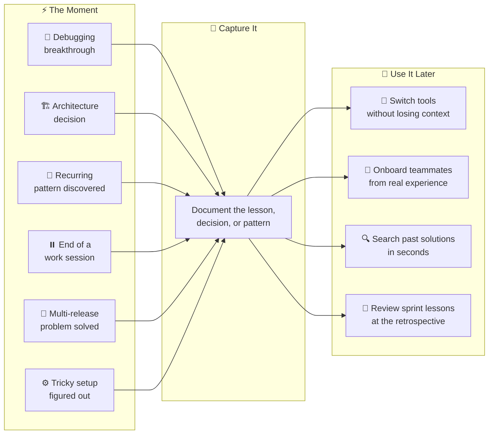

# Why KMGraph?

## The Problem

Development knowledge lives in chat threads that disappear. Every session restart, LLM switch, or team handoff loses context: architecture decisions, debugging solutions, recurring patterns, and process learnings are gone with no trail.

The average developer re-solves the same problems across sessions because there is no record of the first solution. Architecture decisions get relitigated because the rationale was never captured. New team members repeat the same mistakes because the institutional knowledge that would prevent them is trapped in someone's chat history.

This is not a search problem or a documentation problem. It is a capture problem. The knowledge exists. It just evaporates before it can be recorded.

## The Solution

KMGraph adds a capture step to the development workflow — without interrupting it. When a breakthrough happens, a pattern emerges, or a decision is made, the plugin captures it as a structured markdown file with git metadata, categories, and links to the code that prompted it.

The knowledge lives in the project directory alongside the code. It is version-controlled, searchable, and portable. Any AI assistant that has access to the project directory can read it immediately — no external database, no cloud dependency, no sync step.

## The Outcome

Captured knowledge is accessible in any session. Switching from Claude to Cursor to Gemini does not mean starting over. Onboarding a new teammate means giving them the knowledge graph. Running a sprint retrospective means `/kmgraph:kmg-recall` rather than trying to reconstruct three weeks of decisions from memory.

## When Would I Use This?

Knowledge capture fits naturally into everyday development:

## How It Works

Knowledge is stored as markdown files with configurable storage locations. There is no external database and no cloud dependency. Any tool that opens the project directory can read the files directly.

When the library grows large, the built-in MCP server provides structured read access from any configured path and any MCP-compatible IDE.

Setup takes under 5 minutes for Claude Code installs. Other platforms may require additional configuration time. KMGraph is compatible with Claude Code, Cursor, Windsurf, and any MCP-compatible IDE.

## Related

- [What is a knowledge graph?](./what-is-a-knowledge-graph.md) — the graph structure and how KMGraph implements it
- [Four content types](./four-content-types.md) — lessons, decisions, patterns, and session summaries
- [How KMGraph is organized](./how-kmgraph-is-organized.md) — the layered architecture

---

*Back to [home](/) · [Get started](/GETTING-STARTED) · [Browse commands](/knowledge-graph/reference/command-guide)*
