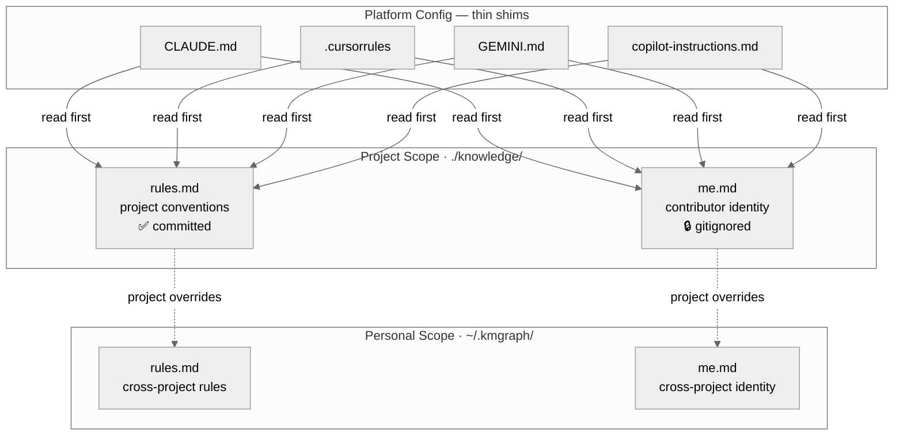

# Portable AI Identity — `me.md` and `rules.md`

KMGraph introduces two files scaffolded at `knowledge/` that give your AI assistant a consistent understanding of who you are and how you work — regardless of which AI platform you're using today.

---

## The Problem: Platform Lock-In and Rule Drift

If you've been using AI coding assistants for a while, you've probably accumulated configuration in `CLAUDE.md`, `.cursorrules`, `copilot-instructions.md`, and other platform-specific files. These files work — until you add a second tool, switch platforms, or have a collaborator join your project.

Three problems surface quickly:

1. **Platform lock-in.** `CLAUDE.md` syntax is Claude Code-only. Rules written there don't travel to Cursor, Windsurf, or Gemini. Every new platform requires rewriting the same context.
2. **Rule drift.** When you update a rule in one file, its duplicate in another platform file silently goes stale. No warning. The rule exists — just in the wrong version.
3. **Identity fragmentation.** There's no single "who am I in this project" document. Working style, communication preferences, and domain expertise live scattered across `CLAUDE.md`, memory files, and implicit expectations.

---

## The Solution: Your AI OS

Nick Milo describes this pattern in his [Obsidian ACE framework](https://youtu.be/jbHB-rzKBAs?si=nJGsbkfa7FKTDeyB) and [AI OS walkthrough](https://youtu.be/sboNwYmH3AY?si=NC0woU_9KIigqSR2): platform files should be **thin shims** that say "read these foundation files first." The foundation files are plain markdown — readable by any AI tool, owned by you.



KMGraph implements this pattern directly. Three files, scaffolded automatically during `kmgraph init`:

| File | Purpose | Committed? |
|---|---|---|
| `knowledge/rules.md` | Project conventions shared by all contributors — branch naming, commit format, workflow rules | Yes |
| `knowledge/me.md` | Who *you* are in this project — working style, domain expertise, communication preferences | No — gitignored |
| `knowledge/triggers.md` | When to apply rules — maps workflow phases (planning, committing, architecture decisions) to the relevant `rules.md` sections | Yes |

Your platform files (`CLAUDE.md`, `.cursorrules`, etc.) become one-line shims:

```markdown
# CLAUDE.md
For full context, read `knowledge/rules.md` and `knowledge/me.md` before acting.
```

No more duplication. When you add a new AI platform, you add one line, not rewrite everything.

---

## Two-Level Hierarchy

The same pattern extends to a personal scope — rules and identity that apply across *all* your projects:

| Scope | File | Contents |
|---|---|---|
| Project | `knowledge/rules.md` | Project-specific conventions — committed, shared by all contributors |
| Project | `knowledge/me.md` | Your identity in this project — gitignored, per-contributor |
| Project | `knowledge/triggers.md` | When to apply rules — workflow phase → rules.md section mappings — committed |
| Personal | `~/.kmgraph/rules.md` | Cross-project behavioral rules (e.g., "always use feature flags") |
| Personal | `~/.kmgraph/me.md` | Your identity across all projects — style, expertise, preferences |
| Personal | `~/.kmgraph/triggers.md` | Cross-project trigger timing — personal phases extend (never replace) project entries |

**Precedence:** project-scoped files override personal files when they conflict. Personal files supply defaults.

---

## `knowledge/rules.md` — Project Conventions

`rules.md` is the single authoritative home for behavioral rules. It replaces the scattered conventions in platform files:

```markdown
# Rules — My Project

## Git Workflow
- Branch format: `v{ver}-{description}`
- Commit format: `type(scope): subject` — include `Closes #N` in body
- Never auto-merge; push and await user review
  - **Why:** auto-merges skipped code review and shipped broken features in v0.2.x

## Workflow Preferences
- Parallel tool calls: always run independent searches and reads in parallel
  - **Source:** [[ADR-017-four-layer-architecture]]
```

Each entry supports optional `Why:` and `Source:` annotations. `Why:` is a one-sentence micro-rationale. `Source:` links to the lesson or ADR that created the rule. This means you can understand *why* a rule exists without loading the full lesson into context.

---

## `knowledge/me.md` — Your Identity

`me.md` is gitignored — each contributor on a project maintains their own. It tells the AI assistant who it's working with, how to communicate, and what domain expertise to assume:

```markdown
# About Me — My Project

## Role
Senior backend engineer, primary maintainer of the payments service.
Strong in TypeScript and PostgreSQL; new to the React components in this repo.

## Working Style
- Direct communication: skip preamble, get to the answer
- Show diffs, not rewrites — I read code well
- Ask before refactoring anything I didn't specifically request

## What I Value
Correctness over speed. If a change might break something, say so first.
```

Two contributors on the same project have different `me.md` files. Committing one person's `me.md` would surface the wrong identity context for every other contributor. That's why it's gitignored.

### Project-Level Tier Overrides — `platforms[]`

An optional `platforms[]` block in `me.md` overrides the model tier mappings from `~/.kmgraph/me.md` for this project only. The `profile_schema:` field pins the frontmatter format version so the inspector can migrate entries when the schema evolves:

```yaml
---
profile_schema: 1
platforms:
  - name: claude
    tier_map:
      fast-tier: claude-haiku-4-5-20251001
      standard-tier: claude-sonnet-4-6
      powerful-tier: claude-opus-4-7
  - name: ollama
    host: localhost
    port: 11434
    tier_map:
      fast-tier: llama3.2:3b
      standard-tier: llama3.1:8b
      powerful-tier: llama3.1:70b
  - name: lm-studio
    host: localhost
    port: 1234
    tier_map:
      fast-tier: Phi-3.5-mini-instruct
      standard-tier: Meta-Llama-3.1-8B-Instruct
      powerful-tier: Meta-Llama-3.1-70B-Instruct
---
```

Useful when a project requires a specific model version regardless of personal defaults. Project-level entries take precedence over user-level entries on conflict. Local platforms add `host` and `port` fields pointing at a running Ollama or LM Studio instance; init discovers these automatically and prompts for the model list.

**When a tier maps to an unreachable model**, the resolver falls back down the chain (`powerful-tier → standard-tier → fast-tier`) and logs the collapse once per session. If `fast-tier` is also unreachable, dispatch halts with a remediation prompt. Skills that must not downgrade declare `required_tier: <label>` in their frontmatter and halt instead of collapsing.

---

## `knowledge/triggers.md` — When Rules Apply

`triggers.md` is the third identity file. It maps workflow phases to the rules in `rules.md` — telling the AI assistant *when* to apply each rule, not just *what* the rules say.

```markdown
# Triggers — When to Apply Rules

## After writing an implementation plan

- Apply: `rules.md § Plan Protocol > Parallelism Analysis`
- If plan includes changes to `commands/` or `core/templates/`:
  apply `rules.md § Development Workflow > Plugin Cache & Local Testing`
  (add cache sync + reload as the final implementation step)

## Before committing

- Apply: `rules.md § Knowledge Capture > Plan-First Rule`
- Apply: `rules.md § Knowledge Capture > Branch-Close Rule`

## When making an architecture decision

- Apply: `rules.md § Knowledge Capture > When to Capture` (ADR trigger condition)

## At session end

- Apply: `rules.md § Knowledge Capture > Cadence & Routing` (run sync-all)
```

`triggers.md` is committed — it documents project workflow phases shared by all contributors. The AI reads it alongside `rules.md` at every phase transition to ensure the right rules are applied at the right time. All AI platforms read this file; there is no platform-specific version.

During init, `triggers.md` is pre-populated by mapping the section headings in `rules.md` to trigger phases. The dry-run preview shows the derived entries so the user can confirm, edit, or skip each one.

---

## Setting Up

Run `kmgraph init` in any project. When `me.md`, `rules.md`, or `triggers.md` are missing, the wizard:

1. **Scans existing sources** — reads all platform files found at the project root (`CLAUDE.md`, `GEMINI.md`, `.cursorrules`, `AGENTS.md`, etc.), plus `README`, ADRs, lessons, and sessions to extract recommendations
2. **Presents a dry-run preview** — shows proposed content for each missing file, pre-populated from the scan, before anything is written
3. **Archives originals** — any existing file that would be overwritten is archived to `.kg-archive-{date}/` with a note showing the archive path so it can be rolled back
4. **Waits for approval** — the user confirms, edits, or skips each file individually before it is written
5. **Updates platform files** — shows which cross-reference comments would be added to each platform file and flags any content that overlaps with `rules.md` for optional removal (with user approval)

For the personal scope, run `/kmgraph:init-personal-kg`. It creates `~/.kmgraph/me.md`, `~/.kmgraph/rules.md`, and `~/.kmgraph/triggers.md` and offers to populate them from `~/.claude/CLAUDE.md`.

---

## Keeping Rules Up to Date — rules-capture

The `rules-capture` skill watches for behavioral corrections mid-session:

> "from now on, always X"  
> "never do X again"  
> "I prefer X over Y"

When detected, it appends a suggestion to your response with a shortcut menu:

```
→ Capture as rule? (project-rules / project-me / personal-rules / personal-me / no)
```

Selecting an option dispatches to `rules-capture-agent`, which reads the target file, checks for duplicates, drafts the rule in house style, and presents an Approve / Edit / Discard loop before writing.

Rules stay current without manual editing.

---

## Before/After

**Before:**

```
CLAUDE.md           ← rules + identity + Claude-specific syntax, 150 lines
.cursorrules        ← duplicates 40% of CLAUDE.md, silently stale
~/.claude/CLAUDE.md ← personal preferences, Claude-only
```

**After:**

```
knowledge/rules.md          ← single authoritative rules source (committed)
knowledge/me.md             ← contributor identity in this project (gitignored)
knowledge/triggers.md       ← when to apply rules — workflow phase mappings (committed)
~/.kmgraph/rules.md         ← cross-project personal rules (local only)
~/.kmgraph/me.md            ← cross-project personal identity (local only)
~/.kmgraph/triggers.md      ← cross-project trigger timing (local only)
CLAUDE.md                   ← shim: "read knowledge/rules.md, me.md, and triggers.md"
.cursorrules                ← shim: "read knowledge/rules.md, me.md, and triggers.md"
```

One rule update. Four platforms served.

---

## Related

- [Personal vs Project KGs](../PERSONAL-V-PROJECT.md) — Understanding the two scopes
- [ADR-028](../../knowledge/decisions/ADR-028-me-and-rules-as-platform-agnostic-source-of-truth.md) — Full architectural rationale
- [Nick Milo — Obsidian ACE Framework](https://youtu.be/jbHB-rzKBAs?si=nJGsbkfa7FKTDeyB)
- [Nick Milo — Building Your AI OS](https://youtu.be/sboNwYmH3AY?si=NC0woU_9KIigqSR2)
