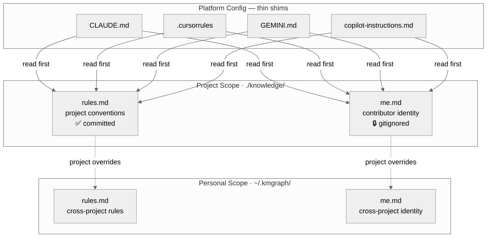

import Tabs from '@theme/Tabs';
import TabItem from '@theme/TabItem';

KMGraph scaffolds three files that give the AI assistant a consistent picture of how a contributor works and what they know, regardless of which platform is in use.

---

## Quick start

<Tabs>
  <TabItem value="new" label="New Project" default>

Run `/kmgraph:init`. The wizard scaffolds templates and steps through each file before writing anything.

Since there are no existing platform files to scan, start minimal:

- [**`me.md`**](#me-md) — A few lines about your role, communication style, and what expertise to assume. It doesn't need to be complete — it grows as you work.
- [**`rules.md`**](#rules-md) — Start nearly empty. Don't try to fill it upfront. Let it grow through `rules-capture` as you establish real patterns in actual sessions.
- [**`triggers.md`**](#triggers-md) — Pre-populated from `rules.md` section headings. Usually needs no editing.

</TabItem>
<TabItem value="existing" label="Existing Project">

Run `/kmgraph:init`. The wizard reads existing config files and drafts the three files automatically:

1. **Scans existing sources** — reads all platform files at the project root (`CLAUDE.md`, `GEMINI.md`, `.cursorrules`, `AGENTS.md`, etc.), plus README, ADRs, lessons, and sessions
2. **Presents a dry-run preview** — proposed content for each file, pre-populated from the scan, before anything is written
3. **Archives originals** — any file that would be overwritten is archived to `.kg-archive-{date}/` for rollback
4. **Waits for approval** — confirm, edit, or skip each file individually
5. **Updates platform files** — adds cross-reference shims and flags content that overlaps with `rules.md` for optional removal

</TabItem>
</Tabs>

For cross-project personal identity (rules and style that apply across all projects), run `/kmgraph:init-personal-kg`. It creates `~/.kmgraph/me.md`, `~/.kmgraph/rules.md`, and `~/.kmgraph/triggers.md`.

---

## Before / after

**Before:**

```
CLAUDE.md           ← rules + identity + Claude-specific syntax, 150 lines
.cursorrules        ← duplicates 40% of CLAUDE.md, silently stale
~/.claude/CLAUDE.md ← personal preferences, Claude-only
```

**After:**

```
knowledge/rules.md      ← single authoritative rules source (committed)
knowledge/me.md         ← your identity in this project (gitignored)
knowledge/triggers.md   ← when to apply rules — workflow phase mappings (committed)
~/.kmgraph/rules.md     ← cross-project personal rules (local only)
~/.kmgraph/me.md        ← cross-project personal identity (local only)
~/.kmgraph/triggers.md  ← cross-project trigger timing (local only)
CLAUDE.md               ← shim: "read knowledge/rules.md, me.md, and triggers.md"
.cursorrules            ← shim: "read knowledge/rules.md, me.md, and triggers.md"
```

One rule update. Four platforms served.

---

## Why this exists

Teams using multiple AI tools tend to accumulate config across `CLAUDE.md`, `.cursorrules`, `copilot-instructions.md`, and others. That works fine until a second tool gets added, platforms change, or a new contributor joins.

Three problems come up:

1. **Platform lock-in.** `CLAUDE.md` syntax is Claude Code-only. Rules written there don't travel to Cursor, Windsurf, or Gemini. Every new platform means rewriting the same context.
2. **Rule drift.** When a rule is updated in one file, its duplicate in another platform file silently goes stale. No warning, no error.
3. **Identity fragmentation.** Working style, communication preferences, and domain expertise end up scattered across several files with no single source of truth.

Nick Milo describes this pattern in his [Obsidian ACE framework](https://youtu.be/jbHB-rzKBAs?si=nJGsbkfa7FKTDeyB) and [AI OS walkthrough](https://youtu.be/sboNwYmH3AY?si=NC0woU_9KIigqSR2): platform files become **thin shims** that say "read these foundation files first." The foundation files are plain markdown, readable by any AI tool.

All platform config files point to two foundation files in `knowledge/` — rules.md and me.md — with project scope overriding personal scope defaults from `~/.kmgraph/`.



Your platform files become one-line shims:

```markdown
# CLAUDE.md
For full context, read `knowledge/rules.md` and `knowledge/me.md` before acting.
```

No more duplication. Adding a new AI platform means adding one line, not rewriting everything.

---

## The three files

### `me.md` — Role and identity {#me-md}

<Tabs groupId="kg-scope">
<TabItem value="project" label="Project (knowledge/)">

Each contributor keeps their own copy — it's gitignored. It covers the contributor's role on this project, their areas of strength, and what's new to them in this codebase.

```markdown
# About Me — My Project

## Role
Senior backend engineer, primary maintainer of the payments service.
Strong in TypeScript and PostgreSQL; new to the React components in this repo.

## Working Style
- Direct communication: skip preamble, get to the answer
- Show diffs, not rewrites — I read code well
- Ask before refactoring anything I didn't specifically request

## What I Value
Correctness over speed. If a change might break something, say so first.
```

Two contributors on the same project will have different files. Committing one person's file would give every other contributor the wrong context.

`me.md` also accepts an optional `platforms[]` frontmatter block to override model tier mappings for this project. See [Model Tier Resolver](../reference/tier-resolver.md) for the full schema.

</TabItem>
<TabItem value="personal" label="Personal (~/.kmgraph/)">

Cross-project identity: the communication style, expertise, and preferences that stay consistent regardless of which project is active. Created once with `/kmgraph:init-personal-kg`.

```markdown
# About Me — Personal

## Background
Full-stack developer, 8 years experience.
Primary languages: TypeScript, Python, Go.

## Working Style
- Conclusions first, details on request
- Prefer explicit over implicit — spell out assumptions
- No preamble or trailing summary in responses

## Preferences
- Always show diffs for code changes, not full rewrites
- Flag breaking changes before suggesting them
```

When both files exist, the project file takes precedence. This file holds preferences that never change between projects; codebase-specific context belongs in `knowledge/me.md`.

</TabItem>
</Tabs>

---

### `rules.md` — Behavioral rules {#rules-md}

<Tabs groupId="kg-scope">
<TabItem value="project" label="Project (knowledge/)">

One file, one source of truth for how work happens on this project. All platform files point here instead of duplicating rules across each one.

```markdown
# Rules — My Project

## Git Workflow
- Branch format: `v{ver}-{description}`
- Commit format: `type(scope): subject` — include `Closes #N` in body
- Never auto-merge; push and await user review
  - **Why:** auto-merges skipped code review and shipped broken features in v0.2.x

## Workflow Preferences
- Parallel tool calls: always run independent searches and reads in parallel
  - **Source:** [[ADR-017-four-layer-architecture]]
```

Each entry supports optional `Why:` and `Source:` annotations. `Why:` is a one-sentence explanation so the rule doesn't feel arbitrary. `Source:` links to the lesson or ADR it came from.

</TabItem>
<TabItem value="personal" label="Personal (~/.kmgraph/)">

Rules that apply across every project: commit habits, communication preferences, anything that doesn't change depending on the codebase. Project-level rules take precedence when there's a conflict.

```markdown
# Personal Rules

## Always
- Use feature flags for any user-facing behaviour change
- Write tests before implementation on any public API change

## Never
- Squash commits on shared branches
- Push directly to main

## Communication
- Lead responses with the answer, not the approach
- Ask before refactoring anything outside the stated scope
```

Rules that would apply on every project belong here rather than duplicated in each project's `rules.md`.

</TabItem>
</Tabs>

---

### `triggers.md` — When rules apply {#triggers-md}

<Tabs groupId="kg-scope">
<TabItem value="project" label="Project (knowledge/)">

Maps workflow phases to rules in `rules.md`, so the AI knows *when* to apply each rule, not just *what* the rules say. Committed and shared by all contributors.

```markdown
# Triggers — When to Apply Rules

## After writing an implementation plan
- Apply: `rules.md § Plan Protocol > Parallelism Analysis`
- If plan includes changes to `commands/` or `core/templates/`:
  apply `rules.md § Development Workflow > Plugin Cache & Local Testing`

## Before committing
- Apply: `rules.md § Knowledge Capture > Plan-First Rule`
- Apply: `rules.md § Knowledge Capture > Branch-Close Rule`

## When making an architecture decision
- Apply: `rules.md § Knowledge Capture > When to Capture`

## At session end
- Apply: `rules.md § Knowledge Capture > Cadence & Routing`
```

During init, `triggers.md` is pre-populated by mapping `rules.md` section headings to trigger phases. The dry-run preview shows derived entries for review before anything is written.

</TabItem>
<TabItem value="personal" label="Personal (~/.kmgraph/)">

Workflow phases that apply across all projects. Personal entries extend project entries; they never replace them.

```markdown
# Personal Triggers

## Before starting any task
- Apply: `personal rules.md § Communication`

## Before any commit
- Apply: `personal rules.md § Never`

## When introducing a new dependency
- Apply: `personal rules.md § Always > Feature flags`
```

Project-specific phase logic belongs in `knowledge/triggers.md`. Personal triggers should stay general enough to apply anywhere.

</TabItem>
</Tabs>

---

## Keeping rules current

The `rules-capture` skill watches for behavioral corrections mid-session:

> "from now on, always X"  
> "never do X again"  
> "I prefer X over Y"

When detected, it appends a shortcut menu to the response:

```
→ Capture as rule? (project-rules / project-me / personal-rules / personal-me / no)
```

Selecting an option opens a short review loop: the agent reads the target file, checks for duplicates, drafts the rule, and asks for approval before writing. No manual file editing needed.

---

## Personal scope

A summary of all six files across both scopes. Project-scoped files take precedence; personal files supply defaults.

| Scope | File | Contents |
|---|---|---|
| Project | `knowledge/me.md` | Your role in this project — gitignored, per-contributor |
| Project | `knowledge/rules.md` | Project conventions — committed, shared by all contributors |
| Project | `knowledge/triggers.md` | When to apply rules — committed |
| Personal | `~/.kmgraph/me.md` | Your identity across all projects — style, expertise, preferences |
| Personal | `~/.kmgraph/rules.md` | Cross-project behavioral rules (e.g., "always use feature flags") |
| Personal | `~/.kmgraph/triggers.md` | Cross-project trigger timing — extends, never replaces, project entries |

Run `/kmgraph:init-personal-kg` to set up the personal scope.

---

## Related

- [Personal vs Project KGs](../PERSONAL-V-PROJECT.md) — Understanding the two scopes
- [Model Tier Resolver](../reference/tier-resolver.md) — Configuring model tier mappings in `me.md`
- [ADR-028](../../knowledge/decisions/ADR-028-me-and-rules-as-platform-agnostic-source-of-truth.md) — Full architectural rationale
- [Nick Milo — Obsidian ACE Framework](https://youtu.be/jbHB-rzKBAs?si=nJGsbkfa7FKTDeyB)
- [Nick Milo — Building Your AI OS](https://youtu.be/sboNwYmH3AY?si=NC0woU_9KIigqSR2)
