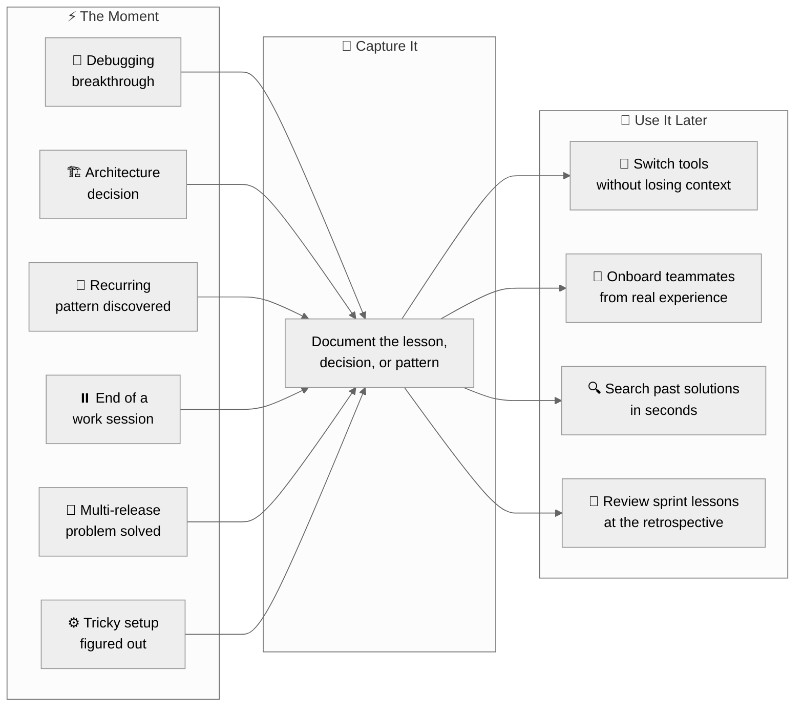

# Knowledge Management Graph (kmgraph)

---
!!! info

    **Institutional knowledge from LLM sessions no longer has to disappear. Prompting breakthroughs and coding solutions can persist permanently.**

    **The plugin builds a searchable library of lessons learned during development, debugging, and architecture work that is retained across sessions and projects, with cross-model portability through chat history extraction.**

The Knowledge Management Graph captures and structures key insights from LLM conversations (lessons learned, architecture decisions, session summaries, and more), and stores them as portable markdown files for persistent access. Storage locations are configurable (project-local or centralized).

Context persists across sessions. Cross-model portability is supported through chat history extraction and manual MEMORY.md synchronization, enabling knowledge reuse when switching between LLMs.

Knowledge graphs can be version-controlled and shared via Git. When a graph outgrows project-local storage, the built-in MCP server provides structured read access to graph data from any configured path and any MCP-compatible IDE.

Setup takes under 5 minutes for Claude Code marketplace installs. Other platforms and local LLMs may require additional configuration time. Compatible with Claude Code, Cursor, Windsurf, and more.

---

## Why It Matters

- :material-chat-question: **The Problem**

  Development knowledge lives in chat threads that disappear. Every LLM switch, session restart, or team handoff loses context: architecture decisions, debugging solutions, recurring patterns, and process learnings are lost permanently.

- :material-lightbulb-on: **The Solution**

  This plugin helps users capture the important stuff, like lessons learned, architecture decisions, and recurring patterns, inside the development workflow without having to stop chatting.

- :material-database-check: **The Outcome**

  Captured knowledge is accessible in any session. Cross-platform portability is supported through markdown storage and chat history extraction, enabling reuse across different LLMs and IDEs.

---

## When Would I Use This?

Knowledge capture fits naturally into everyday development:

```mermaid
%%{init: { 'flowchart': { 'useMaxWidth': true }, 'theme': 'neutral' }}%%
graph LR
    subgraph Trigger["⚡ The Moment"]
        A["🐞 Debugging<br/>breakthrough"]
        B["🏗️ Architecture<br/>decision"]
        C["🔁 Recurring<br/>pattern discovered"]
        D["⏸️ End of a<br/>work session"]
        E["🧩 Multi-release<br/>problem solved"]
        F["⚙️ Tricky setup<br/>figured out"]
    end

    subgraph Capture["📝 Capture It"]
        G["Document the lesson,<br/>decision, or pattern"]
    end

    subgraph Payoff["🎯 Use It Later"]
        H["🔄 Switch tools<br/>without losing context"]
        I["🤝 Onboard teammates<br/>from real experience"]
        J["🔍 Search past solutions<br/>in seconds"]
        K["🏃 Review sprint lessons<br/>at the retrospective"]
    end

    A --> G
    B --> G
    C --> G
    D --> G
    E --> G
    F --> G
    G --> H
    G --> I
    G --> J
    G --> K

    accTitle: When to Use the Knowledge Graph
    accDescr: Three-phase journey flow showing six trigger moments (debugging, architecture decisions, recurring patterns, end of session, multi-release problems, tricky setups) feeding into knowledge capture, which then enables four future benefits (tool switching, team onboarding, instant search, and sprint retrospective reviews).
```

---

## Quick Start

- **[Getting Started](GETTING-STARTED.md)**

  Install, initialize, and configure the plugin. Claude Code marketplace setup takes under 5 minutes; other platforms and local LLMs may require additional configuration. Step-by-step instructions for all supported platforms.

- **[Concepts](CONCEPTS.md)**

  Understand the knowledge graph structure. Learn about the Four Pillars this project was built on, key terminology, and how everything connects.

- **[Command Guide](COMMAND-GUIDE.md)**

  Full reference for all commands, organized by learning path. Essential, intermediate, and advanced commands.

- **[Cheat Sheet](CHEAT-SHEET.md)**

  One-page quick reference with the most common commands and workflows at a glance.

---

## How It Works

Knowledge is stored as markdown files with configurable storage locations. There is no external database and no cloud dependency. Any tool that opens the project directory can read the files directly. If the library grows large, the built-in MCP server handles access from any configured path and any MCP-compatible IDE.

???+ note "Full Feature List"
    - **Lesson-Learned Capture** with categorized storage and git metadata tracking
    - **Knowledge Graph** with quick-reference entries linked to full lessons
    - **MEMORY.md Bidirectional Sync** for persistent cross-session context
    - **Meta-Issue Tracking** for complex multi-attempt problems
    - **Automated Knowledge Sync** pipeline (4 steps → 1 command)
    - **Chat History Extraction** from Claude Code and Gemini logs
    - **Session Summaries** for work documentation
    - **ADR Management** for architecture decisions
    - **Multi-KG Support** with flexible configuration

---

## Installation

The plugin supports three installation tiers:

| Tier | Platform | Commands Available |
|------|----------|--------------------|
| **Tier 1** | Claude Code (marketplace or local) | slash commands + hooks + agents |
| **Tier 2** | MCP IDEs (Cursor, Windsurf, VS Code, JetBrains) | MCP tools |
| **Tier 3** | Any platform (template-only) | Manual markdown workflow |

See [Getting Started](GETTING-STARTED.md) for platform-specific setup instructions.

---

!!! success "Now in Beta"
    This project has **completed its initial alpha development** and is now in beta, actively seeking feedback from test users. Feedback, feature requests, and bug reports are welcome via the [issue tracker](https://github.com/technomensch/knowledge-graph/issues).

---

## Links

- **Repository:** [github.com/technomensch/knowledge-graph](https://github.com/technomensch/knowledge-graph)
- **Issues:** [github.com/technomensch/knowledge-graph/issues](https://github.com/technomensch/knowledge-graph/issues)
- **Releases:** [github.com/technomensch/knowledge-graph/releases](https://github.com/technomensch/knowledge-graph/releases)

---

??? info "About This Project"
    This project was initially built as a **personal learning project** to explore **docs-as-code** practices and plugin development. It has evolved into a comprehensive knowledge management system designed for institutional knowledge capture and cross-session memory. The architecture reflects these principles: platform-agnostic core, automated workflows, and portable knowledge representation.

    This is a platform-agnostic knowledge graph that was developed entirely using Gemini and Claude, leveraging very specific context and detailed natural language prompting.
