# Knowledge Management Graph (kmgraph)

---

**Stop losing knowledge in LLM session chat history and never forget a prompting or coding breakthrough.**

**Start building a searchable library of everything you learn while developing, debugging, or architecting with AI, and retain it across sessions, projects, and even platforms (like switching from Claude to Gemini).**

---

## Why It Matters

- :material-chat-question: **The Problem**

  Development knowledge lives in chat threads that disappear. Every LLM switch, session restart, or team handoff loses context: architecture decisions, debugging solutions, recurring patterns, and process learnings are lost permanently.

- :material-lightbulb-on: **The Solution**

  This plugin helps users capture the important stuff, like lessons learned, architecture decisions, and recurring patterns, inside the development workflow without having to stop chatting.

- :material-database-check: **The Outcome**

  Users can easily look up that information not only in their current chat, but also in any other chat session, even if they switch to a totally different LLM, IDE, or coding assistant!

---

## When Would I Use This?

Knowledge capture fits naturally into everyday development:

```mermaid
%%{init: { 'flowchart': { 'useMaxWidth': true }, 'theme': 'neutral' }}%%
graph LR
    subgraph Trigger["⚡ The Moment"]
        A["🐞 Debugging<br/>breakthrough"]
        B["🏗️ Architecture<br/>decision"]
        C["🔁 Recurring<br/>pattern discovered"]
        D["⏸️ End of a<br/>work session"]
        E["🧩 Multi-release<br/>problem solved"]
        F["⚙️ Tricky setup<br/>figured out"]
    end

    subgraph Capture["📝 Capture It"]
        G["Document the lesson,<br/>decision, or pattern"]
    end

    subgraph Payoff["🎯 Use It Later"]
        H["🔄 Switch tools<br/>without losing context"]
        I["🤝 Onboard teammates<br/>from real experience"]
        J["🔍 Search past solutions<br/>in seconds"]
        K["🏃 Review sprint lessons<br/>at the retrospective"]
    end

    A --> G
    B --> G
    C --> G
    D --> G
    E --> G
    F --> G
    G --> H
    G --> I
    G --> J
    G --> K

    accTitle: When to Use the Knowledge Graph
    accDescr: Three-phase journey flow showing six trigger moments (debugging, architecture decisions, recurring patterns, end of session, multi-release problems, tricky setups) feeding into knowledge capture, which then enables four future benefits (tool switching, team onboarding, instant search, and sprint retrospective reviews).
```

---

## Quick Start

- **[Getting Started](GETTING-STARTED.md)**

  Install, initialize, and configure in under 5 minutes. Step-by-step setup for installing with Claude Code, Cursor, or any local IDE CLI coding assistant.

- **[Concepts](CONCEPTS.md)**

  Understand the knowledge graph structure. Learn about the Four Pillars this project was built on, key terminology, and how everything connects.

- **[Command Guide](COMMAND-GUIDE.md)**

  Full reference for all commands, organized by learning path. Essential, intermediate, and advanced commands.

- **[Cheat Sheet](CHEAT-SHEET.md)**

  One-page quick reference with the most common commands and workflows at a glance.

---

## How It Works

Knowledge is stored as markdown files inside the project directory. There is no external database and no cloud dependency. Any tool that opens the project can read it. If the library grows large, the content can be accessed externally via MCP servers.

???+ note "Full Feature List"
    - **Lesson-Learned Capture** with categorized storage and git metadata tracking
    - **Knowledge Graph** with quick-reference entries linked to full lessons
    - **MEMORY.md Bidirectional Sync** for persistent cross-session context
    - **Meta-Issue Tracking** for complex multi-attempt problems
    - **Automated Knowledge Sync** pipeline (4 steps → 1 command)
    - **Chat History Extraction** from Claude Code and Gemini logs
    - **Session Summaries** for work documentation
    - **ADR Management** for architecture decisions
    - **Multi-KG Support** with flexible configuration

---

## Installation

The plugin supports three installation tiers:

| Tier | Platform | Commands Available |
|------|----------|--------------------|
| **Tier 1** | Claude Code (marketplace or local) | slash commands + hooks + agents |
| **Tier 2** | MCP IDEs (Cursor, Windsurf, VS Code, JetBrains) | MCP tools |
| **Tier 3** | Any platform (template-only) | Manual markdown workflow |

See [Getting Started](GETTING-STARTED.md) for platform-specific setup instructions.

---

!!! success "Help Shape the Beta Release"
    This project has **finished its initial alpha development** and is now actively seeking feedback from test users before launching the beta phase. If you're interested in helping shape the future of this plugin, please [open an issue](https://github.com/technomensch/knowledge-graph/issues) with your feedback, feature requests, or bug reports.

---

## Links

- **Repository:** [github.com/technomensch/knowledge-graph](https://github.com/technomensch/knowledge-graph)
- **Issues:** [github.com/technomensch/knowledge-graph/issues](https://github.com/technomensch/knowledge-graph/issues)
- **Releases:** [github.com/technomensch/knowledge-graph/releases](https://github.com/technomensch/knowledge-graph/releases)

---

??? info "About This Project"
    This project was initially built as a **personal learning project** to explore **docs-as-code** practices and plugin development. It has evolved into a comprehensive knowledge management system designed for institutional knowledge capture and cross-session memory. The architecture reflects these principles: platform-agnostic core, automated workflows, and portable knowledge representation.

    This is a platform-agnostic knowledge graph that was developed entirely using Gemini and Claude, leveraging very specific context and detailed natural language prompting.
