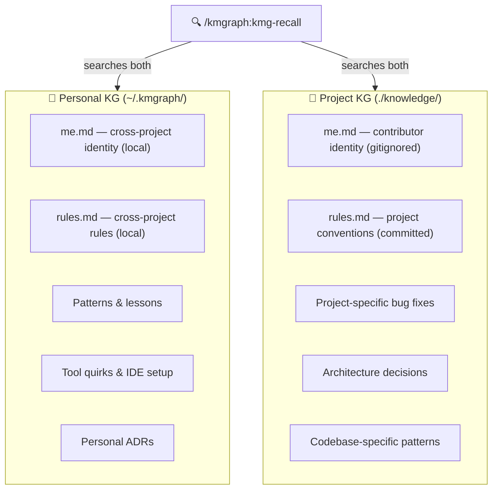

# Personal vs. Project

> "Where should this knowledge live — in my project or my personal graph?"

Every knowledge graph belongs to one of two scopes: **project** or **personal**.

## Project KG

A project KG lives inside a project's directory at `./knowledge/`. It contains knowledge specific to that project:

- Bug fixes and workarounds found in this codebase
- Architecture decisions for this system
- Debugging sessions for this project's stack

**Best for**: Anything that only makes sense in the context of one project.

## Personal KG

A personal KG lives at `~/.kmgraph/` and is accessible from any project. It contains cross-project patterns and lessons:

- Workflow habits ("Create vs Update in implementation plans")
- Tool quirks that appear across projects (MCP registration, IDE setup)
- Personal ADRs ("Why I prefer TypeScript strict mode")
- Reusable checklists and process patterns

**Best for**: Knowledge that would apply identically in your next project.

## Identity and rules files

Each scope also scaffolds two special files:

| File | Scope | Committed? | Purpose |
|---|---|---|---|
| `knowledge/rules.md` | Project | Yes | Project conventions shared by all contributors |
| `knowledge/me.md` | Project | No — gitignored | Who you are in this project (per-contributor) |
| `~/.kmgraph/rules.md` | Personal | N/A local | Cross-project behavioral rules |
| `~/.kmgraph/me.md` | Personal | N/A local | Cross-project personal identity and preferences |

These files are the platform-agnostic foundation that all AI platform config files (CLAUDE.md, .cursorrules, etc.) point to. See [Your AI Profile](../portability/your-ai-profile) for the full setup guide.

## How they work together

| Behavior | Detail |
|---|---|
| **`/kmgraph:kmg-recall`** | Searches both KGs automatically when a personal KG is registered. Results show `[project]` or `[personal]` source labels. |
| **`/kmgraph:kmg-capture-lesson`** | Shows a KG picker when ≥2 KGs are registered. Only one prompt per session (choice remembered). |
| **SessionStart hook** | Surfaces recent personal KG lessons alongside project lessons. |
| **Active KG** | Unchanged by personal KG setup — project KG stays active for new captures by default. |

## When to use personal vs project

| Situation | Save to |
|---|---|
| "I fixed a bug specific to this repo" | Project KG |
| "I learned a general debugging pattern" | Personal KG |
| "We decided to use Redis for this project" | Project KG |
| "I always prefer feature flags over config files" | Personal KG |
| "This MCP registration quirk affects all IDEs" | Personal KG |

## Scope diagram



## Routing captures by level

All capture commands (`session-summary`, `create-adr`, `capture-lesson`, `sync-all`) and `recall` accept an explicit routing flag — or recognize equivalent natural language in the invocation message:

| Signal | Resolves to | Behavior |
|---|---|---|
| `--user` / "user level" / "for the user" | Personal KG (`~/.kmgraph/`) | Writes directly; bypasses `kg_capture`; no KG switch |
| `--project` / "for this project" / "project level" | Current project's KG | Temporarily switches active KG if it differs; restores after |
| `--named=<kg>` / name of a KG (e.g., "career-ops") | Named KG from `kg-config.json` | Writes to named KG directly; no switch |
| (no signal) | Active KG | Default behavior; every draft shows `Saving to: {path}` for confirmation |

**Examples:**

```bash
/kmgraph:kmg-capture-lesson "user level"        # → ~/.kmgraph/lessons-learned/
/kmgraph:kmg-create-adr --project               # → current project's knowledge/decisions/
/kmgraph:kmg-session-summary --named=career-ops # → career-ops KG sessions/
/kmgraph:kmg-recall "auth patterns" --user      # → search only ~/.kmgraph/
```

If a named KG isn't found, a fuzzy suggestion prompt appears. If the project has no configured KG, a setup prompt offers options to initialize or redirect the capture.

## Setup

- **During init**: `/kmgraph:kmg-init` offers to create a personal KG at the end of setup
- **Standalone**: `/kmgraph:kmg-init-personal-kg` creates and registers the personal KG at any time

See [Multi-KG Workflows](./multi-kg-workflows.md) for advanced configuration and [Your AI Profile](../portability/your-ai-profile) for setting up `me.md` and `rules.md`.

## Related

- [Graph Configuration](./graph-configuration.md) — categories, storage paths, and kg-config.json
- [Multi-KG Workflows](./multi-kg-workflows.md) — managing multiple graphs side by side
- [Your AI Profile](../portability/your-ai-profile) — setting up me.md and rules.md
