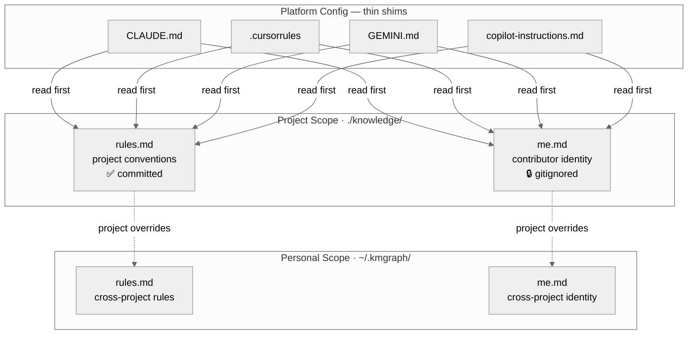

import Tabs from '@theme/Tabs';
import TabItem from '@theme/TabItem';

# Your AI Profile

Your AI profile (`me.md`) tells every AI tool who you are, how you work, and what you already know. Instead of explaining your background at the start of every conversation, you write it once — and it travels with you.

## What belongs in your profile

Your profile captures stable identity facts:

- Your role and domain expertise
- Languages and tools you know well
- Communication preferences (verbose explanations vs. terse, analogies vs. code)
- Things the AI should never assume about you

A minimal example:

```markdown
# About Me — Personal

## Background
Full-stack developer, 8 years experience.
Primary languages: TypeScript, Python, Go.

## Working Style
- Conclusions first, details on request
- Prefer explicit over implicit — spell out assumptions
- No preamble or trailing summary in responses

## Preferences
- Always show diffs for code changes, not full rewrites
- Flag breaking changes before suggesting them
```

## What does NOT belong here

Behavioral rules ("always run tests before pushing") belong in `rules.md`, not `me.md`. Your profile is about *who you are*, not *how the AI should behave*.

## Setup

Your profile lives at `~/.kmgraph/me.md` (personal, cross-project) or `knowledge/me.md` (project-specific override, gitignored).

Run `/kmgraph:init` to create the initial profile interactively, or edit the file directly.

For cross-project personal identity (rules and style that apply across all projects), run `/kmgraph:init-personal-kg`. It creates `~/.kmgraph/me.md`, `~/.kmgraph/rules.md`, and `~/.kmgraph/triggers.md`.

## Project vs. personal scope

When both files exist, the project file takes precedence. This lets you have global defaults and per-project overrides.

<Tabs groupId="kg-scope">
<TabItem value="project" label="Project (knowledge/me.md)">

Each contributor keeps their own copy — it's gitignored. It covers your role on this project, your areas of strength, and what's new to you in this codebase.

```markdown
# About Me — My Project

## Role
Senior backend engineer, primary maintainer of the payments service.
Strong in TypeScript and PostgreSQL; new to the React components in this repo.

## Working Style
- Direct communication: skip preamble, get to the answer
- Show diffs, not rewrites — I read code well
- Ask before refactoring anything I didn't specifically request

## What I Value
Correctness over speed. If a change might break something, say so first.
```

Two contributors on the same project will have different files. Committing one person's file would give every other contributor the wrong context.

</TabItem>
<TabItem value="personal" label="Personal (~/.kmgraph/me.md)">

Cross-project identity: the communication style, expertise, and preferences that stay consistent regardless of which project is active. Created once with `/kmgraph:init-personal-kg`.

```markdown
# About Me — Personal

## Background
Full-stack developer, 8 years experience.
Primary languages: TypeScript, Python, Go.

## Working Style
- Conclusions first, details on request
- Prefer explicit over implicit — spell out assumptions
- No preamble or trailing summary in responses

## Preferences
- Always show diffs for code changes, not full rewrites
- Flag breaking changes before suggesting them
```

Preferences that never change between projects belong here; codebase-specific context belongs in `knowledge/me.md`.

</TabItem>
</Tabs>

## Cross-platform portability

Because `me.md` is plain Markdown, it works on any platform that reads KMGraph. Claude Code, Gemini CLI, Cursor — they all load the same profile. You configure it once and every AI tool benefits.

The platform shim pattern makes this work: each platform config file (`CLAUDE.md`, `.cursorrules`, `GEMINI.md`, etc.) becomes a thin shim that says "read `knowledge/rules.md` and `knowledge/me.md` first."

```
knowledge/me.md         ← your identity in this project (gitignored)
knowledge/rules.md      ← single authoritative rules source (committed)
~/.kmgraph/me.md        ← cross-project personal identity (local only)
~/.kmgraph/rules.md     ← cross-project personal rules (local only)
CLAUDE.md               ← shim: "read knowledge/rules.md and me.md"
.cursorrules            ← shim: "read knowledge/rules.md and me.md"
```

One profile update. Every platform served.



## Model tier configuration

`me.md` also accepts an optional `platforms[]` frontmatter block to override model tier mappings for this project. See [Model Tier Resolver](../../reference/tier-resolver.md) for the full schema.

## Related

- [Custom Rules](../tailoring/custom-rules.md) — behavioral instructions that complement your identity
- [Migrate between Claude and Gemini](./migrate-claude-gemini.md) — how your profile travels to a new platform
- [ADR-028](../../../knowledge/decisions/ADR-028-me-and-rules-as-platform-agnostic-source-of-truth.md) — full architectural rationale for the platform shim pattern
