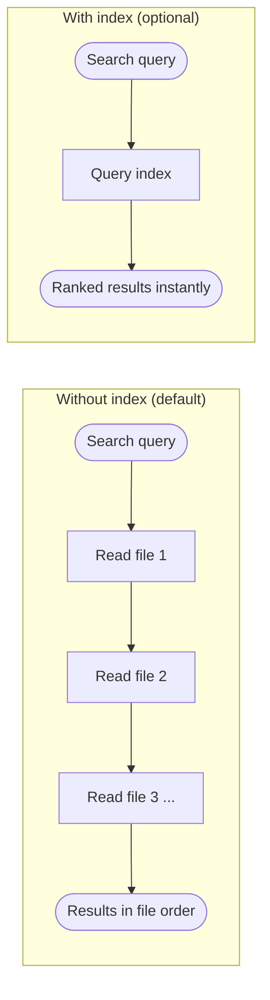

# Search the Graph

> "I know I captured this somewhere. How do I find it?"

Run `/kmgraph:kmg-recall` to search. KMGraph supports two search paths — file-walk (default) and indexed (optional, faster).

## How search works

Without an index, kmgraph reads each file in the knowledge graph sequentially and returns results in file order. With an index, a single query returns results sorted by relevance — files that closely match the query float to the top. Both paths return results from the same knowledge graph files; the difference is speed and ranking. The search label `(FTS5)` in results means the index was used — FTS5 (Full-Text Search version 5) is the underlying search technology.

## Enable the index

The index is off by default and takes about a second to build. Once enabled, it stays current automatically — no maintenance required.

The first time `/kmgraph:kmg-sync-all` is run, it asks once whether to build the index. Answer yes and the index builds automatically. After that, every `sync-all` run keeps it current with no prompts. If no index exists and the user has not previously declined, sync-all asks once — the preference is remembered and users are never asked again regardless of the answer.

To build the index at any time without running sync-all, call `kg_fts5_rebuild` from the MCP tool panel.

The index covers all knowledge graph entries including exported chat logs (`knowledge/chat-history/`) — chat exports are searchable alongside lessons, ADRs, and sessions.

- **How to tell it is active**: search results show `(FTS5)` — this means the index was used
- **How to re-enable after declining**: run `kg_fts5_rebuild` directly

## Manage the index

To revert to file-walk search, delete the index database file for the relevant knowledge graph:

- Project KG: `~/.kmgraph/index/projects/<kgName>.db`
- Personal KG: `~/.kmgraph/index/personal.db`

Run `kg_fts5_rebuild` to recreate the index at any time.

## Related

- [Session Memory](./session-memory.md) — how KMGraph automatically surfaces relevant knowledge at session start
- [Linking Entries](./linking-entries.md) — connecting related entries so recall pulls the right cluster
