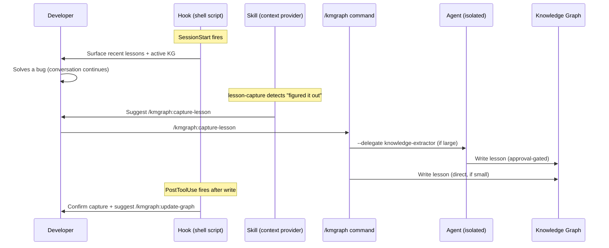

# The Automation Layer

> "What's happening behind the scenes when KMGraph fires automatically?"

KMGraph runs a layer of automation that fires without explicit commands. This page explains how skills, agents, and hooks coordinate to capture knowledge at the right moments without interrupting your workflow.

## Three components

The automation layer has three components that work at different points in the development workflow:

| Component | When | What it does |
|---|---|---|
| **Hooks** | At Claude Code lifecycle events (SessionStart, PostToolUse, Stop, Notification) | Runs shell scripts that provide context, prompt for captures, or enforce quality gates |
| **Skills** | When natural-language patterns match in conversation | Surfaces suggestions and pre-fills command context |
| **Agents** | When a command delegates heavy-lift work | Runs isolated sub-processes that do not crowd the main context |

## How they connect

## Skills and their trigger keywords

Skills listen for natural-language signals. They never execute commands automatically — they surface suggestions.

| Skill | Example trigger phrases |
|---|---|
| **lesson-capture** | "figured it out", "solved it", "the fix was", "turns out the issue was" |
| **kg-recall** | "have we done this before", "did we solve this", "what was the pattern for" |
| **brainstorm-recall** | `superpowers:brainstorming` invoked — fires before `adr-guide` to surface prior art |
| **session-wrap** | "I'm wrapping up", "stopping for the day", context limit approaching |
| **adr-guide** | "I'm thinking of using", "should we use X or Y", "architectural decision" |
| **capture-router** | "capture that", "remember that", "save that", "let's document this" |
| **doc-update-router** | "update the docs", "update the changelog", "update the session summary" |
| **stuck-work-escalation** | 3+ failed attempts on same problem, 30+ min without resolution, "still blocked", "tried everything" |
| **docs-impact-scan** | "push to origin", "push and merge", "open PR", "create PR", "finishing up", "ready to push" |
| **sidebar-update** | Doc file moved or renamed, `git mv docs/...`, "move [doc]", "rename [doc]" |

The docs-impact-scan skill runs an eight-step pre-push workflow — diff scan, docs grep, user confirmation, and update-doc dispatch. See [Docs Impact Scan](./docs-impact-scan.md) for the full workflow and pre-push gate details.

## Hooks and their lifecycle events

| Hook script | Fires on | Default |
|---|---|---|
| `hooks-master.sh` (router) | All events | Enabled |
| `session-end-prompt.sh` | Stop | Prompts for session summary; Codex CLI-compatible (emits JSON decision on stdout via `trap EXIT`) |
| `post-tool-lesson-check.sh` | PostToolUse | Prompts for lesson capture after certain tools |
| `platform-file-change-check.sh` | PostToolUse | Detects changes to CLAUDE.md / AGENTS.md |
| `plan-mirror.sh` | PostToolUse | Mirrors plan files from `~/.claude/plans/` to `docs/plans/` |
| `pre-commit-knowledge-gate.sh` | PreToolUse (git commit) | Prompts for knowledge capture before commit |
| `pre-skill-rules-inject.sh` | PreToolUse (Skill) | Injects rules overrides; hard-blocks brainstorm/plan without recall; enforces PR gate |
| `stop-plan-gate.sh` | Stop | Re-surfaces plan approval gate at session end when a plan was written |
| `post-plan-validate-checklist.sh` | PostToolUse (Write) | Advisory checklist after writing any `plans/*.md` file |
| `notification-dispatch.sh` | Notification | Sends webhook (opt-in — requires `webhookUrl`) |

## The capture-router: type detection from content signals

The `capture-router` skill auto-detects the correct capture destination from what the user describes. When a user says "capture that" or "remember that", the skill reads the content signals to route:

| Content signal | Captured as |
|---|---|
| "I fixed a bug..." / "the solution was..." | Lesson (category: debugging) |
| "We decided to use..." / "the trade-off is..." | ADR |
| "Every time I see X, I should Y..." | Pattern (category: patterns) |
| "Today I worked on..." / "this session..." | Session summary |

The router presents a single confirmation before writing. No silent writes.

## Disabling automation

Any hook or skill can be disabled independently. See:
- [Customize hooks](/knowledge-graph/pillars/tailoring/customize-hooks) — disable individual hook scripts or all hooks
- Skills cannot be fully disabled but can be ignored; they only surface suggestions

## Related

- [Hooks Reference](/reference/hooks) — all lifecycle events and scripts
- [Skills Catalog](/reference/skills) — all skills with trigger keywords
- [Agents Catalog](/reference/agents) — all agents with invocation patterns
