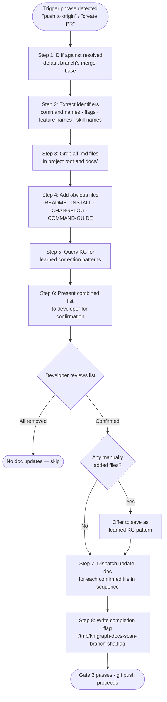
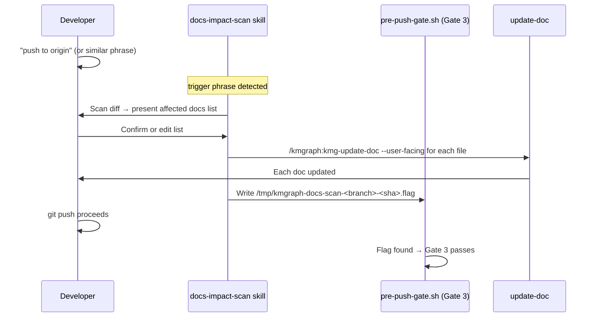

# Docs Impact Scan

> "How does KMGraph know which docs need updating when code changes?"

When code changes ship, documentation often lags behind. The docs-impact-scan skill closes this gap automatically: it fires on pre-push phrases, scans the current git diff for changed identifiers, discovers every doc file that references them, validates the list with the developer, and dispatches targeted updates — all before `git push` completes.

## How it works

The scan runs in eight steps:

| Step | Action |
|---|---|
| 1 | Diff against the resolved default branch's merge-base with `HEAD` (not a hardcoded `main`) — extract changed command names, feature names, flag names, skill names. Falls back to uncommitted/staged changes when `HEAD` is still on the default branch (no feature branch yet), instead of showing nothing. |
| 2 | Grep all `.md` files in the project root and `docs/` for each extracted identifier |
| 3 | Always add obvious files: `README.md`, `INSTALL.md`, `CHANGELOG.md`, `COMMAND-GUIDE.md` |
| 4 | Query the active knowledge graph for learned correction patterns (e.g., "when X changes, also check Y") |
| 5 | Present the combined list to the developer for confirmation — add, remove, or approve |
| 6 | Offer to save any manually-added files as learned patterns to the KG for future runs |
| 7 | Dispatch `/kmgraph:kmg-update-doc --user-facing [file]` for each confirmed file, in sequence |
| 8 | Write a completion flag to `/tmp/` — the pre-push gate checks this flag before allowing push |



## The pre-push gate

The completion flag written in Step 8 has the form:

```
/tmp/kmgraph-docs-scan-<branch>-<sha>.flag
```

The branch name is sanitized (slashes replaced with `-`). The flag is **commit-specific**: a new commit invalidates it, and a flag from a different branch never satisfies the gate. The scan must complete on the same commit and branch being pushed — there is no way to carry a prior scan forward.

The gate is advisory by default: if the flag is absent at push time, Gate 3 injects a prompt to run the scan rather than hard-blocking the push.



## Trigger phrases

The skill fires automatically when any of these phrases appear in conversation:

| Phrase | Notes |
|---|---|
| "push to origin" | Exact or partial match |
| "push and merge" | Also matches "push and merge with admin" |
| "open PR" / "create PR" | PR creation signals |
| "finishing up" / "ready to push" | End-of-session signals |

The skill does not fire on targeted mid-session doc file updates — use `/kmgraph:kmg-update-doc` directly for those.

## When docs are already updated

If the diff already includes changes to expected doc files (for example, `README.md` was updated as part of the feature branch), those files still appear in the confirmed list. The `update-doc` dispatch is additive — it appends only what is missing and does not overwrite existing content.

## Learned correction patterns

When a developer manually adds a file to the list that the grep scan did not find, the skill offers to save a learned correction pattern to the active knowledge graph:

```
When [identifier] changes, also check [file].
Source: docs-impact-scan correction (YYYY-MM-DD)
```

These patterns accumulate over time, making the scan progressively more accurate for the specific project's documentation layout.

> 👍 **Same branch, before push**
>
> Docs updates commit to the feature branch — not a separate docs-update branch. The completion flag is keyed to the current branch and commit SHA, so updates must land before the push that triggers Gate 3.

## Related

- [Automation Layer](./automation-layer.md) — where docs-impact-scan fits in the full skills, hooks, and agents picture — and why it fires without explicit commands
- [Customize Hooks](./customize-hooks.md) — adjusting pre-push gate behavior or disabling Gate 3
- [Skills Catalog](/knowledge-graph/reference/skills) — all skills with trigger keywords and descriptions
