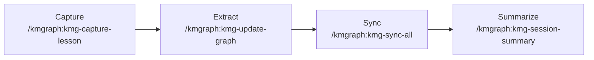

# Quickstart

Install KMGraph, initialize a knowledge graph, and capture your first lesson — in under 5 minutes.

---

## Step 1 — Install

**Claude Code**

```bash
claude --plugin-dir /path/to/knowledge-graph
```

Verify: type `/km` — autocomplete should show `kmgraph` commands.

**Codex CLI**

```bash
codex plugin marketplace add technomensch/knowledge-graph
codex plugin add kmgraph@knowledge-management-graph
```

Skills and MCP tools activate immediately. Run `/kmgraph:kmg-init` to initialize.

**Cursor / Windsurf / VS Code**

Paste the contents of [INSTALL.md](install) into your AI assistant. The installer detects the platform, configures the MCP server, and initializes the knowledge graph automatically.

Requires an assistant with terminal and file system access.

**Generic MCP**

```bash
cd mcp-server && npm install && npm run build
# Register in your IDE's MCP config — point to: mcp-server/dist/index.js
```

See [Platform Adaptation](reference-platform-adaptation) for IDE-specific registration steps.

**Any platform (manual)**

Copy `core/default-templates/` into your project. Follow the template READMEs to manually create lessons, ADRs, and session summaries without automation.

> 🚧 **Do not copy `commands/`, `skills/`, or `agents/`**
>
> These directories are Claude Code plugin-specific and will not function outside the Claude Code plugin system.

---

## Step 2 — Initialize

```bash
/kmgraph:kmg-init
```

The wizard asks for:
- **Project name**
- **Git tracking** — enable for automatic branch/commit metadata on every capture
- **KG type** — `project-local` (default) stores in the project; `personal` stores at `~/.kmgraph/` and is shared across all projects

Init also scaffolds `knowledge/me.md` (your identity and working style, gitignored) and `knowledge/rules.md` (project conventions, committed). These give any AI platform consistent context without platform-specific rewrites.

---

## Step 3 — Capture Your First Lesson

```bash
/kmgraph:kmg-capture-lesson
```

Describe what you just learned or solved. The command structures it into a markdown file with categories, tags, and git metadata.

---

## Step 4 — Recall It

```bash
/kmgraph:kmg-recall "what you captured"
```

Full-text search across all captured lessons, decisions, and patterns.

---

## Step 5 — Check Status

```bash
/kmgraph:kmg-status
```

Shows the active knowledge graph, entry count, and recent captures.

---

## The Capture Pipeline



Use `/kmgraph:kmg-sync-all` at the end of a session to run all four steps in one command.

---

## Troubleshooting

### Stale Plugin Cache

**Claude Code**

```bash
rm -rf ~/.claude/plugins/cache/stayinginsync-knowledge-graph/kmgraph/
/reload-plugins
```

**Codex CLI**

```bash
rm -rf ~/.codex/plugins/cache/knowledge-management-graph/kmgraph/
codex plugin uninstall kmgraph
codex plugin marketplace add technomensch/knowledge-graph
codex plugin add kmgraph@knowledge-management-graph
```

---

## Related

- **[Capturing](pillars-capturing-capture-lessons-learned)** — Save a lesson, ADR, or pattern from your current session
- **[Command Guide](reference-command-guide)** — Complete command reference with examples and learning path
- **[Concepts](concepts-why-kmgraph)** — How the knowledge graph is structured and why
- **[Cheat Sheet](cheat-sheet)** — All commands at a glance
