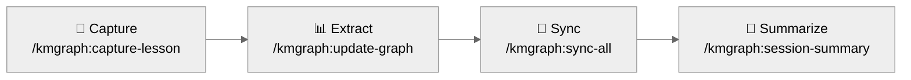

import Tabs from '@theme/Tabs';
import TabItem from '@theme/TabItem';

# Quickstart

Install KMGraph, initialize a knowledge graph, and capture your first lesson — in under 5 minutes.

---

## Step 1 — Install

<Tabs groupId="platform">
  <TabItem value="claude-code" label="Claude Code" default>

```bash
claude --plugin-dir /path/to/knowledge-graph
```

Verify the plugin loaded: type `/km` and the autocomplete menu should show `kmgraph` commands.

  </TabItem>
  <TabItem value="cursor" label="Cursor / Windsurf / VS Code">

Paste the contents of [INSTALL.md](INSTALL.md) into your AI assistant. The installer detects the platform, configures the MCP server, and initializes the knowledge graph automatically.

Requires an assistant with terminal and file system access.

  </TabItem>
  <TabItem value="mcp" label="Generic MCP">

```bash
# Build the MCP server
cd mcp-server && npm install && npm run build

# Register in your IDE's MCP config
# Point to: mcp-server/dist/index.js
```

See [Platform Adaptation](/reference/PLATFORM-ADAPTATION) for IDE-specific registration steps.

  </TabItem>
  <TabItem value="manual" label="Any platform (manual)">

Copy `core/templates/` into your project. Follow the template READMEs to manually create lessons, ADRs, and session summaries without any automation.

:::warning[Do not copy `commands/`, `skills/`, or `agents/`]

These directories are Claude Code plugin-specific and will not function outside the Claude Code
plugin system.

:::

  </TabItem>
</Tabs>

---

## Step 2 — Initialize


```bash
/kmgraph:init
```

The wizard asks for:
- **Project name**
- **Git tracking** — enable for automatic branch/commit metadata on every capture
- **KG type** — `project-local` (default) stores in the project; `personal` stores at `~/.kmgraph/` and is shared across all projects

Init also scaffolds `knowledge/me.md` (your identity and working style, gitignored) and `knowledge/rules.md` (project conventions, committed). These give any AI platform consistent context without platform-specific rewrites. See [Portable AI Identity](guides/me-and-rules.md).

---

## Step 3 — Capture your first lesson


```bash
/kmgraph:capture-lesson
```

Describe what you just learned or solved. The command structures it into a markdown file with categories, tags, and git metadata.

---

## Step 4 — Recall it


```bash
/kmgraph:recall "what you captured"
```

Full-text search across all captured lessons, decisions, and patterns.

---

## Step 5 — Check status


```bash
/kmgraph:status
```

Shows the active knowledge graph, entry count, and recent captures.

---

## The capture pipeline



Use `/kmgraph:sync-all` at the end of a session to run all four steps in one command.

---

## Next steps

- **[Tutorials](/GETTING-STARTED)** — Hand-held walkthroughs for common capture scenarios
- **[How-to Guides](/GETTING-STARTED#using-commands)** — Recipes for specific tasks (ADRs, meta-issues, sharing)
- **[Concepts](/knowledge-graph/concepts/why-kmgraph)** — How the knowledge graph is structured and why
- **[Cheat Sheet](/CHEAT-SHEET)** — All commands at a glance
