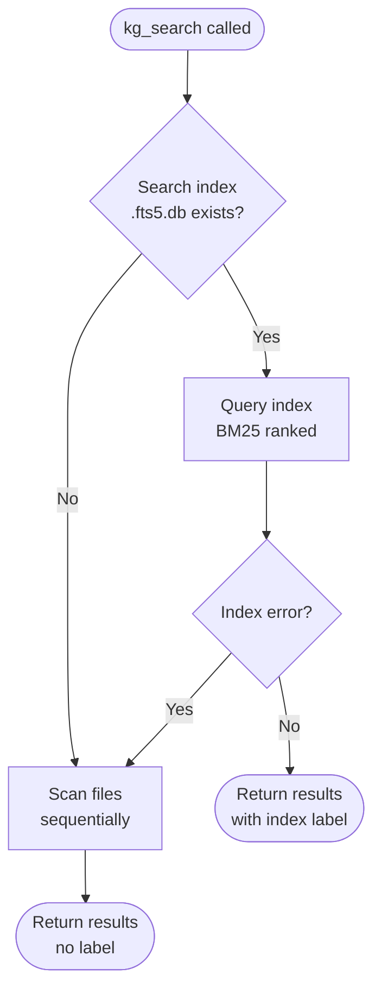

**Version:** 0.5.2 | **Updated:** 2026-04-22

> **Claude Code only:** The `/kmgraph:` prefix requires Claude Code with this plugin installed. Other IDEs access equivalent functionality through MCP tools — see [INSTALL.md](INSTALL.md) for platform-specific setup.
## About Commands on Other Platforms

These commands are designed as reference documentation for any LLM:

- **Claude Code:** Invoke as slash commands (e.g., `/kmgraph:kmg-capture-lesson`)
- **Other platforms:** Copy the command prompt into your LLM. Substitute `${CLAUDE_PLUGIN_ROOT}` with your actual project path
- **No-tool LLMs:** Commands serve as workflow documentation — follow steps manually

Commands work across platforms, but full automation is Claude Code-specific.

---

## Quick Navigation

- [I Want To...](#i-want-to) — Task-based command finder
- [Essential Commands](#essential-commands) — Start here
- [Intermediate Commands](#intermediate-commands) — Daily use
- [Advanced Commands](#advanced-commands) — Power features
- [Command Comparison](#command-comparison) — When to use which
- [Troubleshooting](#troubleshooting) — Common problems and fixes
- [Related Documentation](#related-documentation) — Links to other guides

---

## I Want To...

### Getting Started
- **Set up a new knowledge graph** → `/kmgraph:kmg-init`
- **See what's in my knowledge graph** → `/kmgraph:kmg-status`
- **Document what I just learned** → `/kmgraph:kmg-capture-lesson`
- **Find something I documented before** → `/kmgraph:kmg-recall "search query"`

### Daily Use
- **Sync lessons to the knowledge graph** → `/kmgraph:kmg-update-graph`
- **Summarize this conversation** → `/kmgraph:kmg-session-summary`
- **Add a new category (e.g., security, ml-ops)** → `/kmgraph:kmg-add-category`
- **See my chat history** → `/kmgraph:kmg-extract-chat`
- **Update plugin documentation** → `/kmgraph:kmg-update-doc --user-facing`

### Team Collaboration
- **Share knowledge safely** → `/kmgraph:kmg-config-sanitization`
- **Check for sensitive data before sharing** → `/kmgraph:kmg-check-sensitive`
- **Link lessons to GitHub issues** → `/kmgraph:kmg-link-issue`

### Project Transitions & Onboarding
- **Create comprehensive handoff documentation** → `/kmgraph:kmg-handoff`
- **Set up for new developer** → `/kmgraph:kmg-setup-platform`

> **Note**: The term "issues" in this guide refers to GitHub Issues — a platform feature for tracking bugs, feature requests, and enhancements. This is distinct from "knowledge graph issues" (meta-issues) or "lessons learned issues" (problems documented in the KG).

### Working with Multiple Knowledge Graphs
- **View all configured knowledge graphs** → `/kmgraph:kmg-list`

### Complex Problem Tracking
- **Track a multi-attempt bug** → `/kmgraph:kmg-meta-issue`
- **Start structured issue tracking with documentation and Git branch** → `/kmgraph:kmg-start-issue-tracking`
- **Sync progress to plans and GitHub** → `/kmgraph:kmg-update-issue-plan`

### Memory Management
- **Run the full sync pipeline in one command** → `/kmgraph:kmg-sync-all`


---

## Browse Commands by Category

#### Setup & Configuration

Get the knowledge graph running and configure how it works.

- [🟢 `/kmgraph:kmg-init`](#-kmgraphinit) — Initialize a new knowledge graph
- [🟡 `/kmgraph:kmg-init-personal-kg`](#-kmgraphinit-personal-kg) — Create personal KG for cross-project lessons
- [🟡 `/kmgraph:kmg-list`](#-kmgraphlist) — View all configured knowledge graphs
- [🟡 `/kmgraph:kmg-add-category`](#-kmgraphadd-category) — Add custom categories
- [🟡 `/kmgraph:kmg-config-sanitization`](#-kmgraphconfig-sanitization) — Set up safety features for team sharing

#### Capture & Document

Document lessons, capture history, and summarize sessions.

- [🟢 `/kmgraph:kmg-capture-lesson`](#-kmgraphcapture-lesson) — Capture problems solved and patterns discovered
- [🟡 `/kmgraph:kmg-extract-chat`](#-kmgraphextract-chat) — Export chat history to markdown
- [🟡 `/kmgraph:kmg-session-summary`](#-kmgraphsession-summary) — Summarize important work sessions

#### Search & Sync

Find knowledge and keep the graph synchronized.

- [🟢 `/kmgraph:kmg-status`](#-kmgraphstatus) — Check current knowledge graph status
- [🟢 `/kmgraph:kmg-recall`](#-kmgraphrecall) — Search across all knowledge entries
- [🟡 `/kmgraph:kmg-update-graph`](#-kmgraphupdate-graph) — Extract lessons into knowledge graph
- [🟡 `/kmgraph:kmg-update-doc`](#-kmgraphupdate-doc) — Update documentation with changes
- [🔴 `/kmgraph:kmg-sync-all`](#-kmgraphsync-all) — Run complete synchronization pipeline

#### Team & Sharing

Share knowledge safely with team members.

- [🟡 `/kmgraph:kmg-check-sensitive`](#-kmgraphcheck-sensitive) — Scan for sensitive data before sharing
- [🔴 `/kmgraph:kmg-link-issue`](#-kmgraphlink-issue) — Connect lessons to GitHub issues

#### Advanced Issues

Track complex, multi-attempt problems systematically.

- [🔴 `/kmgraph:kmg-meta-issue`](#-kmgraphmeta-issue) — Track multi-attempt bugs and features
- [🔴 `/kmgraph:kmg-start-issue-tracking`](#-kmgraphstart-issue-tracking) — Systematic issue tracking with Git branches
- [🔴 `/kmgraph:kmg-update-issue-plan`](#-kmgraphupdate-issue-plan) — Sync progress with GitHub and plans

---

## Essential Commands

### 🟢 `/kmgraph:kmg-init`

**Purpose**: Set up a structured knowledge management system for the active project. Lessons, decisions, and patterns land in a searchable, git-tracked knowledge graph so nothing valuable gets lost between sessions.

**When to use**:

- First time setup on any project
- Starting a new project that needs its own knowledge graph
- Creating a separate KG for different work (e.g., personal vs. team)
- **After a plugin update** — verify/upgrade existing KG to current version

**What it does**:

1. Asks for KG name and storage location (project-local, personal, or custom path)
2. Prompts for category selection (architecture, process, patterns, debugging, or custom)
3. Asks for optional custom prefixes per category
4. Creates directory structure (`knowledge/`, `lessons-learned/`, `decisions/`, `sessions/`, `chat-history/`)
5. Copies templates from the plugin
6. Offers to create a **personal KG** at `~/.kmgraph/` for cross-project lessons (see [`/kmgraph:kmg-init-personal-kg`](#-kmgraphinit-personal-kg))
7. Optionally backfills from existing project context (README, CHANGELOG, lessons, decisions, chat history)
8. Optionally installs a git post-commit hook for lesson capture suggestions
9. Updates `.gitignore` based on chosen git strategy
10. Registers the KG in `~/.kmgraph/kg-config.json` and sets it as active

**Time**: 2-3 minutes

**Example**:
```bash
/kmgraph:kmg-init

# Claude asks:
# - What should this knowledge graph be called?
# - Where should it be stored? (project-local / personal / custom)
# - Which categories do you want to include?
# - Would you like to backfill from existing project context? (y/N)
#   (If yes: scans README, CHANGELOG, lessons-learned/, decisions/, chat-history/)
# - Install post-commit hook? (y/n)
# - Git strategy for each category? (commit/ignore)
```

**Backfill Feature**:
When you enable backfill, the system extracts existing knowledge from your project:

- **README.md** — Project overview and key concepts
- **CHANGELOG.md** — Released features and changes
- **lessons-learned/** — Existing lessons (if any)
- **decisions/** — Architecture Decision Records
- **chat-history/** — Extracted chat logs

The system presents candidates for your review before creating entries.

**After backfill**: If backfill was used, the knowledge graph now contains a full set of imported content. This is a good time to build the search index so all that content is immediately searchable by relevance. Run `/kmgraph:kmg-sync-all` and accept the index prompt, or call `kg_fts5_rebuild` directly from the MCP tool panel.

**Next steps**: Run `/kmgraph:kmg-status` to verify setup

**Model tier configuration**: As of v0.5.x, init also walks through the model tier system. Tier labels (`fast-tier`, `standard-tier`, `powerful-tier`) replace hardcoded model names (Haiku, Sonnet, Opus and their Gemini equivalents) so rules, commands, and agents stay stable across model version changes and platforms. During init, a `platforms[]` block is written to `knowledge/me.md` with a `tier_map` entry for each detected platform, binding each tier label to a concrete model name. Locally running Ollama (`localhost:11434`) and LM Studio (`localhost:1234`) instances are discovered automatically and offered as additional platforms, with host, port, and per-tier model selection captured in the walkthrough. An alias map translates legacy model names (Haiku, Sonnet, Opus, Flash, Pro) to tier labels for backwards compatibility, and unrecognized model names trigger a one-time prompt to assign the name to a tier before dispatch continues.

---

### 🟡 `/kmgraph:kmg-init-personal-kg`


**Purpose**: Create a personal knowledge graph at `~/.kmgraph/` for lessons that apply across every project, not just the current one. `capture-lesson` gains a KG picker and `recall` searches both automatically.

**When to use**:

- After running `/kmgraph:kmg-init` and skipping the personal KG offer
- When you want a dedicated place for workflow lessons, cross-project gotchas, and personal ADRs that apply across all projects, not just the current one

**What it does**:

1. Creates `~/.kmgraph/` with standard directory structure
2. Registers it as `type: "personal"` with name `"personal"` in `~/.kmgraph/kg-config.json`
3. Copies knowledge templates (patterns, gotchas, concepts)
4. Builds FTS5 search index for the new KG
5. Does **not** affect which KG resolves from the project directory

After setup:
- `/kmgraph:kmg-capture-lesson` shows a **KG picker** when ≥2 KGs are registered
- `/kmgraph:kmg-recall` searches both project and personal KGs automatically

**Example**:
```bash
/kmgraph:kmg-init-personal-kg

# Claude creates ~/.kmgraph/
# Registers "personal" KG (type: personal) in config
# Project-directory resolution unchanged
```

**Related**: See [Personal vs Project Knowledge](../pillars/organizing/personal-vs-project.md) for when to use each.

---

## Cross-Reference Formatting (Wiki Links)

When you run `/kmgraph:kmg-init` (Step 1f.2) or `/kmgraph:kmg-init-personal-kg` (Step 8.1), the system automatically converts cross-references in your knowledge graph to Obsidian wiki link format for seamless navigation in compatible editors.

### Supported Formats

The wiki pass applies these auto-linkification patterns:

- **Enhancements**: `[[ENH-NNN]]` (e.g., `[[ENH-010]]`)
- **Architecture Decisions**: `[[ADR-NNN-full-title]]` (e.g., `[[ADR-028-postgres-over-mongodb]]`)
- **Lessons Learned**: `[[Lessons_Learned_X]]` (e.g., `[[Lessons_Learned_5]]`)
- **GitHub Issues**: `[#NNN](url)` format (automatically applied when linking via `/kmgraph:kmg-link-issue`)

### When Links Are Applied

- During initial `/kmgraph:kmg-init` setup (Step 1f.2: "Apply Obsidian wiki link formatting to cross-references")
- During `/kmgraph:kmg-init-personal-kg` (Step 8.1: "Applying wiki pass to personal KG")
- Only once — controlled by the `wiki_pass_complete` config flag to avoid re-running on subsequent setups

### Preview Changes with --dry-run

To preview what links will be created without applying them:

```bash
/kmgraph:kmg-init --dry-run
```

The `--dry-run` mode shows which files will be modified and what cross-references will be converted, without writing any changes.

### Scope & Limitations

- **5 legacy lesson files** without the `Lessons_Learned_` prefix are excluded from auto-linking (e.g., `lesson-1.md`, `debug-tip.md`). Manual cross-references to these files still work — they are fully searchable and accessible.
- Lesson files created *after* v0.3.3 automatically follow the `Lessons_Learned_X` naming convention and are auto-linked.

**Related**: For naming conventions and documentation structure, see [Style Guide](STYLE-GUIDE.md).

---

### 🟢 `/kmgraph:kmg-capture-lesson`


**Purpose**: Identifies lessons while context is still fresh and captures both the problem and how it was solved. By automatically linking lessons to relevant metadata, the record is searchable and reusable across future sessions and projects.

> **Command refactored in v0.2.1-beta: 710 → 108 lines.** Execution logic delegated to `agents/` for platform portability. See [CONCEPTS.md § Four-Layer Architecture](../concepts/how-kmgraph-is-organized.md).

**When to use**:

- Just solved a problem
- Discovered a reusable pattern
- Fixed a tricky bug worth remembering
- Learned something that future you will need

**What it does**:

1. `{OPTIONAL}` Prompts to take a session snapshot before starting to preserve the context at the moment of discovery
2. Checks for duplicate or similar existing lessons in the existing knowledge graph before proceeding
3. Asks verification questions to confirm topic, audience, and scope
4. Auto-detects the category from keywords in the lesson content
5. Captures git context for the record — branch, commit, PR, and issue number automatically
6. Wizard captures the following:
- problem
- root cause
- solution
- prevention
7. Creates the lesson file from the standard template with all fields populated
8. Updates category and chronological indexes
9. `{OPTIONAL}` Runs `/kmgraph:kmg-update-graph` to extract KG entries from the new lesson
10. `{OPTIONAL}` Links to a GitHub Issue via `/kmgraph:kmg-link-issue`

**Time**: 5-10 minutes (faster with practice)

**Example**:
```bash
/kmgraph:kmg-capture-lesson                        # → KG resolved from the current directory
/kmgraph:kmg-capture-lesson "user level"           # → personal KG (~/.kmgraph/)
/kmgraph:kmg-capture-lesson --project              # → current project's KG
/kmgraph:kmg-capture-lesson --named=career-ops     # → career-ops KG

# Agent guides you through:
# 1. What problem did you encounter?
# 2. What was the root cause?
# 3. How did you solve it?
# 4. How can this be prevented?
```

**Tips**:

- Capture while the problem is fresh (don't wait)
- Include error messages verbatim
- Note what DIDN'T work (helps future you)
- Level routing: use "user level" for cross-project patterns; "for this project" for codebase-specific lessons. See [Personal vs Project KGs](../pillars/organizing/personal-vs-project) for details.

---

### 🟢 `/kmgraph:kmg-status`

**Purpose**: Show the health and contents of the knowledge graph resolved from the current directory at a glance. File counts, staleness warnings, and a quick command reference, all without leaving the conversation.

**When to use**:

- Verify setup after running `/kmgraph:kmg-init`
- See recent lessons at a glance
- Check profile file staleness (`~/.kmgraph/rules.md`, `~/.kmgraph/me.md`)
- Quick health check on the knowledge graph

**What it shows**:

- Resolved KG name and file path
- Categories and git strategy
- File counts (lessons, KG entries, ADRs, sessions)
- Warnings (stale profile files, missing paths)
- Quick command reference for common next steps

**Time**: Instant

**Example output**:
```
Knowledge Graph Status
━━━━━━━━━━━━━━━━━━━━━

Knowledge Graph: my-project
Location:  /Users/name/projects/my-app/docs/
Categories: architecture, process, patterns, debugging
Git: selective (architecture/patterns committed, process/debugging gitignored)

Stats:
  Lessons: 12
  KG Entries: 28 patterns, 6 concepts, 4 gotchas
  ADRs: 5
  Sessions: 8

Quick Commands:
  /kmgraph:kmg-capture-lesson    — Document a lesson
  /kmgraph:kmg-recall "query"    — Search across all KG
  /kmgraph:kmg-sync-all          — Run full sync pipeline
```

**Tips**: Use the flags `--minimal` for a one-line summary and `--json` for machine-readable output.

---

### 🟢 `/kmgraph:kmg-recall`


**Purpose**: Search across lessons, decisions, patterns, and sessions in one command. When a personal KG is registered, both knowledge graphs are searched automatically, with source labels on every result.

> **Command refactored in v0.2.1-beta: 437 → 79 lines.** Execution logic delegated to `agents/` for platform portability. See [CONCEPTS.md § Four-Layer Architecture](../concepts/how-kmgraph-is-organized.md).

**When to use**:

- "I solved this before..."
- Looking for a specific pattern or solution
- Need to find a past architectural decision
- Searching for context on a topic

**What it searches**:

Dispatches to the recall agent, which searches:

- Lessons learned (full text)
- Architecture decisions (ADRs)
- Knowledge entries (patterns, gotchas, concepts)
- Session summaries
- Profile files (`~/.kmgraph/rules.md`, `~/.kmgraph/me.md`, `knowledge/rules.md`, `knowledge/me.md`)
- Personal KG (if registered) — automatically included when a personal KG exists

**Multi-KG behavior**: When a personal KG is registered, `recall` searches both project and personal KGs by default. Results include a source label (`[project]` or `[personal]`) so origin is always clear.

**Time**: 1-2 seconds (single KG); 2-4 seconds (multi-KG with FTS5)

**Example**:
```bash
/kmgraph:kmg-recall "database timeout"
/kmgraph:kmg-recall "auth patterns" --scope=all
/kmgraph:kmg-recall "workflow patterns" --scope=personal-only

# Multi-KG result format:
# Lessons Learned (3 matches)
# 1. Debugging PostgreSQL Connection Timeouts — [project: my-project]
# 2. Connection Pool Best Practices — [project: my-project]
# 3. Database Timeout Patterns — [personal: personal]
```

**`--scope` parameter**:

| Value | Behavior |
|---|---|
| `active` | The KG resolved from the current directory only |
| `all` | The resolved KG + all registered KGs (auto-default when personal KG exists) |
| `personal-only` | Only KGs with `type: personal` |

**Level routing**: Scope search to a specific KG:

| Flag / Natural Language | Searches |
|---|---|
| `--user` / "user level" | Only `~/.kmgraph/` |
| `--project` / "for this project" | Only current project's KG |
| `--named=<kg>` / KG name | Only the named KG |

```bash
/kmgraph:kmg-recall "auth patterns" --user          # personal KG only
/kmgraph:kmg-recall "database timeout" --project    # current project only
/kmgraph:kmg-recall "deployment" --named=devops-kg  # named KG only
```

**Search tips**:

- Use specific terms ("PostgreSQL timeout" > "database")
- Try synonyms if nothing found
- Search by date: `/kmgraph:kmg-recall "2024-01"`
- Search by category: `/kmgraph:kmg-recall "architecture"`
- Output formats: default (summary), `--format=paths` (file list), `--format=detailed` (full context)
- Scope override: `--scope=active` to restrict to project KG only

---

## Intermediate Commands

### 🟡 `/kmgraph:kmg-update-graph`

**Purpose**: Takes individual lessons learned and adds them directly into the knowledge graph's searchable index. Lessons hold the full narrative; `update-graph` makes patterns findable in seconds, not minutes.

**When to use**:

- After creating or updating lesson-learned documents
- When discovering new patterns or best practices
- Before completing complex work sessions
- Daily or weekly consolidation of captured knowledge

**What it does**:

1. Identifies new or modified lessons (since last sync or last 24 hours)
2. Reads each lesson and extracts: title, problem, solution, when-to-use triggers
3. Checks if a matching KG entry already exists in `knowledge/patterns.md` (or similar)
4. Creates new entries or updates existing ones with bidirectional links
5. Runs data integrity audit on each new entry
6. Commits KG changes

**Time**: 1-5 minutes depending on number of lessons

**Example**:
```bash
/kmgraph:kmg-update-graph
/kmgraph:kmg-update-graph --lesson=Pattern_Discovery.md    # Process specific lesson
/kmgraph:kmg-update-graph --auto                          # Skip prompts, silent mode
/kmgraph:kmg-update-graph --interactive                    # Review each entry before saving
```

**Tips**:

- `--auto` flag is useful when called from other commands (e.g., after `/kmgraph:kmg-capture-lesson`)
- `--interactive` flag lets you review and edit each extracted entry before saving

**Cleaner conversations**: When the context-mode plugin is installed and there are 10 or more lessons to process, `update-graph` reads the lesson files in a background process instead of inline. This keeps the conversation cleaner without changing any results. Falls back automatically if context-mode is not installed.

---

### 🟡 `/kmgraph:kmg-add-category`

**Purpose**: Add a new category to the knowledge graph resolved from the current directory. Creates the directory structure, index file, and git strategy in one step, so the new category is ready to capture lessons immediately.

**When to use**:

- Need to track a new domain (e.g., security, ml-ops, devops)
- Team-specific categorization needed beyond defaults
- Organizing lessons into more granular groups

**What it does**:

1. Prompts for category name (or accepts from command argument)
2. Asks for optional prefix (e.g., "sec-" for security lessons)
3. Asks for git strategy (commit or ignore)
4. Creates `lessons-learned/[category]/` directory
5. Creates `knowledge/[category].md` KG entry file from template
6. Updates `kg-config.json` with the new category
7. Updates `.gitignore` if git strategy is "ignore"

**Time**: Under 1 minute

**Example**:
```bash
/kmgraph:kmg-add-category
/kmgraph:kmg-add-category security
/kmgraph:kmg-add-category ml-ops --prefix ml- --git ignore
```

**Next steps**: Capture lessons in the new category with `/kmgraph:kmg-capture-lesson`

---

### 🟡 `/kmgraph:kmg-session-summary`

**Purpose**: Capture session context on demand and store it in a dated markdown file before it is lost. The dated file is a reliable record of what happened, so any future session can reference it.

**When to use**:

- Before context limits are reached (~180K tokens)
- At major milestones during long sessions
- Before handing work to another developer
- End of a productive work session to preserve context

**What it does**:

1. Auto-detects session scope from conversation context since last summary
2. Classifies session type (feature development, debugging, planning, research)
3. Generates two zones: an Operational Snapshot (Current State, Open Issues, Session History, Session Findings) overwritten on each run, and an Accumulated Narrative appended chronologically
4. One file per day per branch — subsequent runs update the same file; Operational Snapshot sections are overwritten, narrative blocks are timestamped and preserved
5. Saves to `{active_kg_path}/sessions/YYYY-MM-DD-{branch-slug}.md`
6. Optionally triggers lesson capture and KG update

**Snapshot mode** (`--snapshot`): Lightweight mid-session capture. Runs before any capture command when the user opts in. Appends to today's session file (or creates one) without a user review gate. Optional git history (`--snapshot --git`). Used by `capture-lesson`, `create-adr`, and `start-issue-tracking` to preserve the "why" at the moment of discovery.

**Time**: Under 10 seconds (full mode); under 5 seconds (snapshot mode without git)

**Example**:
```bash
/kmgraph:kmg-session-summary                        # → KG resolved from the current directory
/kmgraph:kmg-session-summary --auto                 # Skip confirmation, save immediately
/kmgraph:kmg-session-summary --snapshot             # Mid-session save without review gate
/kmgraph:kmg-session-summary "user level"           # → personal KG (~/.kmgraph/sessions/)
/kmgraph:kmg-session-summary --project              # → current project's KG sessions/
/kmgraph:kmg-session-summary --named=career-ops     # → career-ops KG sessions/
```

**Tips**:

- Captures git commits automatically — no need to list them manually
- Auto-suggests summary when context approaches ~180K tokens
- Run before creating a handoff — START-HERE.md auto-detects today's summary and links it via `continues_from`

---

### 🟡 `/kmgraph:kmg-create-adr`


**Purpose**: Create strategic Architectural Decision Records (ADRs) that capture **why** decisions were made. Records are auto-populated with git metadata, sequential numbering, and the implementation commit, so the history is traceable without manual bookkeeping.

**When to use**:

- Making a significant architecture, process, or technology decision
- Choosing between competing approaches and want to document the rationale
- After a decision has already been made and needs to be formally recorded
- When a lesson learned reveals a decision that should be captured as an ADR

**What it does**:

1. `{OPTIONAL}` Before capturing ADR, prompt will ask whether or not to take a snapshot of the current session before starting to preserve an archive of the context behind the decision
2. Reviews the current ADR items in the resolved knowledge graph
3. Assigns the next ADR number automatically
4. Captures git context for the record — author, branch, and PR/issue number automatically
5. Wizard starts to capture the following:
- title
- status
- category
- context
- decision
- rationale
- consequences
- related lessons
6. Asks if the decision has already been implemented — if yes, captures the current commit and subject line automatically; design-first ADRs get a back-fill reminder
7. Shows a full summary for review before writing anything
8. Creates the ADR file from the standard template with all fields populated
9. Updates the decisions index (count, chronological list, by-category)
10. Commits both files with a structured commit message

**Time**: 5-15 minutes (depends on how much detail you provide)

**Example**:
```bash
/kmgraph:kmg-create-adr                                             # → KG resolved from the current directory
/kmgraph:kmg-create-adr "Use PostgreSQL for primary database"       # Pre-fills title
/kmgraph:kmg-create-adr "Prefer TypeScript strict mode" --user      # → personal KG decisions/
/kmgraph:kmg-create-adr "Use Redis caching" --project               # → current project decisions/
```

**Tips**:

- Pass a title as an argument to skip the first wizard prompt
- Use Proposed status for decisions still under review; Accepted for decisions already implemented
- Link to related lessons in Step 3.8 — creates bidirectional traceability
- If a snapshot was taken earlier in the session, the ADR's Context section can draw from it

---

### 🟡 `/kmgraph:kmg-list`

**Purpose**: Display all knowledge graph projects registered locally. Useful when working across multiple projects and the exact KG name needs to be identified.

**When to use**:

- View all available knowledge graphs
- Check which KG resolves from the current directory
- Review KG configurations
- Verify a new KG was created successfully

**What it shows**:

- All configured knowledge graphs with numbered list
- The KG resolved from the current directory highlighted, if any
- Location paths, categories, git strategy
- Total count

**Time**: Instant

**Example output**:
```
Knowledge Graphs:

1. my-project (active) — /Users/name/projects/my-app/docs/
   Categories: architecture, process, patterns
   Git: selective (architecture/patterns committed, process gitignored)
   Last used: 2026-02-13 15:45

2. ai-research — ~/.kmgraph/knowledge-graphs/ai-research/
   Categories: architecture, process, ml-patterns (custom)
   Git: all committed
   Last used: 2026-02-10 12:00

Total: 2 knowledge graph(s) configured
```

**Tip**: Use `--names-only` for scripting or `--json` for machine-readable output.

---

### 🟡 `/kmgraph:kmg-check-sensitive`

**Purpose**: Scan the knowledge graph resolved from the current directory for emails, API keys, and internal URLs before pushing to a shared repository. Flags findings with file name and line number for manual review.

**When to use**:

- Before pushing knowledge graph files to a public or shared repository
- As a manual check alongside `/kmgraph:kmg-config-sanitization` hooks
- Periodic audit of KG content

**What it does**:

1. Loads scan patterns from `.claude/sanitization-config.json` (or uses defaults)
2. Scans all markdown files in the resolved KG for: email addresses, API keys/tokens, URLs
3. Reports findings with file name, line number, and matched content
4. Use `--user` to scan the personal knowledge graph instead

**Time**: Under 5 seconds

**Example**:
```bash
/kmgraph:kmg-check-sensitive

# Output:
# ⚠️  Potential sensitive data found:
#
# - patterns.md:42 — email: user@example.com
# - debugging-auth.md:15 — URL: https://api.internal.company.com
# - lesson-template.md:8 — api-key: API_KEY=abc123def456
#
# Review these entries before pushing to public repository.
```

---

### 🟡 `/kmgraph:kmg-config-sanitization`

**Purpose**: Run a one-time wizard to automatically flag sensitive data before every commit is saved. Configures scan patterns, custom regexes, and enforcement level in 2-3 minutes.

**When to use**:

- One-time setup per repository for automated security scanning
- When team members need consistent sanitization enforcement

**What it does**:

1. Prompts for scan patterns (emails, API keys, personal names, internal URLs)
2. Collects custom regex patterns specific to your project
3. Asks for action on match (warn or block commit)
4. Installs a pre-commit hook script to `.git/hooks/pre-commit`
5. Creates `.claude/sanitization-config.json` with selected configuration

**Time**: 2-3 minutes

**Example**:
```bash
/kmgraph:kmg-config-sanitization

# Wizard asks:
# 1. What should be scanned for? (checkboxes for email, API keys, names, URLs)
# 2. Any custom patterns? (e.g., "ACME Corp", "internal\.company\.com")
# 3. What should happen when found? (1. Warn  2. Block)
# → Installs hook and creates config
```

**Output**:
```
✅ Pre-commit sanitization hook installed!

Scan patterns: emails, API keys, custom patterns (2)
Action: Block commits with sensitive data

Test the hook:
  git add knowledge/concepts/patterns.md
  git commit -m "test"
```

---

### 🟡 `/kmgraph:kmg-extract-chat`

**Purpose**: Extracts existing local chat history files and stores them within the project as markdown files. Results vary by model and platform; anything beyond Claude may require unsupported configuration.

**When to use**:

- Preserve chat history for reference or knowledge extraction
- End of day archival of important conversations
- When logs might be cleared by app updates

**What it does**:

1. **(Step 0) Resolves the target KG** — calls `kg_resolve` to derive the graph from the current working directory. Skipped when `--output-dir` or `--project` is present.
2. Determines output directory (the resolved KG's `chat-history/` by default, or custom path)
2. Scans Claude logs (`~/.claude/projects/` for `.jsonl` files), Gemini logs (`~/.gemini/tmp/` for `session-*.json` [pre-0.42.0] and `session-*.jsonl` [0.42.0+, streaming format], plus `~/.gemini/antigravity/conversations/` for `.pb` files), and/or Codex CLI sessions (`~/.codex/sessions/YYYY/MM/DD/rollout-*.jsonl`)
3. Merges sessions by date into `YYYY-MM-DD-claude.md`, `YYYY-MM-DD-gemini.md`, and/or `YYYY-MM-DD-codex.md`
4. If a daily file exceeds 900 KB or 30,000 lines, automatically splits into numbered parts (`-part1.md`, `-part2.md`, …) inside a `YYYY-MM-DD/` subfolder to prevent Obsidian rendering failures
5. Supports incremental append — re-running adds new sessions without overwriting; appends target the last part file if the day was previously split

**Time**: Under 30 seconds

**Source flags**:

- `-claude` — Extract only Claude sessions
- `-gemini` — Extract only Gemini sessions
- `--source codex` — Extract only Codex CLI sessions from `~/.codex/sessions/YYYY/MM/DD/rollout-*.jsonl`; outputs `YYYY-MM-DD-codex.md`
- `--source all` — Extract Claude and Gemini sessions; does not include Codex yet, use `--source codex` explicitly

**Date filtering options**:

- `--today` — Extract only today's sessions
- `--date=YYYY-MM-DD` — Extract only sessions from a specific date
- `--after=YYYY-MM-DD` — Extract sessions from this date onwards (inclusive)
- `--before=YYYY-MM-DD` — Extract sessions up to and including this date
- `--project=<fragment>` — Filter to sessions from a specific project (path fragment match). Gemini `.pb` files and hash-named `~/.gemini/tmp/` directories cannot be attributed to a project by name, so they are excluded (not included) whenever `--project` is set, with a visible skip notice.

**Repair and source-override flags**:

- `--rebuild` — Force a clean overwrite/flatten pass for every date in scope, ignoring existing output state. Repairs files written by pre-fix extractor code where normal incremental runs cannot self-heal (dedup treats any uuid already on disk as permanently synced). Not the default mode — use for one-time repair, not routine extraction. Claude-only; `--source gemini`/`codex` prints a warning and is otherwise ignored. Prior content at a rebuilt date is backed up aside (dot-hidden, timestamped, never deleted before the new content is confirmed written), not destroyed.
- `--incremental` — Only extract new sessions; skip a date if its output is already current.
- `--claude-projects-dir=<path>` — Override the Claude session-log source directory (e.g. a restored backup) instead of `~/.claude/projects/`.

**Example**:
```bash
/kmgraph:kmg-extract-chat                                          # Extract all (Claude + Gemini)
/kmgraph:kmg-extract-chat -claude                                  # Extract only Claude
/kmgraph:kmg-extract-chat -gemini                                  # Extract only Gemini
/kmgraph:kmg-extract-chat --source codex                          # Extract only Codex CLI sessions
/kmgraph:kmg-extract-chat --output-dir=/custom/path               # Custom output location
/kmgraph:kmg-extract-chat --today                                  # Today only
/kmgraph:kmg-extract-chat -claude 2026-02-20 through 2026-02-21   # Date range
/kmgraph:kmg-extract-chat --project=knowledge-graph               # Specific project only
/kmgraph:kmg-extract-chat --source codex --after 2026-01-01       # Codex sessions from a date onwards
```

**Tips**:

- Extracted files are automatically searchable via `/kmgraph:kmg-recall`
- Optional `blackboxprotobuf` Python library enables Gemini protobuf file support
- Date ranges use natural language: `YYYY-MM-DD through YYYY-MM-DD` or `YYYY-MM-DD to YYYY-MM-DD`
- Gemini `--project` scoping is fail-closed for `.pb` files and hash-named directories (see above) — a project's own `.pb` sessions are excluded from scoped output rather than risk leaking a foreign project's content in; this is by design, not a bug
- Large days auto-split into a `YYYY-MM-DD/` subfolder with numbered part files; each part is a valid standalone markdown file readable in Obsidian

---

### 🟡 `/kmgraph:kmg-update-doc`

**Purpose**: Maintains this project's user-facing documentation through a guided wizard. Intended primarily for contributors; adapting it to other projects is possible but not yet documented.

**When to use**:

- A plugin feature changed and COMMAND-GUIDE, CHEAT-SHEET, or README needs updating
- Adding a new command entry to user-facing docs
- Ensuring documentation follows v0.0.7 language standards (third-person, Section 508)

**What it does**:

Without `--user-facing`: shows a disambiguation dialog to distinguish plugin documentation from KG content.

With `--user-facing`:

1. Reads target file and displays current sections and version
2. Asks what type of update (add command entry, update existing entry, add section, update metadata, validate only)
3. Runs v0.0.7 standards validation (third-person voice, heading hierarchy, table headers, link text)
4. Shows diff preview before writing
5. Applies changes and commits with standards-compliant message

**Time**: 2-5 minutes

**Example**:
```bash
/kmgraph:kmg-update-doc COMMAND-GUIDE.md --user-facing   # Update plugin documentation wizard
/kmgraph:kmg-update-doc README.md --user-facing           # Update README with new feature info
/kmgraph:kmg-update-doc some-lesson.md                    # Disambiguation dialog for KG content
```

**Tips**:

- Always use `--user-facing` for plugin/project docs (README, COMMAND-GUIDE, CHEAT-SHEET, etc.)
- Without `--user-facing`, a dialog clarifies whether the target is plugin docs or KG content
- Standards validation runs automatically — violations are flagged before writing

---

## Advanced Commands

### 🔴 `/kmgraph:kmg-meta-issue`

**Purpose**: Create a structured workspace for problems that resist initial solutions. Tracks each attempt with its hypothesis and outcome so understanding evolves across attempts rather than starting blind each time.

**When to use** (2 or more criteria should be met):

- 3+ solution attempts already tried or expected
- Root cause understanding has shifted 2+ times
- Problem spans multiple project versions
- High complexity requiring coordination across systems
- Significant learning value for future similar problems

**What it does**:

1. **Initialize** (`/kmgraph:kmg-meta-issue "Problem Title"`):
   - Prompts for domain, scope, severity, expected attempts
   - Creates structured directory under `{active_kg_path}/issues/[meta-issue-name]/`
   - Populates core files: README, description, implementation-log, test-cases
   - Creates analysis files: root-cause-evolution, timeline, lessons-learned
   - Links to knowledge graph
2. **Add attempt** (`--add-attempt 003 "Try connection pooling"`):
   - Creates numbered attempt folder with solution approach and results templates
   - Updates implementation log
3. **Update understanding** (`--update-understanding "Root cause is network latency"`):
   - Records belief shifts with timestamp and evidence
   - Updates description with current best understanding
4. **View status** (`--status`):
   - Shows all active meta-issues with attempt counts and current understanding
5. **Log attempt with hypothesis** (`--log-attempt NNN "hypothesis"`):
   - Enforces a distinct hypothesis before each attempt begins
   - Pre-populates the attempt template's hypothesis field
   - Reminds the user to invoke `stuck-work-escalation` at attempt 3+
   - At 5 attempts, exit-path analysis becomes mandatory (see `stuck-work-escalation` skill)

**Time**: 3-5 minutes for initialization

**Example**:
```bash
/kmgraph:kmg-meta-issue "Authentication Redesign"
/kmgraph:kmg-meta-issue --add-attempt 002 "OAuth2 with JWT"
/kmgraph:kmg-meta-issue --log-attempt 003 "JWT expiry logic is the root cause"
/kmgraph:kmg-meta-issue --update-understanding "Token expiry logic flawed"
/kmgraph:kmg-meta-issue --status
```

> **Note**: Do NOT use meta-issue for simple bugs, standard features, or one-off debugging. Use `/kmgraph:kmg-capture-lesson` instead.

**See also**: [Meta-Issue Guide](../pillars/capturing/document-meta-issues.md) — full guide covering directory structure, attempt templates, escalation thresholds, and worked examples. [Track a Multi-Attempt Issue](../pillars/capturing/document-meta-issues.md) — step-by-step walkthrough.

---

### 🔴 `/kmgraph:kmg-start-issue-tracking`


**Purpose**: Document a bug or enhancement from identification through resolution, with git integration when a repository is present. Captures the context of an issue in structured templates for review and implementation.

**When to use**:

- Identified a bug that needs structured tracking
- Planning a new feature or enhancement
- Documenting a problem before solving it
- Creating a developer handoff with full context

> **Note**: The term "issue" here refers to a GitHub Issue — a platform feature for tracking bugs and feature requests/enhancements.

**What it does**:

1. **Snapshot gate** — optionally takes a session snapshot before the issue dialog
2. **Branch guard** — Step 1.0 now surfaces a ⚠️ warning when current branch ≠ main, priming the user before versioning decisions; Step 6.2 lesson capture prompt becomes strongly recommended when working on a non-main branch
3. **Steps 1.1–1.4 ask one question at a time** — type (bug vs. enhancement), version impact, branch name, and plan filename are each asked independently, waiting for a response before the next question. No multi-question prompts.
4. Scans chat history for recent proposals ("Would you like me to...")
5. Runs git authority check and auto-detects version increment path
6. Auto-detects issue type from keywords (bug vs. enhancement)
7. Creates directory structure with documentation templates (description, solution approach, test cases, implementation log)
8. Generates an implementation plan with safety headers and atomic approval protocol
9. **Step 5.0: Creates a GitHub Issue** via `gh issue create --body-file` from the issue description; writes the returned issue number back to spec frontmatter (`github-issue` field auto-populated)
10. Creates a Git feature branch (`issue/{N}-{slug}`)
11. Optionally creates a draft PR on GitHub with `--body-file` populated from solution approach and `Closes #N` referencing the issue created in Step 5.0
11. **Step 6.2 (lesson capture) is a mandatory gate** — must receive a response before continuing. When working on a non-main branch, this step is strongly recommended.
12. **Step 6.4 (ROADMAP + CHANGELOG update) is a mandatory gate** — must receive a response confirming ROADMAP and CHANGELOG entries have been considered before the command completes.
13. Links to knowledge graph and prompts for lesson capture
14. Engages implementation freeze — stops before any code changes

**Time**: 5-10 minutes

**Example**:
```bash
/kmgraph:kmg-start-issue-tracking
/kmgraph:kmg-start-issue-tracking CLI flag parsing fails on quoted args
/kmgraph:kmg-start-issue-tracking Add token usage display
```

**Tips**:

- Uses the Dual-ID Policy: local IDs (`issue-N` or `ENH-NNN`) are independent from GitHub issue numbers (`#N`)
- GitHub Issue creation is automatic at Step 5.0 — `gh issue create --body-file` runs before branch creation; `github-issue` frontmatter is written back immediately

**See also**: [Track Issues](TRACK-ISSUES.md) — full lifecycle walkthrough including git integration and the implementation freeze gate.

---

### 🔴 `/kmgraph:kmg-update-issue-plan`

**Purpose**: Keeps the knowledge graph, active plans, and GitHub issues in sync after new entries are extracted. The right command when formal issue plans are part of the workflow.

**When to use**:

- After extracting new KG entries with `/kmgraph:kmg-update-graph`
- When implementation plan needs to reflect new insights
- Before committing governance-related changes
- When progress needs to be posted to a GitHub Issue

> **Note**: References to "issues" here mean GitHub Issues — platform-level bug reports or feature requests.

**What it does**:

1. **Knowledge extraction**: Runs `/kmgraph:kmg-update-graph` to extract patterns
2. **Plan sync**: Updates the active implementation plan with a "Lessons Learned Integration" section
3. **Local issue update**: Appends progress and new verification requirements to local issue docs
4. **GitHub sync**: Maps local issue ID to GitHub Issue number, posts a knowledge sync comment, and updates PR description with related lessons
5. **Governance audit**: Outputs a summary table showing sync status across all components

**Time**: 2-5 minutes

**Example**:
```bash
/kmgraph:kmg-update-issue-plan
/kmgraph:kmg-update-issue-plan --auto       # Skip prompts
/kmgraph:kmg-update-issue-plan --pr=42      # Sync to specific PR
```

**Tips**:

- Works fully offline — GitHub steps gracefully degrade if `gh` CLI is not installed
- Decision gates will prompt before creating new issues for out-of-scope discoveries

---

### 🔴 `/kmgraph:kmg-link-issue`

**Purpose**: Link a lesson or ADR to a GitHub Issue after the fact. Writes the issue number into the file's frontmatter and posts a comment to the issue, so the KG and GitHub stay in sync.

**When to use**:

- A lesson was captured but not linked to its relevant GitHub Issue
- An ADR should reference the GitHub Issue that prompted the decision
- Building traceability between knowledge and tracked work

> **Note**: "Issue" here refers to a GitHub Issue — which could be a bug report or a feature request/enhancement.

**What it does**:

1. Validates the file exists and issue number is provided
2. Updates YAML frontmatter in the lesson/ADR with issue and PR metadata
3. Posts a comment to the GitHub Issue with a link to the lesson (if `gh` CLI available)
4. Updates the related KG entry with the issue reference
5. Reports bidirectional link status

**Time**: Under 1 minute

**Example**:
```bash
/kmgraph:kmg-link-issue knowledge/lessons-learned/process/my-lesson.md --issue 42
/kmgraph:kmg-link-issue knowledge/decisions/ADR-005.md --issue 38 --pr 40
```

---

### 🔴 `/kmgraph:kmg-sync-all`

**Purpose**: The catch-up command when lessons have been captured but the pipeline has not run. Replaces four manual steps in a single pass: update-graph, plan sync, issue update, and GitHub posting.

**When to use**:

- After significant work sessions to consolidate everything
- Weekly deep sync to ensure KG, plans, and GitHub are aligned
- Before major milestones or project phase changes
- As a catch-up sync if you've been capturing lessons without syncing

**What it does**:

1. **Scans** for new or modified lessons in `{active_kg_path}/lessons-learned/`
2. **Extracts** KG entries from lessons (delegates to `/kmgraph:kmg-update-graph`)
3. **Links** to active implementation plan if relevant
4. **Updates** local issue with KG references and progress notes
5. **Enriches** today's session summary with KG insights
6. **Generates** GitHub Issue comment draft and asks for single confirmation before posting

**Time**: 1-5 minutes depending on volume

**Example**:
```bash
/kmgraph:kmg-sync-all
/kmgraph:kmg-sync-all --auto       # Skip GitHub posting confirmation
/kmgraph:kmg-sync-all --dry-run    # Preview without changes
```

**Output**:
```
Knowledge Sync Complete
-----------------------
Lessons scanned:  3 (2 new, 1 modified)
KG entries:       2 created, 1 updated
Plan linked:      v2.0 (Step 2 → Prefix Naming lesson)
Local issue:      issue-42 (updated)
GitHub:           #45 (comment posted)
Session:          2026-02-11 (enriched)
```

**Tips**:

- Idempotent — safe to run multiple times (existing entries updated, not duplicated)
- GitHub integration is optional — works fully offline if `gh` CLI is not installed

**Cleaner conversations**: When the context-mode plugin is installed, `sync-all` runs file scans in a background process so the results do not fill the conversation. Falls back automatically if context-mode is not installed. No configuration required.

**Search index**: Each run of `sync-all` automatically refreshes the search index if one has been built. On the first run after upgrading, `sync-all` will ask once whether to build the index. The preference is remembered.

---

### 🔴 `/kmgraph:kmg-handoff`

**Purpose**: Create a complete snapshot of project state for continuation across sessions, models, or machines. Five documents capture everything the next session needs to orient without losing working context.

**When to use**:

- Before transitioning project to another developer
- Preparing for context window limits (>180K tokens)
- Completing a major release cycle
- Creating documentation for AI assistant handoffs
- Before taking a long break

**What it creates**:

1. **START-HERE.md** — Thin pointer: branch, commit, auto-detected link to today's session summary
2. **DOCUMENTATION-MAP.md** — File inventory with purpose annotations
3. **ARCHITECTURE-SNAPSHOT.md** — Current codebase structure and key decisions

Operational state (current branch, open issues, in-progress work) lives in the linked session summary — not in the handoff package. Run `/kmgraph:kmg-session-summary` first if you want that context captured.

**Time**: 1-2 minutes

**Example**:
```bash
/kmgraph:kmg-handoff
/kmgraph:kmg-handoff --output-dir=./backup/
```

**Output**:
```
✅ Handoff package created!

Location: ./handoff-packages/2026-06-09

Files:
- START-HERE.md               — 8 lines
- DOCUMENTATION-MAP.md        — 156 lines
- ARCHITECTURE-SNAPSHOT.md    — 189 lines

Total: ~353 lines of documentation
Reading time: ~20 minutes for complete orientation
```

**Tips**:

- Creates dated directory: `handoff-packages/YYYY-MM-DD/` by default
- START-HERE.md auto-detects today's session summary and sets `continues_from` — run `/kmgraph:kmg-session-summary` first for best results
- Files can be shared via zip or archived for future reference

---

## Command Comparison

### Capture vs Update vs Sync

**Three ways to save learnings**:

1. **`/kmgraph:kmg-capture-lesson`**
   - Creates a NEW lesson file
   - Guided interview process
   - Use: When documenting new learnings

2. **`/kmgraph:kmg-update-graph`**
   - Extracts patterns from existing lessons
   - Updates knowledge entries
   - Use: Daily or weekly to consolidate

3. **`/kmgraph:kmg-sync-all`**
   - Full 4-step pipeline (capture → update → sync → link)
   - Comprehensive sync across KG, plans, issues, and GitHub
   - Use: Weekly deep sync or before sharing

**When to use which**:

- Just solved a problem → `capture-lesson`
- End of day/week → `update-graph`
- Major milestone → `sync-all`

---

### Status vs Recall vs List

**Three ways to view knowledge**:

1. **`/kmgraph:kmg-status`**
   - High-level overview of the resolved KG
   - File counts, warnings, recent activity
   - Use: Daily check-in, health check

2. **`/kmgraph:kmg-recall`**
   - Deep full-text search across all memory systems
   - Find specific content by keyword
   - Use: Looking for something specific

3. **`/kmgraph:kmg-list`**
   - Shows all configured KGs (if multiple)
   - Metadata only (names, paths, categories)
   - Use: Switching between projects

---

### Issue Tracking: meta-issue vs start-issue-tracking

**Two levels of issue tracking**:

1. **`/kmgraph:kmg-start-issue-tracking`**
   - For individual bugs or enhancements
   - Creates a single issue directory, implementation plan, and Git branch
   - Standard workflow for most tracked work

2. **`/kmgraph:kmg-meta-issue`**
   - For complex problems requiring 3+ solution attempts
   - Creates a richer directory structure with attempt folders and root-cause evolution
   - Tracks how understanding changes over time

**When to use which**:

- Standard bug or feature → `start-issue-tracking`
- Multi-attempt investigation → `meta-issue`

---

## Troubleshooting

### "Command not found"

**Problem**: Claude doesn't recognize `/kmgraph:...` command

**Solutions**:

1. Verify plugin installed: Check Claude Code > Extensions
2. Restart Claude Code
3. Update plugin: Check for updates in marketplace
4. Check the resolved KG: Run `/kmgraph:kmg-status`

---

### "No knowledge graph resolved"

**Problem**: Commands fail with "no knowledge graph resolved from the current directory"

**Solutions**:

1. Run `/kmgraph:kmg-init` to create the first KG for this project
2. Run `/kmgraph:kmg-list` to confirm a KG is registered for this directory
3. Run the command from inside the project directory the KG is registered under

---

### "No chat history found"

**Problem**: `/kmgraph:kmg-extract-chat` finds no logs

**Solutions**:

1. Verify log directories exist:
   ```bash
   ls ~/.claude/projects/
   ls ~/.gemini/tmp/
   ```
2. Check if you've used Claude Code or Gemini recently
3. Logs may be cleared on app updates

---

### "Protobuf extraction fails"

**Problem**: Gemini `.pb` files can't be read

**Solutions**:
```bash
# Install optional dependency
pip install blackboxprotobuf

# Or skip protobuf files (JSON extraction still works)
/kmgraph:kmg-extract-chat -gemini  # Will warn about .pb files
```

---

### "Git branch creation fails"

**Problem**: `/kmgraph:kmg-start-issue-tracking` can't create a branch

**Solutions**:
```bash
# Check current branch
git branch

# Make sure you're on main/develop
git checkout main

# Try again
git checkout -b issue/N-description
```

---
## MCP Tool: `kg_upgrade`

Available on all platforms (Codex, Gemini CLI, Cursor, etc.). Inspects and applies upgrades to an existing KMGraph installation.

**Inspect** (no args): returns a JSON object with `upgrades` and `warnings` arrays.

**Apply**: pass `apply: ["category", ...]` to apply one or more categories.

| Category | What it does |
|---|---|
| `directories` | Creates missing required subdirectories (`templates/`, `decisions/`, `sessions/`, `chat-history/`, `tmp/`) |
| `config` | Backfills missing fields in `~/.kmgraph/kg-config.json` introduced in newer versions |
| `templates` | Deploys template files to new destinations — skips any dest file that already exists with different content (user content preserved, reported as "Skipped (user content)"); silently skips identical files |
| `starter-relocation` | Moves starter files (e.g., `ADR-template.md`) from live dirs into `templates/` (ENH-022 migration) — always runs before `templates` when both are applied in the same call |
| `stray-knowledge-dir` | Project-local KGs only: merges known template files from a stray `knowledge/` subdir into `concepts/` and removes it |
| `platform-split` | Removes Claude Code–specific tool directives from `knowledge/rules.md` (requires `confirm_platform_split: true`) |

**`version-update` item** (inspect-only, not an apply category): reported when `lastAppliedVersion` stored in the KG config is older than the installed MCP server version. The item's `details` field lists the concrete apply categories to run. After any successful apply, `lastAppliedVersion` is written back automatically.

**Startup Protocol**: `AGENTS.md` and `GEMINI.md` instruct Codex and Gemini CLI to call `kg_upgrade` inspect at the start of each session. Errors (e.g., no KG configured) are suppressed — upgrades are only surfaced when relevant.

---

## Technical Details

This section covers implementation specifics for users who want to understand how features work internally.

### Context-Mode Integration

When the [context-mode plugin](https://github.com/steventcramer/context-mode) is installed alongside kmgraph:

- `sync-all` uses `ctx_batch_execute` to combine lesson scanning and KG extraction in a single sandboxed background process
- `update-graph` uses `ctx_execute_file` for sandboxed file reads when processing 10 or more lessons; falls back to the knowledge-extractor subagent for large batches without context-mode, or reads directly for small batches
- Detection: kmgraph checks for `mcp__plugin_context-mode_context-mode__ctx_batch_execute` at runtime; no configuration required; zero breaking change if context-mode is absent

### Search Index Implementation

The diagram below shows how `kg_search` decides which search method to use.



`kg_search` checks for a search index first. If the index exists, it queries the index and returns BM25-ranked results with an index label. If the index does not exist or encounters an error, `kg_search` falls back to reading files sequentially. The caller receives the same result format either way.

- Index format: SQLite database using FTS5 (Full-Text Search version 5) extension
- Ranking: BM25 — the same relevance algorithm used by most search engines
- Stemming: porter stemmer — "searching" matches "search", "decisions" matches "decision"
- Rebuild strategy: incremental — only re-indexes files whose modification time changed
- Storage: `{kg-root}/.fts5.db` — gitignored, local only, rebuilt on demand
- Package: `node-sqlite3-wasm` (WASM-based SQLite, no native compilation required)
- Fallback: if the index is corrupt or missing, `kg_search` silently uses file-scan

---

## Related Documentation

### **Quick help**
- [Cheat Sheet](CHEAT-SHEET.md)

  One-page quick reference

- [Concepts](../concepts/why-kmgraph.md)

  Term definitions

### **Writing better entries**
- [Patterns Guide](../pillars/capturing/capture-patterns.md)

  Quality standards

- [Templates](templates/)

  Structured formats

- Examples (`examples/`)

  Real samples

## Related


- **[Quickstart](../quickstart)**

  Installation, first lesson, and setup verification.

- **[Quick Reference](CHEAT-SHEET.md)**

  One-page cheat sheet with all commands at a glance.

- **[Concepts Guide](../concepts/why-kmgraph.md)**

  Plain-English explanations of all key terms and patterns.


---

## Related Documentation

### **Getting started**

- [Quickstart](../quickstart)

  Installation, first lesson, setup verification (5 min)

- [Installation](INSTALL.md)

  Universal installer for all platforms (paste-friendly)

- [Configuration Guide](../pillars/organizing/graph-configuration.md)

  Post-install setup: sanitization, team workflows, MCP server

### **Learning resources**

- [Quick Reference](CHEAT-SHEET.md)

  One-page cheat sheet for common tasks

- [Concepts Guide](../concepts/why-kmgraph.md)

  Plain-English definitions of every term and pattern

- Examples (`examples/`)

  Real-world completed examples of lessons, ADRs, and KG entries

### **Advanced**

- [Workflows](../pillars/organizing/multi-kg-workflows.md)

  Step-by-step guides for all 9 workflow types (non-Claude platforms)

- [Platform Adaptation](reference/PLATFORM-ADAPTATION.md)

  Integration details for Cursor, Windsurf, Continue, VS Code, Aider

- [Style Guide](STYLE-GUIDE.md)

  Documentation authoring standards and conventions
---

**Version**: 0.5.2
**Updated**: 2026-04-22
